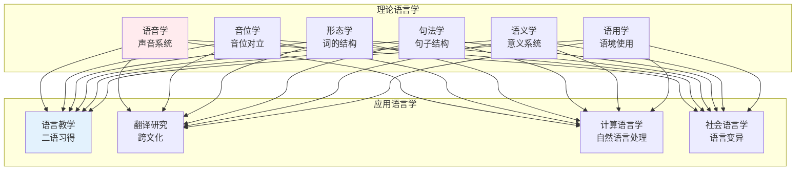
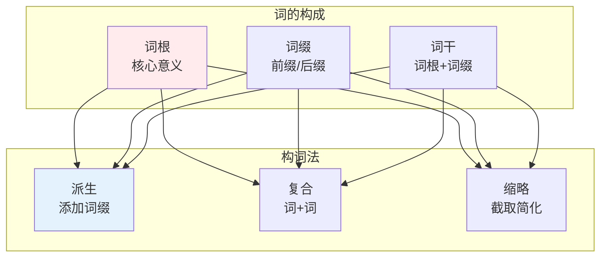
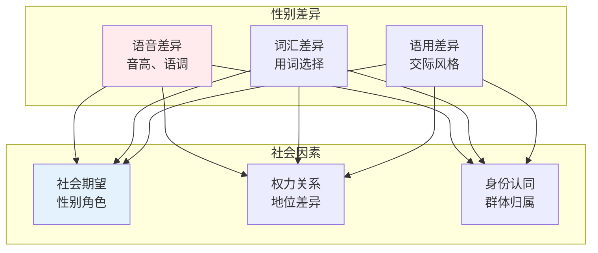
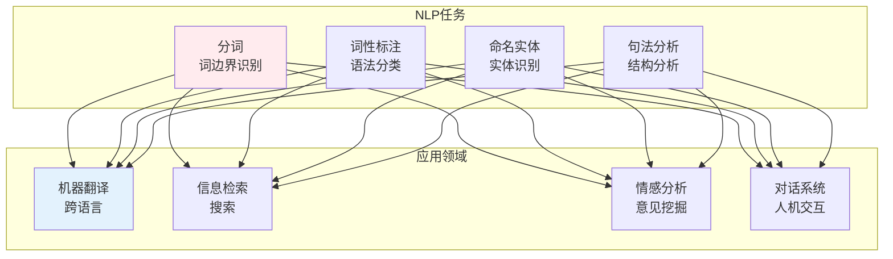

# 语言学知识体系

> **核心观点**：语言是人类特有的符号系统，是思维和交际的工具。

---

## 📊 语言学分支



---

## 🔬 理论语言学

### 语音学

| 概念 | 内涵 | 分类 |
|------|------|------|
| 元音 | 气流不受阻 | 开口度、唇形 |
| 辅音 | 气流受阻 | 发音部位、方法 |
| 声调 | 音高变化 | 平上去入 |
| 语调 | 句子音高 | 陈述、疑问 |

### 形态学



### 句法学

| 理论 | 核心思想 | 分析方法 |
|------|----------|----------|
| 传统语法 | 规则描述 | 主谓宾 |
| 结构主义 | 层次分析 | 直接成分 |
| 生成语法 | 深层结构 | 句法树 |
| 功能语法 | 功能体现 | 主位述位 |

### 语义学

```
语义关系类型：
1. 同义关系：意义相近
2. 反义关系：意义相反
3. 上下义关系：包含关系
4. 多义关系：一词多义
5. 同音关系：声音相同
```

---

## 🗣️ 语用学

### 言语行为理论

| 行为类型 | 内涵 | 例子 |
|----------|------|------|
| 言内行为 | 说话本身 | 发出声音 |
| 言外行为 | 说话意图 | 请求、命令 |
| 言后行为 | 说话效果 | 说服、感动 |

### 合作原则

```
格莱斯合作原则四准则：
1. 量准则：提供适量信息
2. 质准则：说真话
3. 关联准则：说相关的话
4. 方式准则：清楚明白地说
```

---

## 🌍 社会语言学

### 语言变异

| 变异类型 | 影响因素 | 例子 |
|----------|----------|------|
| 地域变异 | 地理分布 | 方言 |
| 社会变异 | 社会阶层 | 社会方言 |
| 情境变异 | 使用场合 | 正式/非正式 |
| 时间变异 | 历史变化 | 古今差异 |

### 语言与性别



---

## 📜 语言史

### 语言谱系

| 语系 | 分布 | 代表语言 |
|------|------|----------|
| 印欧语系 | 欧洲、南亚 | 英语、印地语 |
| 汉藏语系 | 东亚 | 汉语、藏语 |
| 闪含语系 | 中东、北非 | 阿拉伯语、希伯来语 |
| 尼日尔-刚果语系 | 非洲 | 斯瓦希里语 |

### 语言演变

```
语言演变规律：
1. 语音演变：音变规律
2. 语法演变：结构变化
3. 词汇演变：新词产生、旧词消亡
4. 语义演变：意义转移
```

---

## 💻 计算语言学

### 自然语言处理



---

## 🎯 核心结论

### 语言学的基本发现

1. **语言是符号系统**：能指与所指的关系
2. **语言是普遍的**：所有人类都有语言
3. **语言是文化的载体**：语言相对论
4. **语言是演变的**：语言变化是常态
5. **语言是社会的**：语言反映社会

### 语言学的价值

```
语言学如何帮助我们：
1. 理解人类认知
2. 改进语言教学
3. 开发语言技术
4. 保护语言多样性
5. 促进跨文化交际
```

---

## 📚 参考文献

1. 索绪尔《普通语言学教程》
2. 乔姆斯基《句法结构》
3. 韩礼德《功能语法导论》
4. 莱考夫《我们赖以生存的隐喻》
5. 吕叔湘《现代汉语八百词》
6. 朱德熙《语法讲义》
7. 王力《汉语史稿》
8. 刘润清《西方语言学流派》