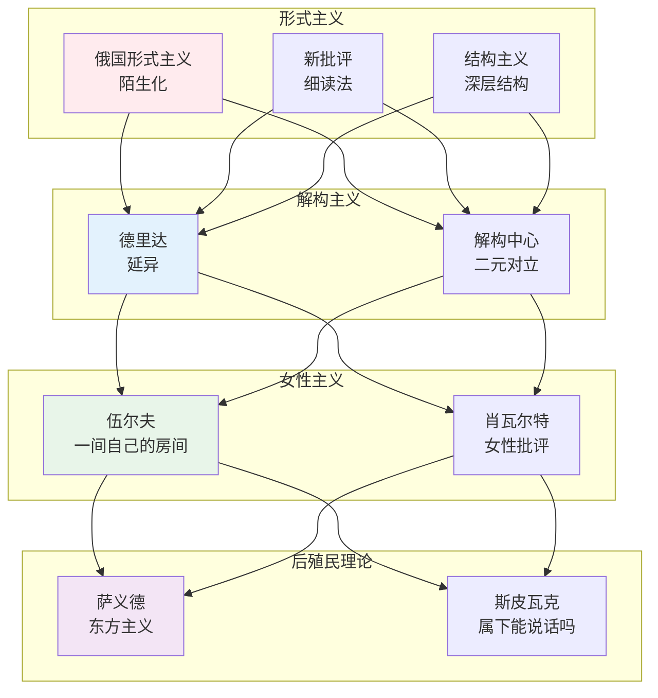
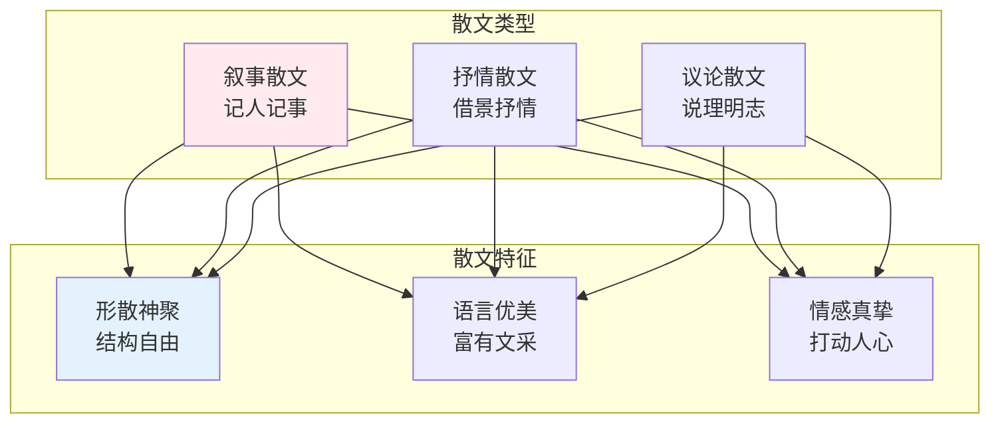
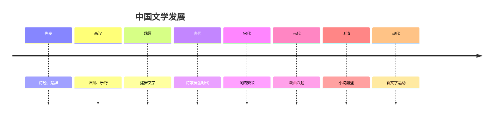
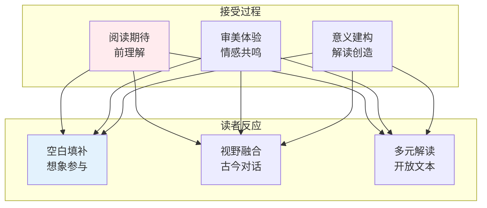

# 文学知识体系

> **核心观点**：文学是语言的艺术，通过审美形式表达人类经验与情感。

---

## 📊 文学理论框架



---

## 📖 文学体裁

### 诗歌

| 类型 | 特征 | 代表作品 |
|------|------|----------|
| 抒情诗 | 表达情感 | 《静夜思》 |
| 叙事诗 | 讲述故事 | 《孔雀东南飞》 |
| 哲理诗 | 表达哲思 | 《登鹳雀楼》 |
| 朦胧诗 | 意象丰富 | 北岛、舒婷 |

### 小说

| 类型 | 特征 | 代表作品 |
|------|------|----------|
| 现实主义 | 再现生活 | 《红楼梦》 |
| 浪漫主义 | 想象夸张 | 《巴黎圣母院》 |
| 现代主义 | 意识流 | 《尤利西斯》 |
| 后现代主义 | 解构叙事 | 《百年孤独》 |

### 散文



### 戏剧

| 类型 | 特征 | 代表作品 |
|------|------|----------|
| 悲剧 | 命运冲突 | 《哈姆雷特》 |
| 喜剧 | 社会讽刺 | 《威尼斯商人》 |
| 正剧 | 现实生活 | 《雷雨》 |

---

## 🔬 文学批评方法

### 内在批评

| 方法 | 核心思想 | 操作 |
|------|----------|------|
| 细读法 | 文本自足 | 语言分析 |
| 新批评 | 反对意图 | 张力、悖论 |
| 结构主义 | 深层结构 | 二元对立 |

### 外在批评

| 方法 | 核心思想 | 操作 |
|------|----------|------|
| 传记批评 | 作者生平 | 文本与作者 |
| 历史批评 | 时代背景 | 文本与历史 |
| 社会批评 | 社会反映 | 文本与社会 |

### 理论批评

| 方法 | 核心思想 | 操作 |
|------|----------|------|
| 精神分析 | 无意识 | 梦、象征 |
| 马克思主义 | 经济基础 | 阶级分析 |
| 女性主义 | 性别权力 | 女性形象 |

---

## 📜 文学史

### 中国文学史



### 西方文学史

| 时期 | 特征 | 代表作家 |
|------|------|----------|
| 古希腊 | 悲剧喜剧 | 埃斯库罗斯 |
| 文艺复兴 | 人文主义 | 莎士比亚 |
| 启蒙时代 | 理性讽刺 | 伏尔泰 |
| 浪漫主义 | 情感想象 | 拜伦、雪莱 |
| 现实主义 | 批判现实 | 巴尔扎克 |
| 现代主义 | 意识流 | 乔伊斯 |

---

## 🎯 文学核心概念

### 文学性

```
文学性的构成：
1. 语言：形象、含蓄、多义
2. 结构：叙事、节奏、张力
3. 意象：象征、隐喻、暗示
4. 情感：共鸣、感染、升华
```

### 文学功能

| 功能 | 内涵 | 例子 |
|------|------|------|
| 审美功能 | 美的享受 | 诗歌意象 |
| 认识功能 | 反映现实 | 社会小说 |
| 教育功能 | 道德教化 | 寓言故事 |
| 娱乐功能 | 消遣娱乐 | 通俗小说 |

### 文学接受



---

## 🎯 核心结论

### 文学的基本发现

1. **文学是建构的**：意义由读者参与建构
2. **文学是审美的**：形式与内容统一
3. **文学是多元的**：多种解读并存
4. **文学是历史的**：受时代影响
5. **文学是跨文化的**：人类共同遗产

### 文学学习路径

```
文学学习四步骤：
1. 阅读经典：积累文本经验
2. 学习理论：掌握分析工具
3. 批评实践：培养鉴赏能力
4. 创作尝试：理解创作过程
```

---

## 📚 参考文献

1. 《诗经》
2. 《楚辞》
3. 《红楼梦》
4. 《哈姆雷特》
5. 莎士比亚全集
6. 鲁迅全集
7. 韦勒克《文学理论》
8. 童庆炳《文学理论教程》