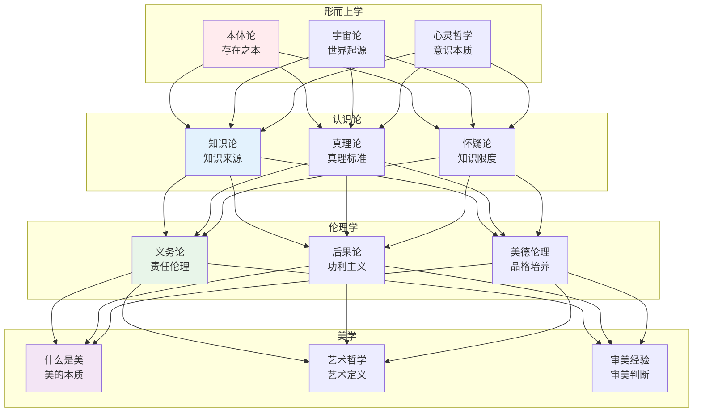
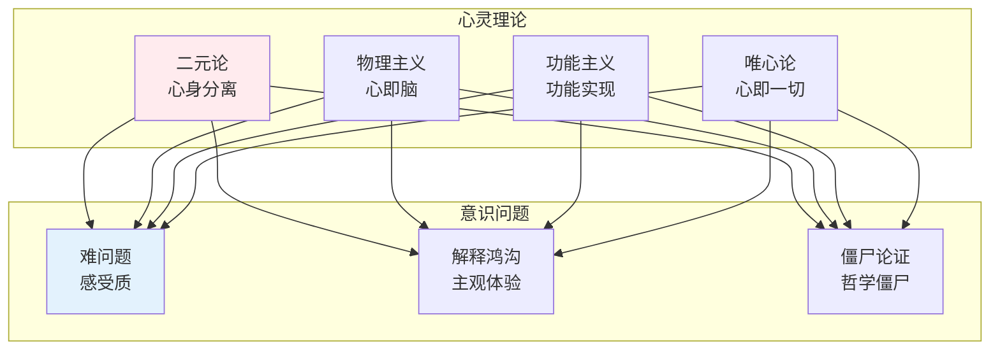
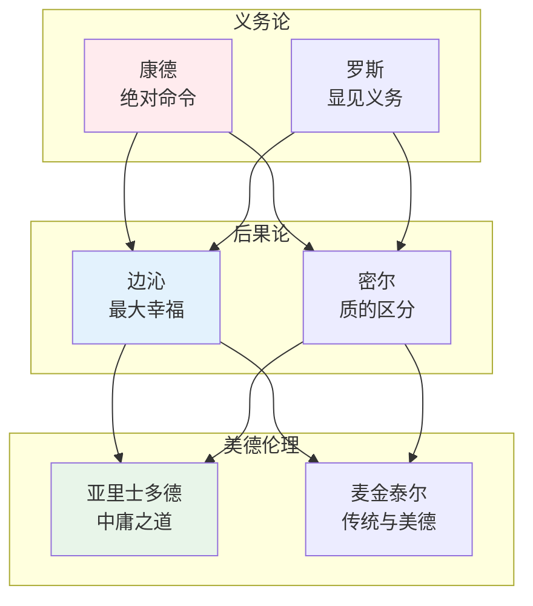

# 哲学知识体系

> **核心观点**：哲学是对存在、知识、价值、理性、心灵和语言等基本问题的系统性反思。

---

## 📊 哲学分支体系



---

## 🔬 形而上学

### 本体论核心问题

| 问题 | 内涵 | 主要立场 |
|------|------|----------|
| 存在是什么 | 最根本的问题 | 实在论/唯名论 |
| 实体是什么 | 事物的本质 | 一元论/多元论 |
| 因果关系 | 事物如何联系 | 决定论/自由意志 |
| 时空本质 | 时空的存在方式 | 绝对论/相对论 |

### 心灵哲学



---

## 📚 认识论

### 知识定义

**传统定义**：知识是确证的真信念（JTB）

| 要素 | 内涵 | 例子 |
|------|------|------|
| 信念 | 主观接受 | 我相信天是蓝的 |
| 真 | 符合事实 | 天确实是蓝的 |
| 确证 | 有理由支持 | 我看到了天 |

### 知识来源

| 来源 | 代表人物 | 核心观点 |
|------|----------|----------|
| 理性主义 | 笛卡尔 | 理性是知识来源 |
| 经验主义 | 洛克 | 经验是知识来源 |
| 先验论 | 康德 | 先验范畴使知识可能 |
| 实用主义 | 杜威 | 知识来自实践 |

### 真理理论

```
真理理论对比：
1. 符合论：信念与事实符合
2. 融贯论：信念系统内部一致
3. 实用论：信念在实践中有效
4. 紧缩论：真理只是断言
```

---

## ⚖️ 伦理学

### 三大伦理学派



### 伦理学理论对比

| 理论 | 核心原则 | 优点 | 缺点 |
|------|----------|------|------|
| 义务论 | 行为本身是否正当 | 强调原则 | 忽视后果 |
| 后果论 | 行为后果是否好 | 结果导向 | 计算困难 |
| 美德伦理 | 行为者品格如何 | 整体视角 | 标准模糊 |

### 应用伦理学

| 领域 | 核心问题 | 当代挑战 |
|------|----------|----------|
| 生命伦理 | 生死抉择 | 安乐死、基因编辑 |
| 环境伦理 | 人与自然 | 气候变化、生物多样性 |
| 商业伦理 | 利润与道德 | 企业社会责任 |
| 网络伦理 | 虚拟空间 | 隐私、网络暴力 |

---

## 🎨 美学

### 美的本质

| 理论 | 核心观点 | 代表人物 |
|------|----------|----------|
| 客观论 | 美是对象属性 | 柏拉图 |
| 主观论 | 美是主观感受 | 休谟 |
| 关系论 | 美是主客统一 | 康德 |
| 实践论 | 美是人的本质力量 | 马克思 |

### 艺术哲学

```
艺术定义的困难：
1. 本质主义定义的失败
2. 历史语境的变化
3. 制度理论的兴起
4. 概念艺术的挑战
```

---

## 🏛️ 西方哲学史

### 古希腊哲学

| 哲学家 | 核心思想 | 贡献 |
|--------|----------|------|
| 苏格拉底 | 认识你自己 | 对话法 |
| 柏拉图 | 理念论 | 理想国 |
| 亚里士多德 | 实体论 | 逻辑学 |

### 近代哲学

| 哲学家 | 核心思想 | 贡献 |
|--------|----------|------|
| 笛卡尔 | 我思故我在 | 怀疑方法 |
| 洛克 | 白板说 | 经验主义 |
| 康德 | 批判哲学 | 先验唯心论 |
| 黑格尔 | 绝对精神 | 辩证法 |

### 现代哲学

| 哲学家 | 核心思想 | 贡献 |
|--------|----------|------|
| 尼采 | 权力意志 | 价值重估 |
| 海德格尔 | 存在之思 | 此在分析 |
| 维特根斯坦 | 语言游戏 | 分析哲学 |
| 萨特 | 存在先于本质 | 存在主义 |

---

## 🏮 中国哲学

### 先秦哲学

| 学派 | 代表人物 | 核心思想 |
|------|----------|----------|
| 儒家 | 孔子、孟子 | 仁义礼智 |
| 道家 | 老子、庄子 | 道法自然 |
| 墨家 | 墨子 | 兼爱非攻 |
| 法家 | 韩非子 | 法术势 |

### 宋明理学

```
理学核心概念：
1. 理：宇宙本体
2. 气：物质构成
3. 心：主观精神
4. 性：人性本质
5. 知：道德认识
6. 行：道德实践
```

---

## 🎯 核心结论

### 哲学的基本问题

1. **存在论问题**：世界是什么？
2. **认识论问题**：我们能知道什么？
3. **伦理学问题**：我们应该做什么？
4. **美学问题**：什么是美？
5. **逻辑学问题**：什么是有效的推理？

### 哲学的实践价值

```
哲学如何改变思维：
1. 培养批判性思考
2. 澄清概念混乱
3. 反思预设前提
4. 探索人生意义
5. 促进理性对话
```

---

## 📚 参考文献

1. 柏拉图《理想国》
2. 亚里士多德《尼各马可伦理学》
3. 康德《纯粹理性批判》
4. 黑格尔《精神现象学》
5. 尼采《查拉图斯特拉如是说》
6. 海德格尔《存在与时间》
7. 维特根斯坦《哲学研究》
8. 冯友兰《中国哲学简史》