# 哲学知识体系

> **第一性原理**：哲学是对最基本、最普遍问题的反思性追问，旨在寻求终极解释和根本原则。

---

## 📚 哲学的公理体系

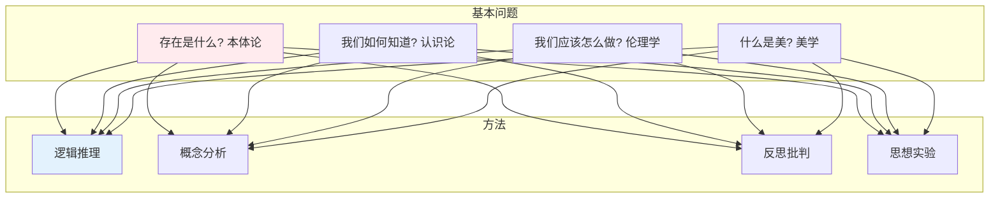

---

## 一、本体论 Ontology

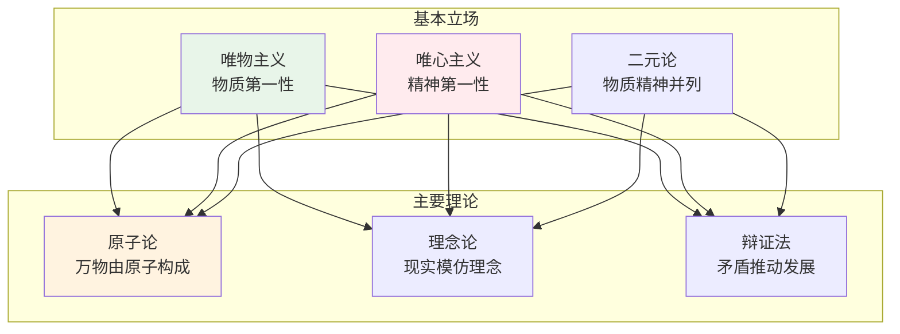

---

## 二、认识论 Epistemology

### 知识来源之争

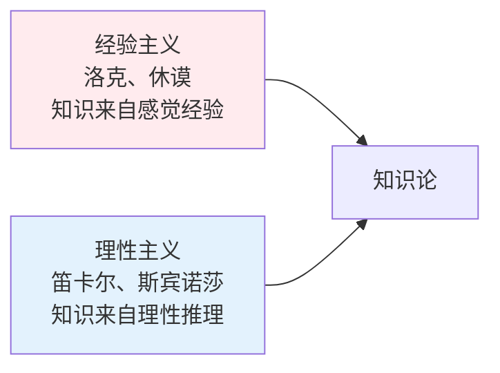

### 真理理论

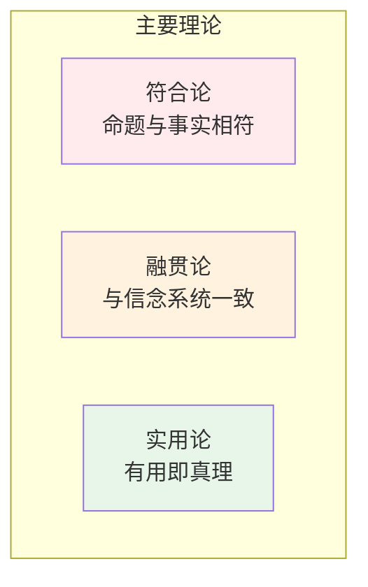

### 康德批判哲学

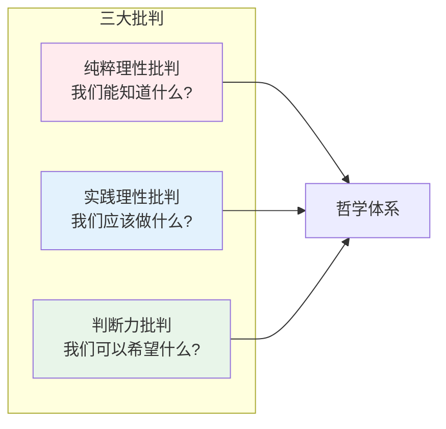

---

## 三、伦理学 Ethics

### 三大流派

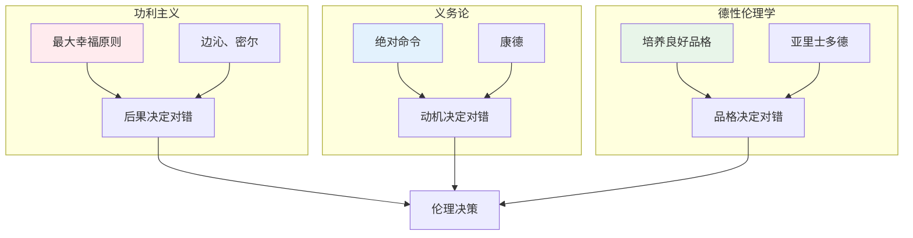

### 康德的绝对命令

```
1. 普遍化原则：只按照你能愿意它成为普遍法则的准则行动。
2. 人性原则：永远把人当作目的，而不仅仅是手段。
3. 自律原则：理性存在者为自己立法。
```

---

## 四、逻辑学 Logic

### 形式逻辑

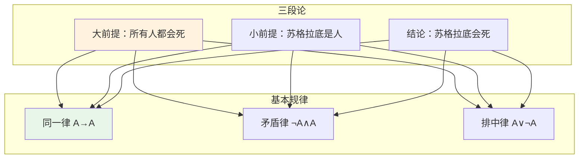

### 常见谬误

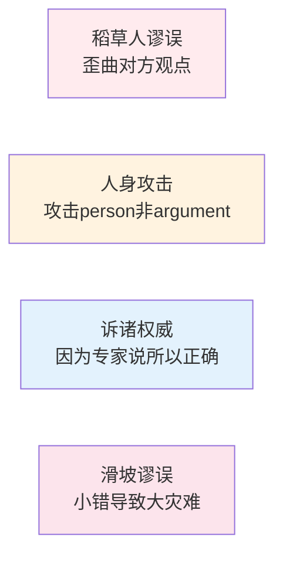

---

## 五、美学 Aesthetics

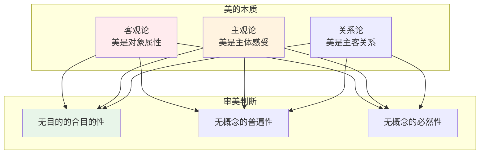

---

## 六、哲学思维方式

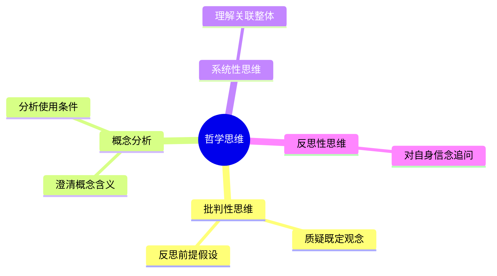

---

## 📖 学习路径

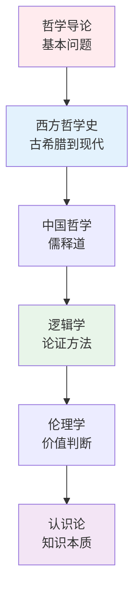

---

## 参考文献

1. 《西方哲学史》- 罗素
2. 《中国哲学简史》- 冯友兰
3. 《纯粹理性批判》- 康德
4. 《尼采文集》