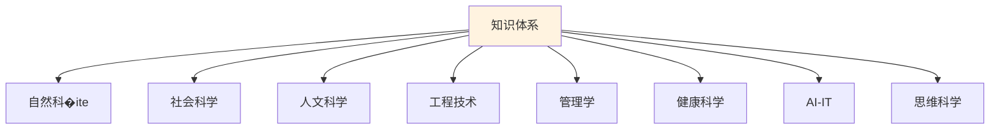

# 知识体系总览

> **费曼学习法**：如果你不能用简单的话解释清楚，说明你还没真正理解。

---

## 🎯 一句话理解知识体系

**知识就像一张大网，每个知识点都是网上的一个节点，节点之间相互连接。**

---

## 🗺️ 知识地图

---

## 📚 知识领域导航

| 领域 | 说明 | 链接 |
|------|------|------|
| 🔬 自然科学 | 研究大自然是怎么运作的 | [进入](natural-sciences/index.md) |
| 🧠 社会科学 | 研究人和人之间是怎么相处的 | [进入](social-sciences/index.md) |
| 🎭 人文科学 | 研究人创造的文化和思想 | [进入](humanities/index.md) |
| ⚙️ 工程技术 | 用科学知识造出有用的东西 | [进入](engineering/index.md) |
| 💼 管理学 | 怎么把事情做好、把人管好 | [进入](management/index.md) |
| 🏥 健康科学 | 让人不生病、生病了怎么治 | [进入](health/index.md) |
| 🤖 AI-IT | 让机器变聪明 | [进入](AI-IT/index.md) |
| 🧩 思维科学 | 让脑子更好使、想问题更清楚 | [进入](thinking/index.md) |

---

## 🔗 跨领域知识连接

| 连接类型 | 说明 |
|----------|------|
| 数学基础 | 自然科学/数学 → AI-IT、工程技术 |
| 心理学 | 社会科学/心理学 → 思维科学 |
| 哲学 | 人文科学/哲学 → 思维科学、AI伦理 |
| 社会学 | 社会科学/社会学 → 思维科学、管理学 |
| 生物学 | 自然科学/生物 → 健康科学 |

---

## 🎮 知识闯关游戏

---

## 💡 给小学生的话

> 知识不是孤岛，而是相互连接的岛屿！
> 
> 学会用"跳转"的思维，把知识连起来！
> 
> 这样学得更快、记得更牢！

---

**每个知识专家都曾经是初学者！**