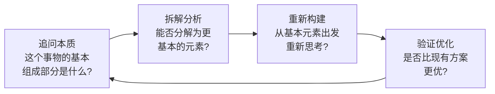
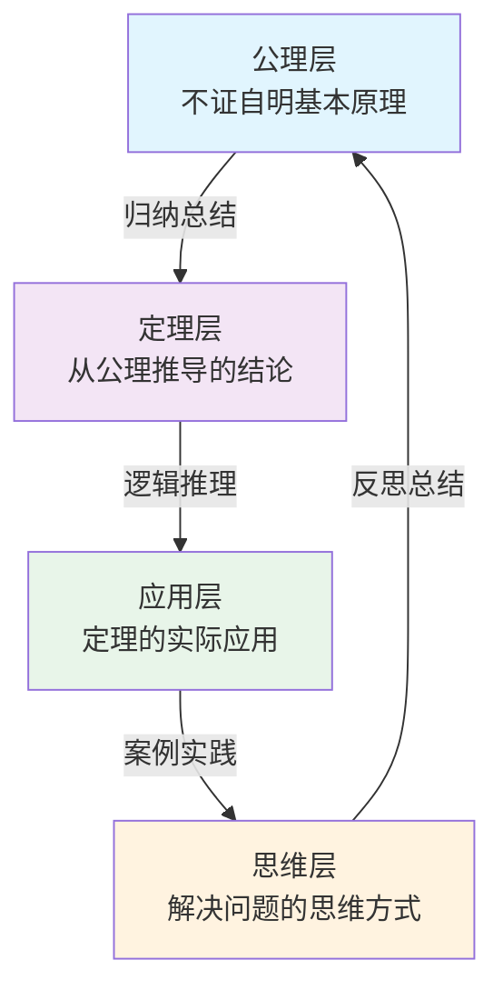
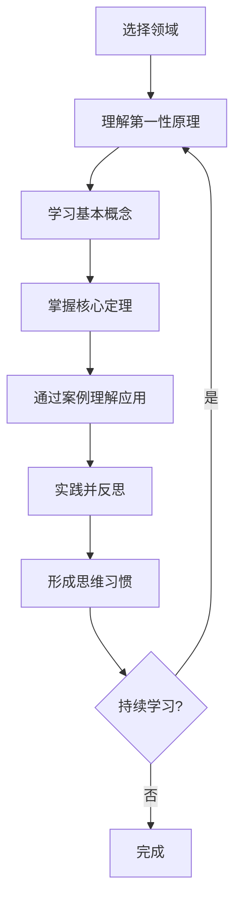
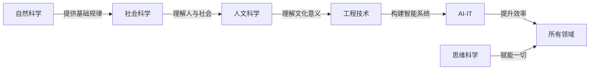

# 知识体系总览

> **第一性原理**：从最基本的规律出发，构建系统化的知识框架。

---

## 🌍 知识架构

```mermaid
graph TB
    K[知识体系] --> NS[自然科学<br/>Natural Sciences]
    K --> SS[社会科学<br/>Social Sciences]
    K --> HUM[人文科学<br/>Humanities]
    K --> ENG[工程技术<br/>Engineering]
    K --> MGT[管理学<br/>Management]
    K --> HLT[健康科学<br/>Health]
    K --> AI[AI-IT]
    K --> THK[思维科学<br/>Thinking]

    NS --> MATH[数学<br/>Mathematics]
    NS --> PHYS[物理学<br/>Physics]
    NS --> CHEM[化学<br/>Chemistry]
    NS --> BIO[生物学<br/>Biology]
    NS --> AST[天文学<br/>Astronomy]
    NS --> GEO[地理学<br/>Geography]

    SS --> ECON[经济学<br/>Economics]
    SS --> PSY[心理学<br/>Psychology]
    SS --> SOC[社会学<br/>Sociology]
    SS --> POL[政治学<br/>Political Science]
    SS --> LAW[法学<br/>Law]
    SS --> EDU[教育学<br/>Education]

    HUM --> PHI[哲学<br/>Philosophy]
    HUM --> HIST[历史<br/>History]
    HUM --> LIT[文学<br/>Literature]
    HUM --> LING[语言学<br/>Linguistics]
    HUM --> ART[艺术<br/>Art]
    HUM --> ETH[民族学<br/>Ethnology]

    ENG --> CS[计算机科学<br/>Computer Science]
    ENG --> MECH[机械工程<br/>Mechanical]
    ENG --> EE[电气工程<br/>Electrical]
    ENG --> CHE[化学工程<br/>Chemical]
    ENG --> CE[土木工程<br/>Civil]

    MGT --> BA[企业管理<br/>Business Admin]
    MGT --> HR[人力资源<br/>HRM]
    MGT --> MKT[市场营销<br/>Marketing]
    MGT --> ACC[会计学<br/>Accounting]
    MGT --> TOUR[旅游管理<br/>Tourism]
    MGT --> ENT[创业管理<br/>Entrepreneurship]

    HLT --> MED[医学<br/>Medicine]
    HLT --> PH[公共卫生<br/>Public Health]
    HLT --> SPT[体育科学<br/>Sports Science]
    HLT --> NURS[护理学<br/>Nursing]
    HLT --> PHARM[药学<br/>Pharmacy]
    HLT --> REHAB[康复医学<br/>Rehabilitation]

    AI --> AICORE[AI核心知识<br/>Core Knowledge]
    AI --> AI基礎[基础知识<br/>Fundamentals]
    AI --> AI硬件[硬件基础<br/>Hardware]
    AI --> AI应用[AI应用<br/>Applications]

    THK --> LEARN[学习认知<br/>Learning]
    THK --> COG[认知科学<br/>Cognition]
    THK --> CRIT[批判思维<br/>Critical Thinking]
```

---

## 📚 各知识领域

### 🔬 自然科学 Natural Sciences
从自然规律出发，理解物质世界的本质。

| 领域 | 内容 |
|------|------|
| [数学](natural-sciences/mathematics/index.md) | 从集合论到现代数学的完整体系 |
| [物理学](natural-sciences/physics/index.md) | 从经典力学到量子物理 |
| [化学](natural-sciences/chemistry/index.md) | 从原子分子论到有机合成 |
| [生物学](natural-sciences/biology/index.md) | 从细胞到生态系统 |
| [天文学](natural-sciences/astronomy/index.md) | 宇宙起源与演化 |
| [地理学](natural-sciences/geography/index.md) | 地球系统与人文地理 |

### 🧠 社会科学 Social Sciences
从人类行为与社会规律出发，理解社会运行。

| 领域 | 内容 |
|------|------|
| [经济学](social-sciences/economics/index.md) | 资源配置与决策科学 |
| [心理学](social-sciences/psychology/index.md) | 心理活动与行为规律 |
| 社会学 | 社会结构与变迁 |
| 政治学 | 权力与治理 |
| 法学 | 法律体系与正义 |
| 教育学 | 学习与发展 |

### 🎭 人文科学 Humanities
从人类精神活动出发，理解文化与意义。

| 领域 | 内容 |
|------|------|
| [哲学](humanities/philosophy/index.md) | 对最基本问题的反思 |
| 历史 | 文明演进与规律 |
| 文学 | 文字与叙事艺术 |
| 语言学 | 语言的结构与演变 |
| 艺术 | 审美与创作 |
| 民族学 | 文化比较研究 |

### ⚙️ 工程技术 Engineering
从自然规律出发，设计和建造人工系统。

| 领域 | 内容 |
|------|------|
| [计算机科学](engineering/computer-engineering/index.md) | 计算与信息处理 |
| 机械工程 | 设计与制造 |
| 电气工程 | 电力与控制 |
| 化学工程 | 化工过程 |
| 土木工程 | 建筑与结构 |

### 💼 管理学 Management
从组织行为出发，优化资源配置。

| 领域 | 内容 |
|------|------|
| 企业管理 | 战略与运营 |
| 人力资源 | 人才管理 |
| 市场营销 | 市场与品牌 |
| 会计学 | 财务与成本 |
| 旅游管理 | 服务业管理 |
| 创业管理 | 创新与增长 |

### 🏥 健康 Health
从生命规律出发，维护人类健康。

| 领域 | 内容 |
|------|------|
| 医学 | 疾病诊断与治疗 |
| 公共卫生 | 疾病预防促进 |
| [体育科学](health/sports-science/index.md) | 运动与策略游戏 |
| 护理学 | 健康照护 |
| 药学 | 药物研发应用 |
| 康复医学 | 功能恢复 |

### 🤖 AI-IT
从信息处理出发，构建智能系统。

| 领域 | 内容 |
|------|------|
| [AI核心知识](AI-IT/AI核心知识/基础理论/index.md) | 智能本质与算法 |
| 基础知识 | 数学与计算基础 |
| 硬件基础 | 计算机体系结构 |
| AI应用 | 计算机视觉与自然语言处理 |

### 🧩 思维科学 Thinking
从认知规律出发，理解思维的本质。

| 领域 | 内容 |
|------|------|
| [学习认知](thinking/index.md) | 认知过程与学习策略 |
| 心理学 | 思维的心理机制 |
| 哲学 | 批判性思维基础 |
| 社会学 | 社会认知与传播 |

---

## 🎯 学习方法论

### 第一性原理思维

### 知识构建层次

---

## 📖 推荐使用方式

### 系统化学习路径

### 跨学科联系

---

**持续更新中...**