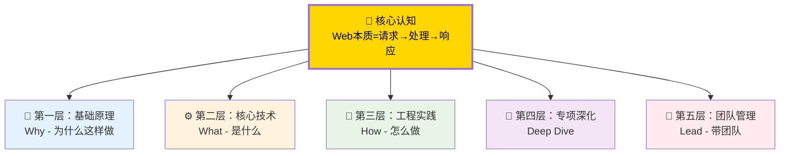
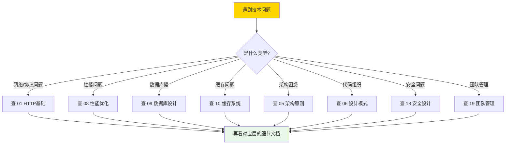
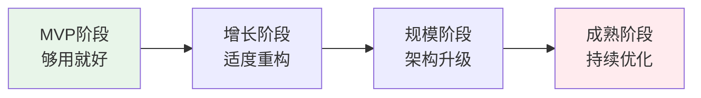

# Web 开发知识体系 — 总览

> 基于金字塔原理构建：结论先行 → 归类分组 → 逻辑递进
> 核心规律：Web开发的本质是「请求→处理→响应」循环，所有技术围绕此展开

---

## 一、金字塔结构



### 各层核心规律

| 层级 | 核心规律 | 一句话总结 |
|------|---------|-----------|
| **顶层** | 请求→处理→响应 | 所有技术围绕此循环 |
| **原理层** | 无状态是常态，层次要解耦 | HTTP无状态，每层管好自己的事 |
| **核心层** | 抽象隐藏复杂，复用创造价值 | 好的抽象让复杂变简单 |
| **实践层** | 测试驱动质量，监控先于问题 | 测不到的代码不可信，看不到的系统不可靠 |
| **深化层** | 场景决定方案，没有银弹 | 合适比先进重要 |
| **管理层** | 人比技术重要，知识产生复利 | 一个人的经验变成团队的，价值倍增 |

---

## 二、文档索引（按层级）

### 📐 第一层：基础原理

| 编号 | 文档 | 核心规律 | 适用场景 |
|:--:|------|---------|---------|
| [01](./01-HTTP与网络基础.md) | HTTP与网络基础 | HTTP无状态，所有会话管理都是额外叠加 | 理解请求生命周期 |
| [02](./02-操作系统与进程模型.md) | 操作系统与进程模型 | 进程隔离内存，线程共享内存，协程轻量级 | 理解PHP-FPM/Go协程 |
| [03](./03-开发全流程方法论.md) | 开发全流程方法论 | 先设计再编码，测试先行，持续交付 | 从需求到上线 |

### ⚙️ 第二层：核心技术

| 编号 | 文档 | 核心规律 | 适用场景 |
|:--:|------|---------|---------|
| [04](./04-算法与数据结构.md) | 算法与数据结构 | 选择合适的结构，时间和空间的权衡 | 面试/性能优化 |
| [05](./05-架构设计原则.md) | 架构设计原则 | 高内聚低耦合，关注点分离 | 系统设计 |
| [06](./06-面向对象与设计模式.md) | 面向对象与设计模式 | 找不变的东西抽象出来 | 代码组织 |

### 🔧 第三层：工程实践

| 编号 | 文档 | 核心规律 | 适用场景 |
|:--:|------|---------|---------|
| [07](./07-代码规范与风格.md) | 代码规范与风格 | 规范的价值在于一致而非对错 | 团队协作 |
| [08](./08-性能优化方法论.md) | 性能优化方法论 | 先测量再优化，用数据说话 | 性能瓶颈排查 |
| [09](./09-数据库设计.md) | 数据库设计 | 索引是速度的代价，事务是一致性的保障 | 表设计/查询优化 |
| [10](./10-缓存系统设计.md) | 缓存系统设计 | 缓存是空间的换时间，一致性vs性能权衡 | 热点数据/减少DB压力 |
| [11](./11-消息队列.md) | 消息队列 | 解耦+削峰+异步，可靠投递三层保障 | 异步处理/流量控制 |
| [12](./12-容器化与CI-CD.md) | 容器化与CI/CD | 自动化消除人为错误，可重复即可靠 | 部署/发布 |
| [13](./13-前端工程化.md) | 前端工程化 | 组件化复用，构建优化加载 | 前端项目 |
| [14](./14-后端工程化.md) | 后端工程化 | Service层封装业务，Repository层封装数据 | 后端项目 |

### 🚀 第四层：专项深化

| 编号 | 文档 | 核心规律 | 适用场景 |
|:--:|------|---------|---------|
| [15](./15-PHP深度解析.md) | PHP深度解析 | PHP-FPM进程模型，理解生命周期是优化基础 | PHP项目 |
| [16](./16-Go语言与高并发.md) | Go语言与高并发 | goroutine轻量级，channel通信，适合高并发 | 网关/实时服务 |
| [17](./17-Python与AI集成.md) | Python与AI集成 | Python强在数据/AI，PHP强在Web，两者互补 | AI功能集成 |
| [18](./18-系统安全设计.md) | 系统安全设计 | 永远不要信任用户输入，安全是持续过程 | 安全加固 |

### 👥 第五层：团队管理

| 编号 | 文档 | 核心规律 | 适用场景 |
|:--:|------|---------|---------|
| [19](./19-技术团队管理.md) | 技术团队管理 | 管理是通过他人拿结果，不是自己做更多 | 团队负责人 |
| [20](./20-持续学习与成长.md) | 持续学习与成长 | 学习曲线决定竞争力，T型发展最稳健 | 个人成长 |

---

## 三、快速决策树

### 遇到问题时，先判断属于哪一层



### 技术选型时，先看这个矩阵

```mermaid
quadrantChart
    title 技术选型四象限
    x-axis 学习成本:低 --> 学习成本:高
    y-axis 适用规模:小 --> 适用规模:大
    quadrant-1 成熟稳定方案
    quadrant-2 需谨慎评估
    quadrant-3 快速上手方案
    quadrant-4 长期投入方案
    
    "Laravel": [0.3, 0.6]
    "Go+Gin": [0.4, 0.8]
    "MySQL+Redis": [0.2, 0.7]
    "K8s+微服务": [0.8, 0.9]
    "MongoDB": [0.3, 0.5]
    "Elasticsearch": [0.6, 0.7]
```

---

## 四、核心思维模型

### 4.1 权衡思维（Trade-off）

> **任何技术选择都是权衡，没有完美方案，只有最适合当前场景的方案。**

| 维度 | 选项A | 选项B | 如何选择 |
|------|-------|-------|---------|
| 一致性 vs 可用性 | 强一致（ACID） | 最终一致（BASE） | 金融选A，社交选B |
| 性能 vs 可维护性 | 手写SQL | ORM | 热点选A，常规选B |
| 开发速度 vs 运行效率 | 动态语言 | 静态语言 | 初创选A，稳定期选B |
| 单体 vs 微服务 | 开发简单 | 扩展灵活 | 小团队选A，大团队选B |

### 4.2 分层思维（Layering）

> **每一层只关心自己的职责，通过接口与上下层通信。**

```
表现层（Controller/UI）→ 只负责接收请求和返回响应
业务层（Service）       → 只负责业务逻辑编排
领域层（Domain）        → 只负责业务规则和数据一致性
基础设施层（Repository）→ 只负责数据持久化
```

### 4.3 演进思维（Evolution）

> **不要过度设计，让架构随需求演进。**



---

## 五、常见问题速查

| 问题 | 所属层级 | 查看文档 | 核心思路 |
|------|---------|---------|---------|
| 请求很慢 | 实践层 | 08/09 | 先EXPLAIN看执行计划，再加索引 |
| 缓存失效了 | 实践层 | 10 | 区分雪崩/穿透/击穿，分别处理 |
| 代码乱看不懂 | 核心层 | 05/06 | 检查是否符合SOLID，是否职责单一 |
| 团队进度慢 | 管理层 | 19 | 检查是否有清晰的技术决策和Code Review |
| 数据库锁表 | 实践层 | 09 | 检查长事务、大事务、缺索引 |
| 前端首屏慢 | 实践层 | 13 | 代码分割、懒加载、CDN加速 |

---

## 六、学习路径建议

### 初学者路径（0→1）

```
第1周：01 → 02 → 03 → 05（建立整体认知）
第2周：04 → 06 → 07（理解核心概念）
第3-4周：08 → 09 → 10 → 14（掌握工程实践）
第5周起：按需深入 15/16/17/18
```

### 进阶者路径（1→10）

```
架构方向：05 → 06 → 08 → 09 → 10 → 11 → 18
性能方向：08 → 09 → 10 → 13 → 14
管理方向：19 → 20 → 05 → 18
全栈方向：13 → 14 → 09 → 10 → 15/16/17
```

---

> 📌 **使用建议：** 
> - 想理解"为什么" → 看「原理层」
> - 想理解"是什么" → 看「核心层」
> - 想知道"怎么做" → 看「实践层」
> - 想深入某个领域 → 看「专项层」
> - 想提升团队效能 → 看「管理层」
