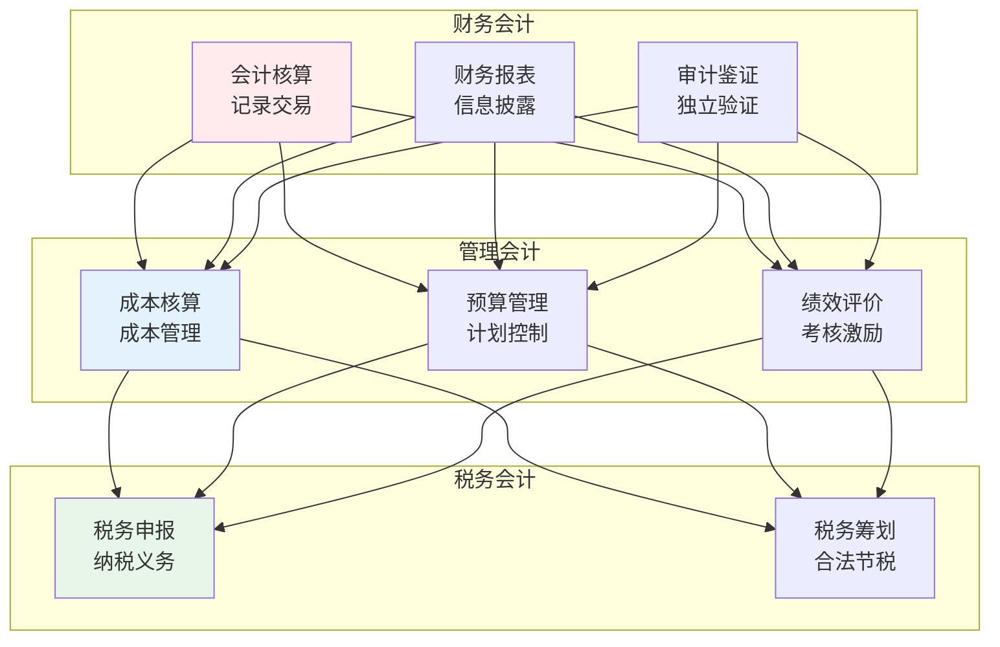
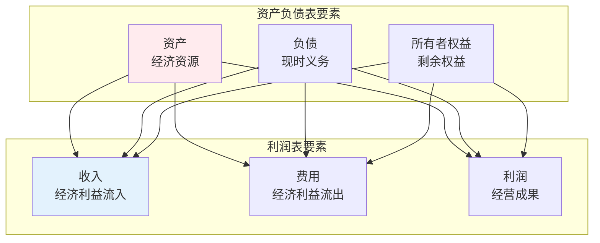
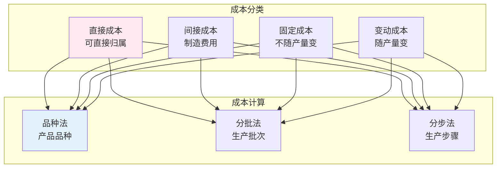

# 会计学

> **核心观点**：会计是计量、分析和报告财务信息的学科，为经济决策提供依据。

---

## 📊 会计体系



---

## 📋 财务会计

### 会计基本假设

| 假设 | 内涵 | 意义 |
|------|------|------|
| 会计主体 | 独立核算单位 | 界定范围 |
| 持续经营 | 长期运营 | 计价基础 |
| 会计分期 | 定期报告 | 时间划分 |
| 货币计量 | 统一计量单位 | 可比性 |

### 会计要素



### 会计等式

```
基本会计等式：
资产 = 负债 + 所有者权益

扩展会计等式：
资产 + 费用 = 负债 + 所有者权益 + 收入
```

---

## 📈 财务报表

### 报表体系

| 报表 | 内容 | 编制基础 |
|------|------|----------|
| 资产负债表 | 财务状况 | 时点数据 |
| 利润表 | 经营成果 | 时期数据 |
| 现金流量表 | 现金变动 | 时期数据 |
| 所有者权益变动表 | 权益变化 | 时期数据 |

### 财务比率分析

| 类别 | 指标 | 公式 | 意义 |
|------|------|------|------|
| 偿债能力 | 流动比率 | 流动资产/流动负债 | 短期偿债 |
| 偿债能力 | 资产负债率 | 负债/资产 | 长期偿债 |
| 盈利能力 | 净资产收益率 | 净利润/净资产 | 盈利水平 |
| 盈利能力 | 毛利率 | 毛利/收入 | 盈利空间 |
| 营运能力 | 总资产周转率 | 收入/资产 | 运营效率 |

---

## 💰 管理会计

### 成本核算



### 预算管理

| 预算类型 | 内容 | 作用 |
|----------|------|------|
| 销售预算 | 销售收入 | 起点预算 |
| 生产预算 | 生产数量 | 衔接销售 |
| 成本预算 | 成本费用 | 控制支出 |
| 现金预算 | 现金流量 | 资金管理 |

### 本量利分析

```
本量利分析公式：
利润 = 销售收入 - 变动成本 - 固定成本
利润 = 单价×销量 - 单位变动成本×销量 - 固定成本
利润 = (单价 - 单位变动成本)×销量 - 固定成本
```

---

## 🎯 核心结论

### 会计基本原则

1. **真实性**：如实反映经济活动
2. **相关性**：信息有用
3. **可比性**：口径一致
4. **及时性**：及时提供
5. **实质重于形式**：经济实质优先

### 会计发展趋势

```
会计四大趋势：
1. 信息化：财务共享中心
2. 智能化：AI辅助核算
3. 战略化：管理会计转型
4. 国际化：准则趋同
```

---

## 📚 参考文献

1. 《基础会计》- 中国人民大学
2. 《财务会计》- 中国人民大学
3. 《管理会计》- 中国人民大学
4. 《成本会计》- 中国人民大学
5. 《审计学》- 中国人民大学
6. 《税法》- 中国人民大学
7. 《财务管理》- 中国人民大学
8. 《会计准则》- 财政部