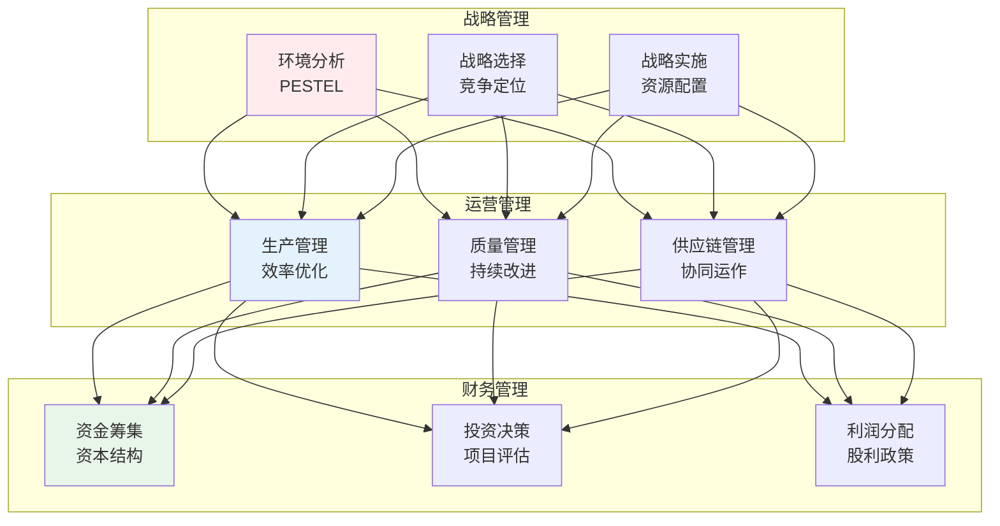
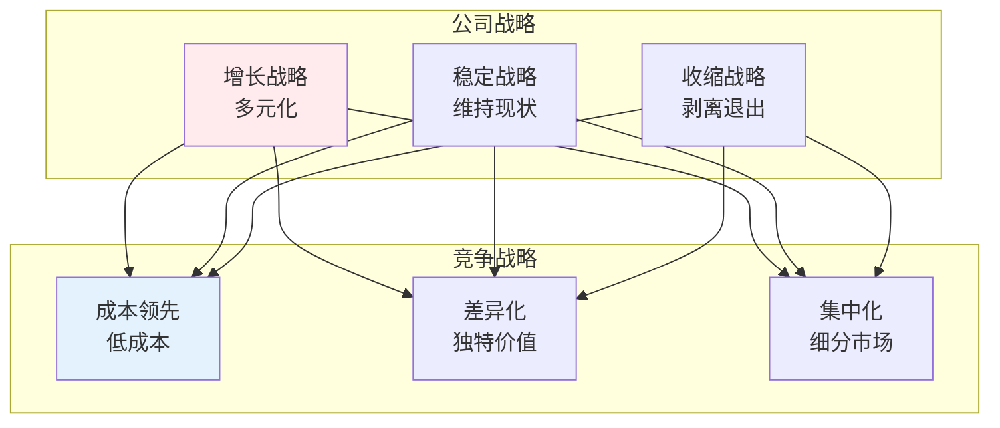
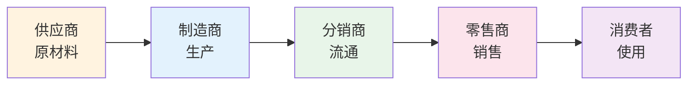
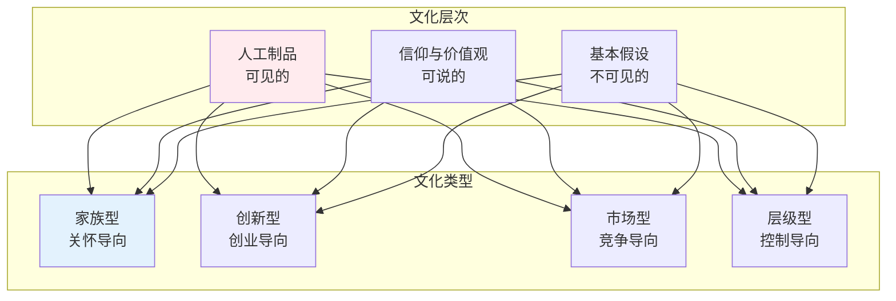

# 企业管理

> **核心观点**：企业管理是研究企业如何有效运营、实现目标的学科，核心是资源配置与组织协调。

---

## 📊 企业管理框架



---

## 🎯 战略管理

### 战略分析工具

| 工具 | 分析内容 | 应用 |
|------|----------|------|
| PESTEL | 宏观环境 | 政治、经济、社会、技术、环境、法律 |
| 波特五力 | 行业竞争 | 竞争者、供应商、买方、替代品、新进入者 |
| SWOT | 综合分析 | 优势、劣势、机会、威胁 |
| 价值链 | 内部能力 | 基本活动、支持活动 |

### 战略类型



---

## ⚙️ 运营管理

### 生产管理

| 概念 | 内涵 | 方法 |
|------|------|------|
| 生产计划 | 产出安排 | MRP、ERP |
| 库存管理 | 库存控制 | JIT、EOQ |
| 产能管理 | 能力规划 | 线性规划 |
| 流程优化 | 效率提升 | 精益生产 |

### 质量管理

```
质量管理三阶段：
1. 质量检验：事后检查
2. 统计质量：过程控制
3. 全面质量：全员参与
```

### 供应链管理



---

## 💰 财务管理

### 财务报表

| 报表 | 内容 | 作用 |
|------|------|------|
| 资产负债表 | 财务状况 | 资产、负债、权益 |
| 利润表 | 经营成果 | 收入、成本、利润 |
| 现金流量表 | 现金变动 | 经营、投资、筹资 |

### 财务分析

| 指标 | 公式 | 意义 |
|------|------|------|
| 流动比率 | 流动资产/流动负债 | 短期偿债 |
| 资产负债率 | 负债/资产 | 长期偿债 |
| 净资产收益率 | 净利润/净资产 | 盈利能力 |
| 总资产周转率 | 收入/资产 | 运营效率 |

### 投资决策

```
投资评估方法：
1. 净现值法：NPV
2. 内部收益率法：IRR
3. 回收期法：PP
4. 获利指数法：PI
```

---

## 🏢 组织管理

### 组织结构

| 类型 | 特征 | 优点 | 缺点 |
|------|------|------|------|
| 直线制 | 垂直指挥 | 简单明确 | 缺乏分工 |
| 职能制 | 专业分工 | 效率高 | 多头领导 |
| 事业部制 | 产品/地区划分 | 灵活自主 | 资源重复 |
| 矩阵制 | 双重汇报 | 资源共享 | 指挥混乱 |

### 组织文化



---

## 🎯 核心结论

### 企业管理原则

1. **目标导向**：明确企业使命
2. **效率优先**：优化资源配置
3. **顾客至上**：创造客户价值
4. **持续创新**：保持竞争优势
5. **社会责任**：承担社会义务

### 管理发展趋势

```
企业管理四大趋势：
1. 数字化转型：智能化运营
2. 敏捷管理：快速响应
3. 平台化组织：生态协同
4. 员工体验：人本管理
```

---

## 📚 参考文献

1. 德鲁克《管理的实践》
2. 波特《竞争战略》
3. 彼得·圣吉《第五项修炼》
4. 柯林斯《从优秀到卓越》
5. 明茨伯格《管理者而非MBA》
6. 哈佛商业评论
7. 《管理学》- 罗宾斯
8. 《战略管理》- 迈克尔·波特