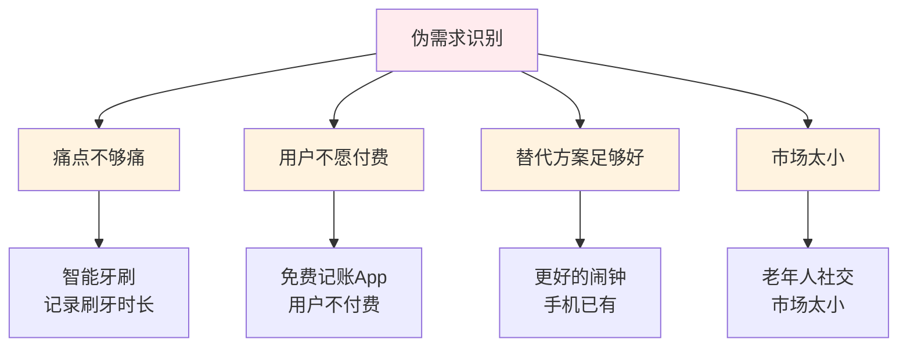
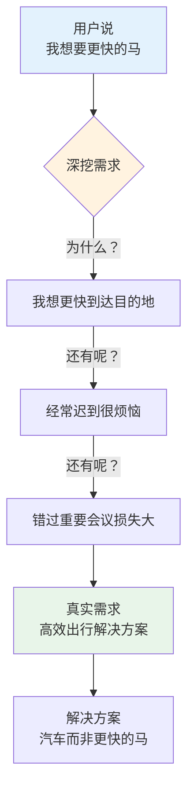
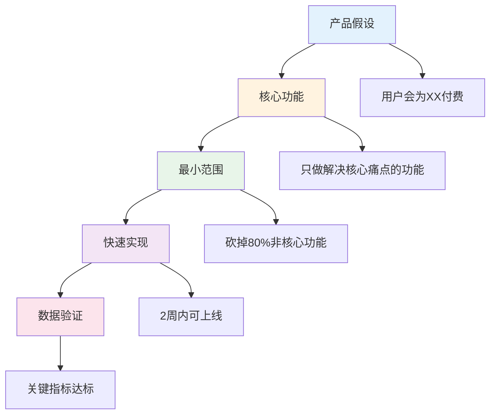

# 需求验证实战 — 判断需求真假的核心方法

> 90%的创业失败源于伪需求，掌握需求验证是创业第一课

---

## 一、什么是真需求 vs 伪需求

### 1.1 需求判断公式

```
真需求 = 痛点强度 × 用户规模 × 支付意愿 × 替代方案不足
```

| 维度 | 真需求特征 | 伪需求特征 |
|------|------------|------------|
| 痛点强度 | 不解决会死 | 有了更好 |
| 用户规模 | 大众刚需 | 小众爱好 |
| 支付意愿 | 愿意付费 | 只想免费 |
| 替代方案 | 现有方案很差 | 已有完美方案 |

### 1.2 经典伪需求案例



---

## 二、用户访谈实战

### 2.1 访谈前准备

| 准备事项 | 具体内容 |
|----------|----------|
| 目标用户 | 明确画像，找10个以上 |
| 访谈问题 | 开放式问题，不引导 |
| 记录工具 | 录音+笔记 |
| 心态 | 学习者，不是推销者 |

### 2.2 访谈问题框架

**错误问法：**
- "你觉得这个功能有用吗？"（引导性）
- "你会用这个产品吗？"（假设性）

**正确问法：**
```
1. 你目前怎么解决[问题]？
2. 这个方案有什么不好？
3. 你为此花了多少钱/时间？
4. 如果有更好的方案，你愿意付多少钱？
5. 你能描述一下上次遇到这个问题的场景吗？
```

### 2.3 需求挖掘案例



---

## 三、MVP设计原则

### 3.1 MVP定义

```
MVP = 最小可行产品
     = 只做核心功能
     = 用最低成本验证假设
```

### 3.2 MVP设计框架



### 3.3 MVP类型对比

| 类型 | 实现方式 | 适用场景 | 成本 |
|------|----------|----------|------|
| 落地页MVP | 静态页面+表单 | 验证付费意愿 | 极低 |
| 视频MVP | 产品演示视频 | 验证概念接受度 | 低 |
| 人工MVP | 人工替代产品 | 验证服务需求 | 中 |
| 众筹MVP | 众筹平台 | 验证付费意愿+筹集资金 | 中 |
| 代码MVP | 最小功能产品 | 验证产品体验 | 高 |

---

## 四、实战案例

### 4.1 案例：Dropbox验证需求

**背景：** 文件同步是个普遍痛点

**验证方法：**
1. 制作产品演示视频（成本：$0）
2. 发布到Hacker News
3. 观察注册量

**结果：**
- 视频发布后，注册量从5000涨到75000
- 验证了需求真实性

**启示：** 不需要写代码，先验证需求

### 4.2 案例：Zappos验证需求

**背景：** 网上卖鞋，担心用户不接受

**验证方法：**
1. 去实体店拍照
2. 上传到网站
3. 用户下单后，去实体店买来寄出

**结果：**
- 验证了用户愿意网上买鞋
- 后来被Amazon收购

**启示：** 用最笨的方法验证最核心的假设

### 4.3 案例：Airbnb验证需求

**背景：** 人们愿意把房子租给陌生人吗？

**验证方法：**
1. 找到3个愿意出租的房东
2. 帮他们拍照、发布
3. 观察是否有租客

**结果：**
- 第一周就有订单
- 验证了供需两端

**启示：** 从一个小切口开始，验证核心假设

---

## 五、需求验证检查清单

### 访谈前

- [ ] 明确要验证的假设
- [ ] 选择10个目标用户
- [ ] 准备开放式问题
- [ ] 准备记录工具

### 访谈中

- [ ] 不引导用户
- [ ] 多问"为什么"
- [ ] 记录原话
- [ ] 观察情绪反应

### 访谈后

- [ ] 整理访谈记录
- [ ] 识别共同痛点
- [ ] 判断需求真假
- [ ] 设计MVP验证

---

## 六、常见误区

| 误区 | 正确做法 |
|------|----------|
| 朋友说好就是好需求 | 找目标用户验证 |
| 专家说有市场 | 自己去验证 |
| 竞品有需求 | 分析竞品不足 |
| 数据显示有需求 | 看付费数据 |
| 愿意注册就是需求 | 看付费转化 |

---

## 七、下一步行动

1. 选择一个你想验证的需求
2. 写出你的核心假设
3. 找10个目标用户访谈
4. 根据反馈设计MVP
5. 2周内上线验证

---

> **记住：不要爱上你的想法，要爱上用户的问题。**
