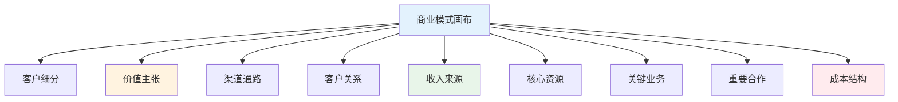
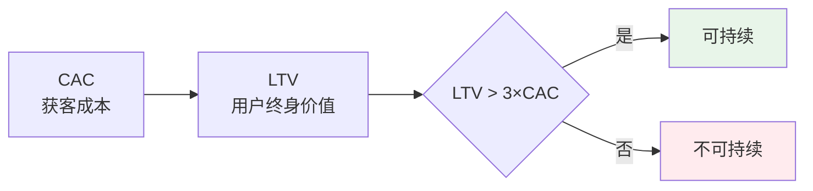
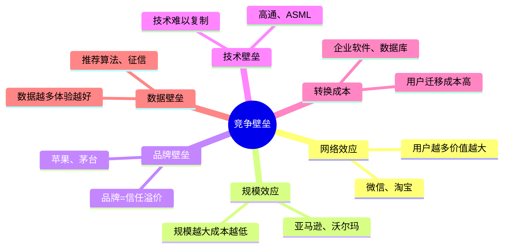

# 商业模式设计 — 构建可持续盈利模型

> 80%的创业者搞不清商业模式，导致有用户无收入

---

## 一、商业模式核心公式

```
收入 = 流量 × 转化率 × 客单价 × 复购率
利润 = 收入 - 成本
```

### 商业模式画布详解



---

## 二、六种盈利模式对比

| 模式 | 核心逻辑 | 典型案例 | 适合场景 |
|------|----------|----------|----------|
| 直接销售 | 卖产品赚钱 | 电商、零售 | 标准化产品 |
| 订阅制 | 持续收费 | Netflix、SaaS | 高频使用 |
| 平台佣金 | 抽成 | 淘宝、滴滴 | 连接供需 |
| 广告模式 | 流量变现 | 百度、抖音 | 高流量 |
| 增值服务 | 基础免费+高级付费 | 微信、游戏 | 用户基数大 |
| 数据服务 | 数据变现 | 征信、大数据 | 数据壁垒 |

---

## 三、单位经济模型

### 3.1 核心指标



### 3.2 计算公式

```
CAC = 总获客成本 / 新用户数
LTV = 平均客单价 × 购买频次 × 用户生命周期
ROI = (LTV - CAC) / CAC
```

### 3.3 案例：SaaS公司经济模型

| 指标 | 数值 | 分析 |
|------|------|------|
| 月费 | ¥500 | 客单价 |
| 流失率 | 5%/月 | 留存率95% |
| 生命周期 | 20个月 | 1/5% |
| LTV | ¥10,000 | 500×20 |
| CAC | ¥2,000 | 获客成本 |
| LTV/CAC | 5 | 健康（>3） |

---

## 四、竞争壁垒设计

### 4.1 壁垒类型



### 4.2 壁垒强度排序

| 壁垒类型 | 强度 | 构建难度 | 典型行业 |
|----------|------|----------|----------|
| 网络效应 | ⭐⭐⭐⭐⭐ | 极难 | 平台、社交 |
| 数据壁垒 | ⭐⭐⭐⭐ | 难 | AI、大数据 |
| 品牌壁垒 | ⭐⭐⭐⭐ | 难 | 消费品、奢侈品 |
| 转换成本 | ⭐⭐⭐ | 中 | 企业软件 |
| 规模效应 | ⭐⭐⭐ | 中 | 电商、物流 |
| 技术壁垒 | ⭐⭐ | 易被突破 | 硬科技 |

---

## 五、实战案例

### 5.1 案例：拼多多的商业模式创新

**传统电商模式：**
- 搜索→浏览→下单→配送
- 流量越来越贵

**拼多多模式：**
- 社交裂变→拼团→下单→配送
- 用户带来用户，CAC极低

**关键创新：**
1. 社交裂变降低获客成本
2. 团购提升转化率
3. 下沉市场差异化定位

### 5.2 案例：Costco的盈利模式

**传统零售：** 赚差价
**Costco：** 赚会员费

```
商品毛利率：1%（几乎不赚钱）
会员费：$60/年
会员数：1亿+
会员费收入：$60亿/年
```

**启示：** 找到独特的盈利模式，不走寻常路

### 5.3 案例：字节跳动的广告模式

**传统媒体：** 内容制作→发行→广告
**字节跳动：** 算法推荐→精准广告

**关键：**
1. 算法提升内容分发效率
2. 精准推荐提升广告效果
3. 用户规模带来网络效应

---

## 六、商业模式设计检查清单

### 核心问题

- [ ] 你为谁创造价值？（客户细分）
- [ ] 你创造什么价值？（价值主张）
- [ ] 如何触达用户？（渠道通路）
- [ ] 如何赚钱？（收入来源）
- [ ] 成本结构是什么？（成本结构）

### 可持续性检验

- [ ] LTV > 3×CAC？
- [ ] 有竞争壁垒吗？
- [ ] 用户会重复购买吗？
- [ ] 能规模化吗？
- [ ] 团队能执行吗？

---

## 七、常见商业模式陷阱

| 陷阱 | 表现 | 后果 |
|------|------|------|
| 薄利多销 | 毛利太低 | 赚不到钱 |
| 免费陷阱 | 用户不付费 | 无法盈利 |
| 补贴获客 | 烧钱换用户 | 补贴停用户走 |
| 单一收入 | 只有一个收入源 | 风险集中 |
| 忽视留存 | 只关注获客 | 用户流失快 |

---

> **记住：好的商业模式是让用户帮你赚钱，而不是你花钱买用户。**
