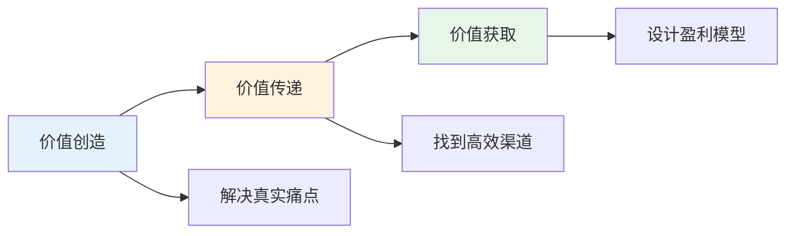
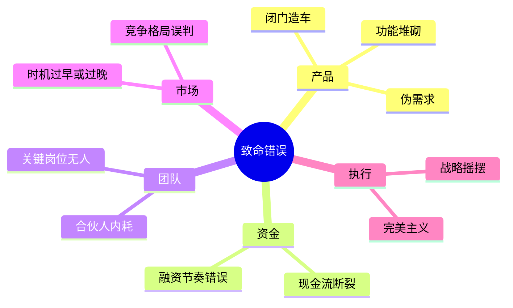
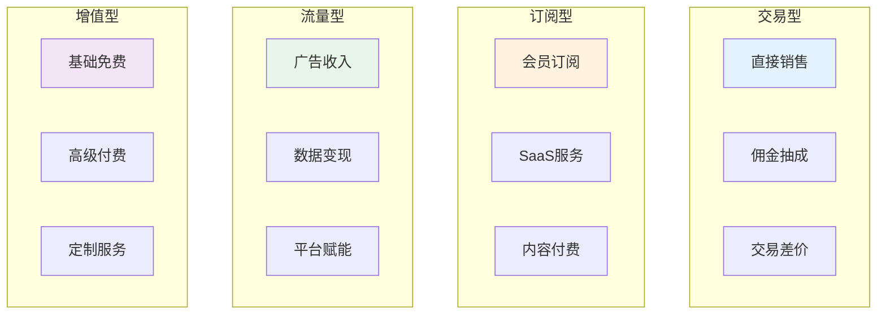
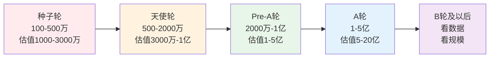
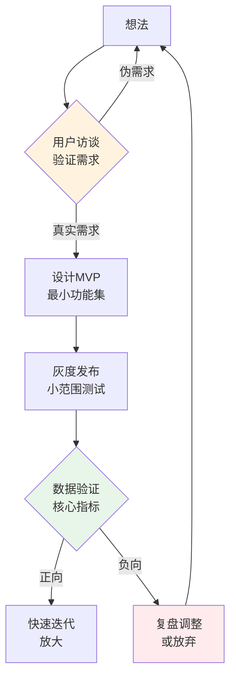
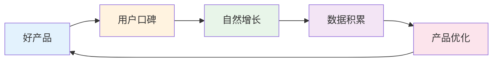

# 商业创业 — 行业内幕与核心认知

> 创业成功率只有1-2%，但掌握核心规律可显著提升胜率
> 目标：用最短时间理解商业本质，避免常见致命错误

---

## 一、创业核心规律

### 1.1 商业本质公式

**核心公式：** `收入 = 流量 × 转化率 × 客单价 × 复购率`

| 要素 | 外行踩坑 | 内行做法 |
|------|----------|----------|
| 流量 | 盲目投广告，烧钱获客 | 先验证自然流量，再放大 |
| 转化率 | 只关注流量，忽略转化 | 先优化转化到5%以上 |
| 客单价 | 打价格战，利润见底 | 做价值差异化，提升溢价 |
| 复购率 | 一锤子买卖 | 建立用户资产，私域运营 |

---

## 二、创业者必须避开的坑

### 2.1 致命错误TOP10

**外行常犯 vs 内行做法：**

| 场景 | 外行做法 | 内行做法 |
|------|----------|----------|
| 有想法 | 直接开干 | 先验证需求，做MVP |
| 找合伙人 | 找朋友/同学 | 价值观一致+能力互补 |
| 融资 | 有钱就拿 | 选择战略投资人 |
| 竞争 | 拼命模仿对手 | 差异化定位 |
| 增长 | 烧钱换增长 | 单位经济模型为正 |

---

## 三、商业模式设计

### 3.1 常见盈利模式

### 3.2 商业模式画布

| 模块 | 核心问题 | 内行思考 |
|------|----------|----------|
| 价值主张 | 为什么选你？ | 差异化价值，不是功能堆砌 |
| 客户细分 | 谁付钱？ | 找到"最痛"的细分市场 |
| 渠道通路 | 怎么触达？ | 先跑通1个渠道再复制 |
| 客户关系 | 如何留存？ | 建立用户资产，私域运营 |
| 收入来源 | 怎么赚钱？ | 多元化收入，降低风险 |
| 核心资源 | 凭什么做？ | 不可复制的核心壁垒 |
| 关键业务 | 做什么？ | 聚焦核心，砍掉非核心 |
| 重要合作 | 谁帮忙？ | 战略合作伙伴 |
| 成本结构 | 花多少？ | 可变成本优先 |

---

## 四、融资认知

### 4.1 融资阶段与估值

**内行融资心法：**
- **融资时机**：账上现金够活6个月时开始
- **估值逻辑**：不是越高越好，要匹配增长预期
- **投资人选择**：要钱还是要资源？战略投资人更值钱
- **Term Sheet**：不是签了就完了，条款决定退出

### 4.2 股权结构设计

| 阶段 | 创始人 | 联创 | 期权池 | 投资人 |
|------|--------|------|--------|--------|
| 初始 | 100% | - | 0% | 0% |
| 天使后 | 70-80% | 10-15% | 10-15% | 10-20% |
| A轮后 | 50-60% | 10-15% | 15-20% | 20-30% |

**关键原则：**
- 创始人要有控制权（51%以上投票权）
- 期权池要提前预留（15-20%）
- 同股不同权是保护创始人的利器

---

## 五、产品思维

### 5.1 MVP验证流程

**外行 vs 内行：**

| 阶段 | 外行做法 | 内行做法 |
|------|----------|----------|
| 想法 | 直接开发 | 先做用户访谈 |
| MVP | 功能完整 | 只做核心功能 |
| 发布 | 大张旗鼓 | 灰度测试 |
| 验证 | 凭感觉 | 看数据指标 |

### 5.2 产品增长飞轮

---

## 六、落地清单

### 创业前必做

- [ ] 验证需求：访谈10个以上目标用户
- [ ] 竞品分析：了解市场格局和空白点
- [ ] 商业计划：用一页纸说清楚商业模式
- [ ] 团队组建：能力互补、价值观一致
- [ ] 资金规划：准备18个月运营资金

### 产品上线前必做

- [ ] MVP定义：砍掉非核心功能
- [ ] 数据埋点：核心转化路径可追踪
- [ ] 灰度策略：小范围验证再放大
- [ ] 反馈机制：建立用户反馈渠道
- [ ] 运营预案：准备好增长和留存策略

---

## 七、推荐阅读

- 《精益创业》— MVP思维
- 《商业模式新生代》— 商业模式画布
- 《从0到1》— 创新思维
- 《创业维艰》— 创业者心理建设
- 《增长黑客》— 数据驱动增长
