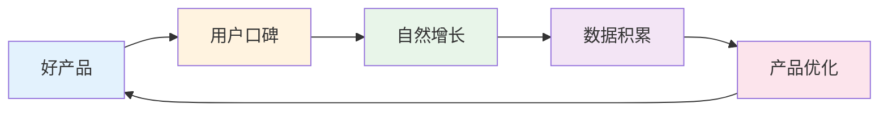
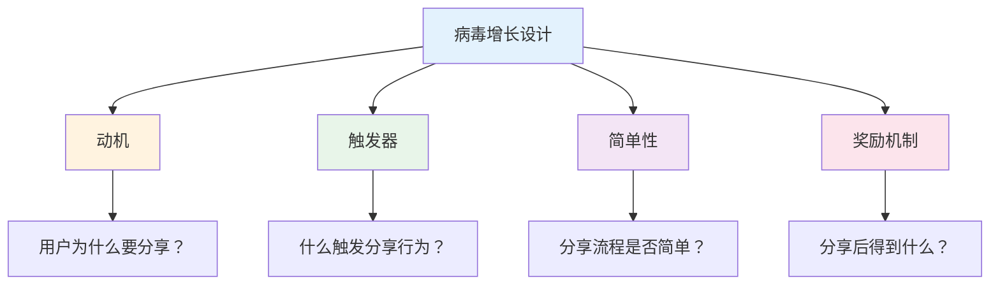
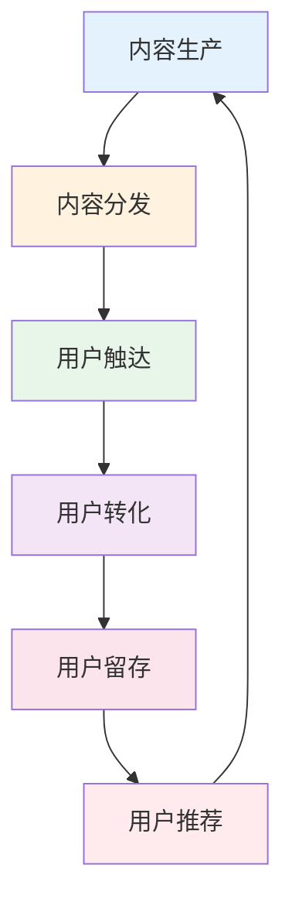

# 增长引擎搭建 — 低成本获客的实战方法

> 增长不是砸钱，而是找到正确的杠杆点

---

## 一、增长飞轮模型



### 增长公式

```
增长 = 自然增长 + 付费增长
自然增长 = 口碑推荐 + 内容引流 + SEO
付费增长 = 广告投放 + 渠道合作 + 地推
```

---

## 二、四大增长引擎

| 引擎类型 | 核心逻辑 | 适用阶段 | 典型案例 |
|----------|----------|----------|----------|
| 病毒式增长 | 用户带来用户 | 早期 | 拼多多、Dropbox |
| 内容增长 | 优质内容引流 | 中期 | 小红书、B站 |
| 付费增长 | 广告投放获客 | 成熟期 | 淘宝直通车 |
| 销售增长 | 地推团队获客 | B2B | 企业软件 |

---

## 三、病毒式增长

### 3.1 病毒系数计算

```
病毒系数 K = 邀请数 × 转化率
K > 1：指数增长
K = 1：线性增长
K < 1：增长停滞
```

### 3.2 病毒增长案例

**Dropbox推荐机制：**
```
邀请好友 → 双方各得500MB空间
结果：3900%增长，0广告成本
```

**拼多多砍价：**
```
发起砍价 → 分享给好友 → 好友帮砍
结果：用户自发传播，CAC极低
```

### 3.3 病毒增长设计要点



---

## 四、内容增长

### 4.1 内容增长漏斗



### 4.2 内容平台选择

| 平台 | 用户特征 | 适合内容 | 获客成本 |
|------|----------|----------|----------|
| 小红书 | 女性、年轻 | 种草、攻略 | 中 |
| B站 | 年轻、深度 | 教程、测评 | 低 |
| 抖音 | 大众、碎片 | 短视频 | 中 |
| 知乎 | 高知、专业 | 深度文章 | 低 |
| 微信公众号 | 泛人群 | 深度内容 | 高 |

### 4.3 内容创作公式

```
爆款内容 = 用户痛点 × 情绪共鸣 × 实用价值 × 传播性
```

| 要素 | 说明 | 案例 |
|------|------|------|
| 痛点 | 戳中用户问题 | "月薪5000如何存钱" |
| 情绪 | 引发共鸣 | "35岁失业的焦虑" |
| 实用 | 提供价值 | "10个省钱技巧" |
| 传播 | 便于分享 | 清单、对比、故事 |

---

## 五、付费增长

### 5.1 广告投放ROI

```
ROI = (广告带来的收入 - 广告成本) / 广告成本
```

### 5.2 渠道效果对比

| 渠道 | 特点 | 适合行业 | ROI参考 |
|------|------|----------|---------|
| 百度SEM | 搜索意图强 | B2B、教育 | 3-5 |
| 信息流 | 兴趣推荐 | 消费品 | 2-4 |
| 小红书 | 种草转化 | 美妆、母婴 | 3-6 |
| 抖音 | 短视频 | 娱乐、消费品 | 2-5 |
| 微信广告 | 精准定向 | 各行业 | 2-4 |

### 5.3 广告投放检查清单

- [ ] 明确投放目标（品牌/转化）
- [ ] 精准人群定位
- [ ] 素材A/B测试
- [ ] 落地页优化
- [ ] 数据追踪设置
- [ ] ROI持续监控

---

## 六、增长实战案例

### 6.1 案例：瑞幸咖啡的增长

**增长策略：**
1. 首杯免费（降低尝试门槛）
2. 邀请好友各得一杯（病毒增长）
3. 高频优惠券（提升复购）
4. 门店密集覆盖（便利性）

**结果：** 18个月上市

### 6.2 案例：知识付费的增长

**增长策略：**
1. 免费内容引流（知乎、公众号）
2. 低价体验课（9.9元）
3. 高价正价课转化
4. 老学员推荐返现

**关键：** 内容获客 + 信任转化 + 裂变增长

### 6.3 案例：B2B SaaS增长

**增长策略：**
1. 免费工具引流
2. 内容营销获客
3. 销售跟进转化
4. 客户成功续费

**关键：** 产品驱动增长（PLG）

---

## 七、增长避坑指南

| 陷阱 | 表现 | 后果 |
|------|------|------|
| 盲目烧钱 | 只看规模不看ROI | 资金链断裂 |
| 忽视留存 | 只关注获客 | 用户流失快 |
| 渠道依赖 | 过度依赖单一渠道 | 渠道变化就死 |
| 数据造假 | 虚假繁荣 | 决策失误 |
| 急于求成 | 跳过验证直接放大 | 浪费资源 |

---

## 八、增长行动清单

### 第一步：确定增长指标

- [ ] 核心指标：DAU/MAU/收入
- [ ] 北极星指标：最能反映价值的指标
- [ ] 辅助指标：漏斗各环节指标

### 第二步：选择增长策略

- [ ] 产品驱动增长（PLG）
- [ ] 内容驱动增长
- [ ] 付费驱动增长
- [ ] 销售驱动增长

### 第三步：执行与迭代

- [ ] 小范围测试
- [ ] 数据验证
- [ ] 优化迭代
- [ ] 规模化放大

---

> **记住：增长的本质是让用户帮你传播，而不是你花钱买用户。**
