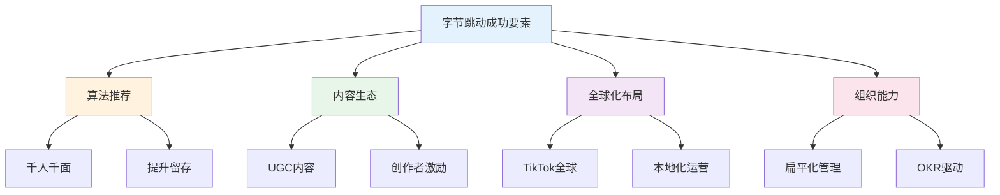
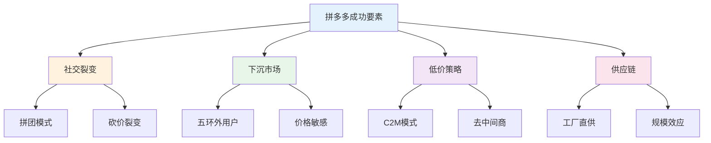
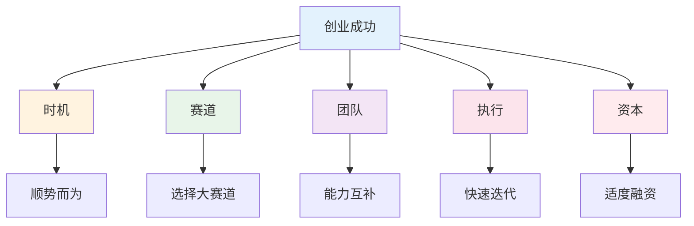
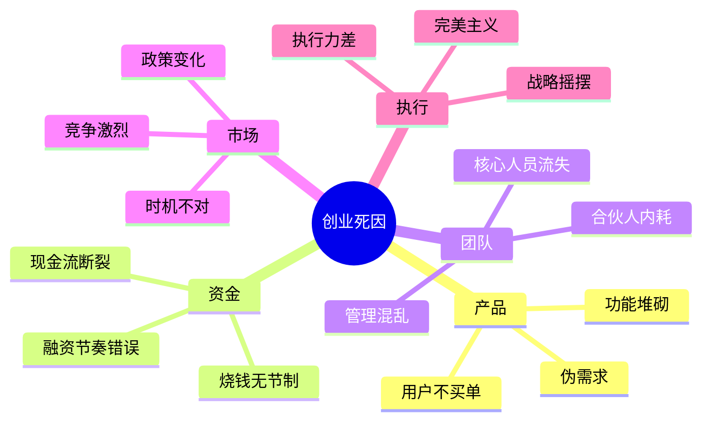
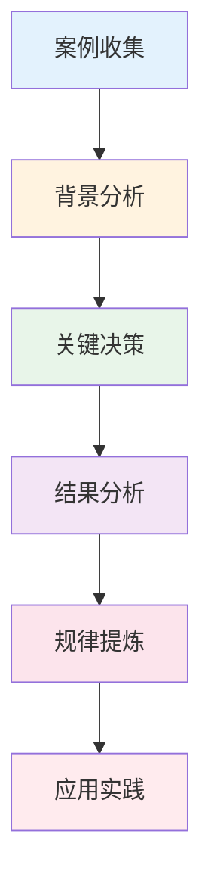

# 创业案例复盘 — 成功与失败的规律

> 从真实案例中学习，避免重复别人的错误

---

## 一、成功案例分析

### 1.1 案例：字节跳动



**成功关键：**
1. 技术驱动：算法推荐提升效率
2. 内容生态：UGC内容降低成本
3. 全球化：TikTok打开海外市场
4. 组织力：扁平管理+OKR

### 1.2 案例：拼多多



**成功关键：**
1. 社交裂变：降低获客成本
2. 差异化定位：避开淘宝京东
3. C2M模式：工厂直供降成本
4. 下沉市场：抓住价格敏感用户

---

## 二、失败案例分析

### 2.1 案例：瑞幸咖啡财务造假

**失败原因：**
1. 过度追求增长，忽视盈利
2. 内部管理失控
3. 财务造假，信任崩塌

**教训：**
- 增长不等于成功，盈利才是关键
- 组织能力要跟上业务扩张
- 诚信是底线

### 2.2 案例：ofo小黄车

**失败原因：**
1. 烧钱补贴，无盈利模式
2. 押金挪用，资金链断裂
3. 管理混乱，运维成本高

**教训：**
- 补贴只能短期获客，不能长期留存
- 现金流管理是生命线
- 运营效率决定成败

### 2.3 案例：教育双减政策

**失败原因：**
1. 政策风险预判不足
2. 过度依赖资本
3. 商业模式单一

**教训：**
- 关注政策风向
- 不要把鸡蛋放一个篮子
- 商业模式要多元化

---

## 三、成功规律总结

### 3.1 成功要素模型



### 3.2 成功概率公式

```
成功概率 = 时机 × 赛道 × 团队 × 执行 × 资本
```

| 因素 | 权重 | 说明 |
|------|------|------|
| 时机 | 30% | 顺势而为事半功倍 |
| 赛道 | 25% | 天花板决定上限 |
| 团队 | 25% | 人是核心竞争力 |
| 执行 | 15% | 快速迭代试错 |
| 资本 | 5% | 助推但非决定 |

---

## 四、失败规律总结

### 4.1 常见死因



### 4.2 死因分析框架

| 死因类型 | 具体表现 | 预防措施 |
|----------|----------|----------|
| 产品死 | 伪需求、用户不买单 | MVP验证、快速迭代 |
| 资金死 | 现金流断裂 | 控制烧钱、及时融资 |
| 团队死 | 内耗、分裂 | 股权清晰、文化一致 |
| 市场死 | 时机不对、竞争激烈 | 差异化、细分市场 |
| 执行死 | 战略摇摆、执行不力 | 聚焦、专注、坚持 |

---

## 五、案例复盘框架

### 5.1 复盘模板

```
【案例背景】
- 公司/产品：
- 赛道/市场：
- 时间/阶段：

【成功/失败结果】
- 关键数据：
- 最终结果：

【关键决策】
- 决策1：
- 决策2：
- 决策3：

【经验教训】
- 做对了什么：
- 做错了什么：
- 可复制的：

【启示】
- 对我们的启发：
- 可以借鉴的：
- 需要避免的：
```

### 5.2 复盘流程



---

## 六、创业检查清单

### 启动前

- [ ] 验证需求真实性
- [ ] 评估市场规模
- [ ] 组建互补团队
- [ ] 设计商业模式
- [ ] 准备启动资金

### 运营中

- [ ] 保持现金流健康
- [ ] 关注核心指标
- [ ] 快速迭代产品
- [ ] 建立竞争壁垒
- [ ] 保持战略聚焦

### 复盘时

- [ ] 定期复盘决策
- [ ] 学习成功案例
- [ ] 吸取失败教训
- [ ] 调整战略方向
- [ ] 保持学习心态

---

> **记住：创业不是百米冲刺，而是马拉松。活着比什么都重要。**
