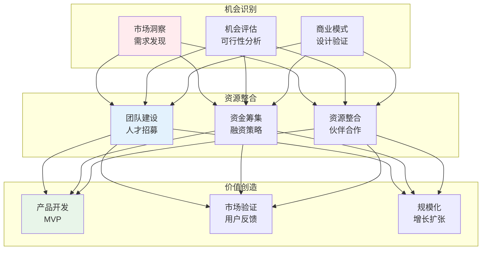
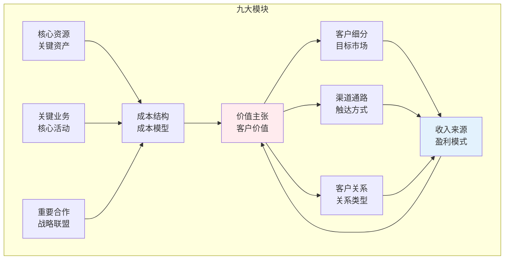
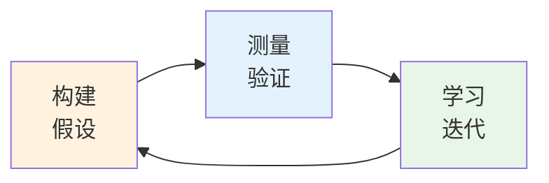
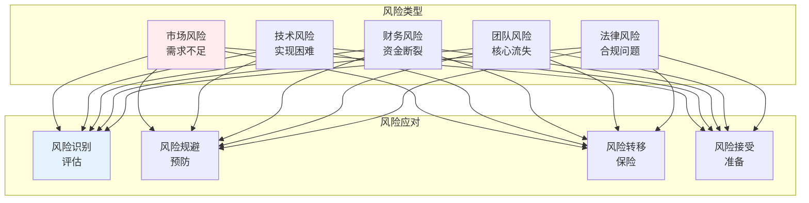

# 商业创业

## 🗂️ 内容导航

| 名称 | 说明 | 链接 |
|------|------|------|
| demand validation practice |  | [进入](01-demand-validation-practice.md) |
| business model design |  | [进入](02-business-model-design.md) |
| 商业创业 — 行业内幕与核心认知 |  | [进入](02-entrepreneurship.md) |
| 增长引擎搭建 — 低成本获客的实战方法 |  | [进入](03-growth-engine.md) |
| 创业案例复盘 — 成功与失败的规律 |  | [进入](04-entrepreneurship-case-studies.md) |

---


> **核心观点**：创业是识别机会、整合资源、创造价值的过程，是推动经济发展的重要力量。

---

## 📊 创业体系



---

## 🎯 商业模式

### 商业模式画布



### 商业模式类型

| 类型 | 特点 | 例子 |
|------|------|------|
| 平台模式 | 连接双方 | 淘宝、滴滴 |
| 订阅模式 | 定期收费 | Netflix、Spotify |
| 免费增值 | 基础免费增值付费 | 微信、Dropbox |
| 硬件+服务 | 硬件引流服务盈利 | 小米、特斯拉 |
| 广告模式 | 免费+广告 | 百度、Google |

---

## 🚀 精益创业

### 精益创业循环



### MVP设计

| MVP类型 | 描述 | 适用场景 |
|---------|------|----------|
| 视频MVP | 演示产品概念 | 验证需求 |
| 众筹MVP | 预售验证 | 产品开发 |
| 单页面MVP | 简单测试 | 市场验证 |
| 人工替代MVP | 人工模拟 | 流程验证 |

---

## 💰 融资策略

### 融资阶段

| 阶段 | 资金来源 | 融资规模 |
|------|----------|----------|
| 种子期 | 创始人、天使 | 10-100万 |
| A轮 | 风险投资 | 100-1000万 |
| B轮 | 风险投资 | 1000万-1亿 |
| C轮及以后 | PE、战略投资 | 1亿以上 |

### 融资方式

```
融资方式对比：
1. 股权融资：出让股份
   - 优点：无还款压力
   - 缺点：稀释控制权

2. 债权融资：借款
   - 优点：保持控制权
   - 缺点：还款压力

3. 混合融资：可转债
   - 优点：灵活转换
   - 缺点：条款复杂
```

---

## 🏢 创业管理

### 团队建设

| 角色 | 职责 | 能力要求 |
|------|------|----------|
| CEO | 战略决策 | 领导力 |
| CTO | 技术实现 | 技术能力 |
| COO | 运营管理 | 执行能力 |
| CMO | 市场营销 | 营销能力 |
| CFO | 财务管理 | 财务能力 |

### 创业风险



---

## 🎯 核心结论

### 创业成功要素

1. **市场机会**：真实需求是基础
2. **团队能力**：执行力是关键
3. **资源获取**：资金和人才
4. **快速迭代**：持续改进
5. **坚持韧性**：克服困难

### 创业心态

```
创业心态四要素：
1. 成长型思维：相信能力可培养
2. 拥抱失败：从失败中学习
3. 客户导向：解决真实问题
4. 长期主义：坚持价值创造
```

---

## 📚 参考文献

1. 埃里克·莱斯《精益创业》
2. 彼得·蒂尔《从0到1》
3. 吉姆·柯林斯《从优秀到卓越》
4. 亚历山大·奥斯特瓦德《商业模式新生代》
5. 盖伊·川崎《创业的艺术》
6. 霍华德·马克斯《投资最重要的事》
7. 《创业管理》- 张玉利
8. 《商业模式创新》- 魏炜