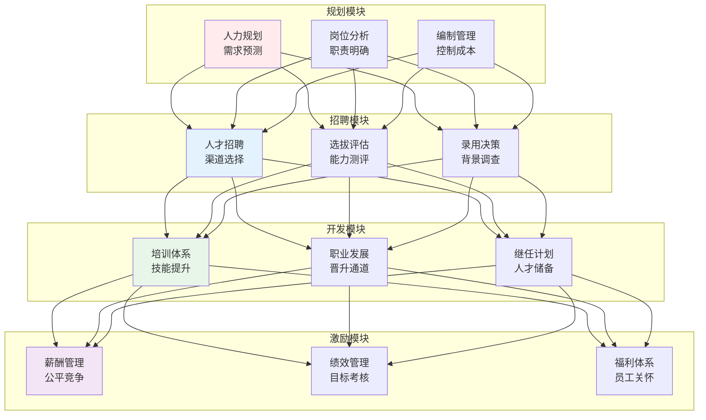
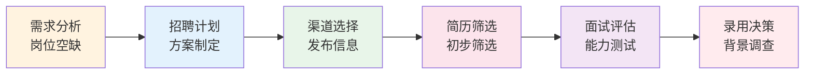
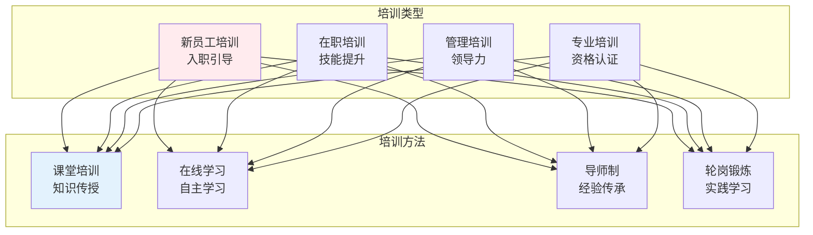
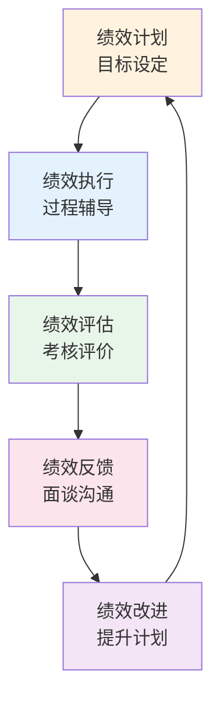

# 人力资源管理

> **核心观点**：人力资源管理是研究如何有效管理组织中人的学科，以实现组织目标和员工发展。

---

## 📊 人力资源管理框架



---

## 📋 岗位分析

### 岗位说明书

| 要素 | 内容 | 作用 |
|------|------|------|
| 岗位标识 | 名称、编号 | 基本信息 |
| 岗位概述 | 主要职责 | 工作内容 |
| 工作职责 | 具体任务 | 责任范围 |
| 任职资格 | 能力要求 | 选拔标准 |
| 工作关系 | 汇报对象 | 组织位置 |

### 岗位分析方法

```
岗位分析方法：
1. 观察法：直接观察工作
2. 访谈法：与任职者交流
3. 问卷法：标准化调查
4. 工作日志法：记录工作活动
```

---

## 👥 招聘与选拔

### 招聘流程



### 面试方法

| 方法 | 特点 | 优点 | 缺点 |
|------|------|------|------|
| 结构化面试 | 标准化问题 | 公平客观 | 灵活性差 |
| 非结构化面试 | 自由提问 | 灵活深入 | 主观性强 |
| 行为面试 | 过去行为预测 | 有效性高 | 准备复杂 |
| 情景面试 | 模拟工作场景 | 直接相关 | 设计复杂 |

### 人才测评

| 测评工具 | 测评内容 | 应用场景 |
|----------|----------|----------|
| 能力测试 | 智力、专业能力 | 岗位匹配 |
| 性格测试 | 人格特质 | 团队建设 |
| 评价中心 | 综合能力 | 管理选拔 |
| 背景调查 | 过往经历 | 风险控制 |

---

## 📈 培训与开发

### 培训体系



### 职业发展

| 发展路径 | 特点 | 适用人群 |
|----------|------|----------|
| 管理通道 | 晋升管理职位 | 领导型人才 |
| 专业通道 | 晋升专业职位 | 技术型人才 |
| 项目通道 | 项目历练 | 综合型人才 |

---

## 💰 薪酬管理

### 薪酬结构

| 组成 | 内容 | 作用 |
|------|------|------|
| 基本工资 | 固定部分 | 基本保障 |
| 绩效工资 | 浮动部分 | 激励作用 |
| 奖金 | 一次性奖励 | 特殊贡献 |
| 福利 | 间接报酬 | 员工关怀 |

### 薪酬设计原则

```
薪酬设计四原则：
1. 外部竞争性：市场对标
2. 内部公平性：岗位价值
3. 个人公平性：绩效差异
4. 法律合规性：符合法规
```

### 绩效管理



---

## ⚖️ 员工关系

### 劳动法规

| 法规 | 内容 | 要点 |
|------|------|------|
| 劳动合同法 | 合同签订 | 书面合同、试用期 |
| 劳动法 | 基本权益 | 工时、休假、工资 |
| 社会保险法 | 社保缴纳 | 五险一金 |
| 劳动争议调解仲裁法 | 争议处理 | 调解、仲裁、诉讼 |

### 员工沟通

```
员工沟通渠道：
1. 正式沟通：会议、报告
2. 非正式沟通：交流、反馈
3. 员工满意度调查
4. 员工申诉机制
```

---

## 🎯 核心结论

### 人力资源管理原则

1. **人岗匹配**：合适的人做合适的事
2. **公平公正**：机会平等、待遇公平
3. **激励有效**：物质与精神并重
4. **发展导向**：员工与组织共同成长
5. **合规合法**：遵守劳动法规

### HR发展趋势

```
HR四大趋势：
1. 数字化HR：智能化管理
2. 员工体验：人本管理
3. 战略HR：业务伙伴
4. 敏捷HR：快速响应
```

---

## 📚 参考文献

1. 德斯勒《人力资源管理》
2. 彭剑锋《人力资源管理概论》
3. 加里·德斯勒《人力资源管理》
4. 雷蒙德·诺伊《人力资源管理》
5. 董克用《人力资源管理》
6. 《绩效管理》- 赵曙明
7. 《薪酬管理》- 刘昕
8. 《员工关系管理》- 程延园