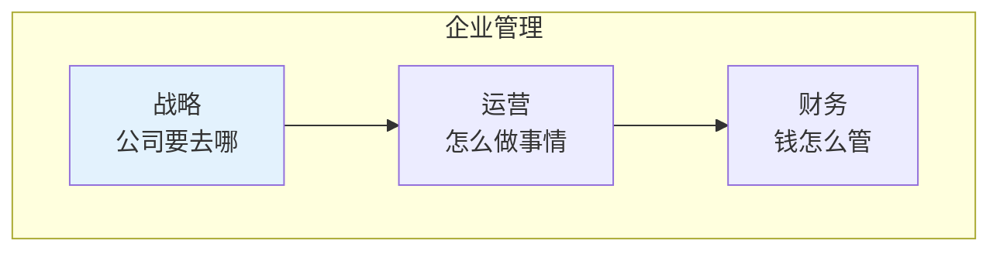
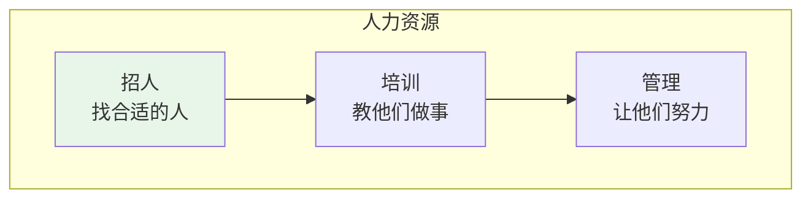
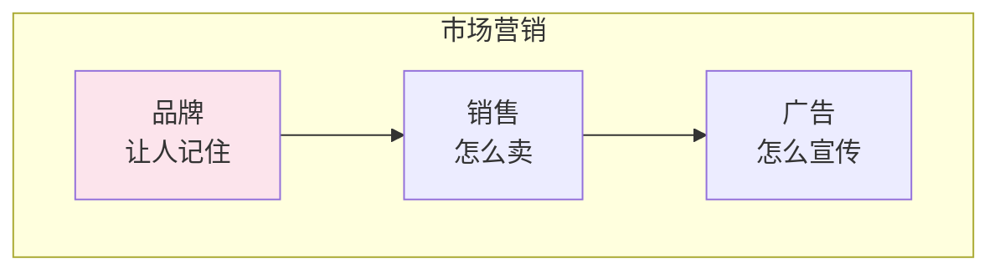
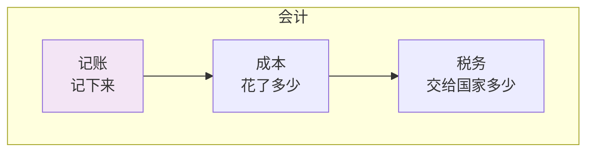
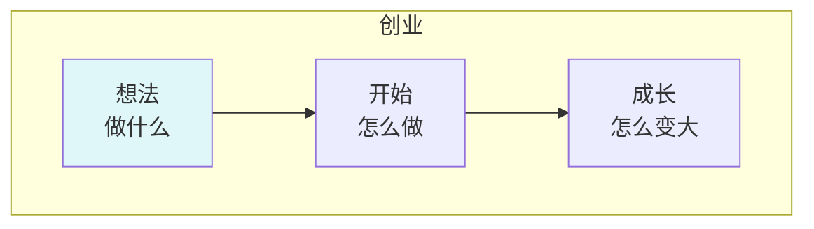
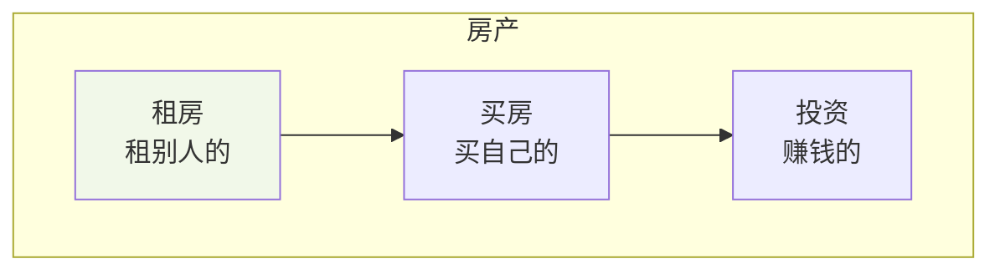
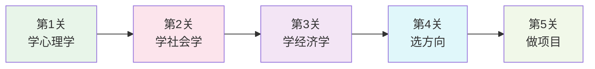

# 管理学

## 🗂️ 内容导航

| 名称 | 说明 | 链接 |
|------|------|------|
| 会计学 | 理解财务会计与管理会计的核心知识 | [进入](accounting/index.md) |
| 企业管理 | 理解企业运营与管理的核心知识 | [进入](business-administration/index.md) |
| 商业创业 | 理解创业过程与商业运营的核心知识 | [进入](entrepreneurship/index.md) |
| 人力资源管理 | 理解人力资源管理的核心知识与实践 | [进入](human-resource-management/index.md) |
| 市场营销 | 理解市场营销的核心知识与实践 | [进入](marketing/index.md) |
| 房产租赁 | 理解房地产租赁与投资的核心知识 | [进入](real-estate/index.md) |
| 旅游管理 | 理解旅游业运营与管理的核心知识 | [进入](tourism-management/index.md) |
| 职场管理 | 理解职场发展与管理的核心知识 | [进入](workplace-management/index.md) |

---

> **费曼学习法**：管理就是"把事情做好"的学问！

---

## 🎯 一句话理解管理学

**管理学就是研究"怎么把事情做好、把人管好"的学问！**

---

## 🔗 科学基础跳转

| 管理领域 | 需要的科学基础 | 跳转链接 |
|----------|----------------|----------|
| 人力资源 | 心理学 | [社会科学/心理学](/social-sciences/psychology/index.md) |
| 市场营销 | 心理学、经济学 | [社会科学/心理学](/social-sciences/psychology/index.md) |
| 企业管理 | 社会学、经济学 | [社会科学/社会学](/social-sciences/sociology/index.md) |
| 会计 | 数学 | [自然科学/数学](/natural-sciences/mathematics/index.md) |

---

## 📚 每个积木块详解

### 🏢 企业管理（公司怎么运转）

**用小学生的话说**：企业管理就是研究"公司是怎么运转的"的学问！

| 积木块 | 小学生版解释 | 需要的科学基础 |
|--------|--------------|----------------|
| 战略 | 公司要去哪 | [社会学](/social-sciences/sociology/index.md) |
| 运营 | 怎么做事情 | [社会学](/social-sciences/sociology/index.md) |
| 财务 | 钱怎么管 | [数学](/natural-sciences/mathematics/index.md) |

---

### 👥 人力资源（怎么管人）

**用小学生的话说**：人力资源就是研究"怎么招人、怎么让人努力干活"的学问！

| 积木块 | 小学生版解释 | 需要的科学基础 |
|--------|--------------|----------------|
| 招人 | 找合适的人 | [心理学](/social-sciences/psychology/index.md) |
| 培训 | 教他们做事 | [心理学](/social-sciences/psychology/index.md) |
| 管理 | 让他们努力 | [心理学](/social-sciences/psychology/index.md) |

---

### 📢 市场营销（怎么卖东西）

**用小学生的话说**：市场营销就是研究"怎么让人想买你的东西"的学问！

| 积木块 | 小学生版解释 | 需要的科学基础 |
|--------|--------------|----------------|
| 品牌 | 让人记住 | [心理学](/social-sciences/psychology/index.md) |
| 销售 | 怎么卖 | [心理学](/social-sciences/psychology/index.md) |
| 广告 | 怎么宣传 | [心理学](/social-sciences/psychology/index.md) |

---

### 💵 会计（怎么算钱）

**用小学生的话说**：会计就是研究"钱怎么记账、怎么算账"的学问！

| 积木块 | 小学生版解释 | 需要的科学基础 |
|--------|--------------|----------------|
| 记账 | 记下来 | [数学](/natural-sciences/mathematics/index.md) |
| 成本 | 花了多少 | [数学](/natural-sciences/mathematics/index.md) |
| 税务 | 交给国家多少 | [数学](/natural-sciences/mathematics/index.md) |

---

### 🚀 创业（怎么从零开始）

**用小学生的话说**：创业就是研究"怎么从零开始做一件事"的学问！

| 积木块 | 小学生版解释 | 需要的科学基础 |
|--------|--------------|----------------|
| 想法 | 做什么 | [心理学](/social-sciences/psychology/index.md) |
| 开始 | 怎么做 | [社会学](/social-sciences/sociology/index.md) |
| 成长 | 怎么变大 | [社会学](/social-sciences/sociology/index.md) |

---

### 🏠 房产（租房买房）

**用小学生的话说**：房产就是研究"租房和买房是怎么回事"的学问！

| 积木块 | 小学生版解释 | 需要的科学基础 |
|--------|--------------|----------------|
| 租房 | 租别人的 | [经济学](/social-sciences/economics/index.md) |
| 买房 | 买自己的 | [经济学](/social-sciences/economics/index.md) |
| 投资 | 赚钱的 | [经济学](/social-sciences/economics/index.md) |

---

## 🎮 管理学闯关游戏

---

## 💡 给小学生的话

> 管理就是"把事情做好"！
> 
> 先学好 [社会科学](/social-sciences/index.md)，再来学管理！
> 
> 记住：理解人，才能管好人！

---

**每个管理者都曾经是初学者！**