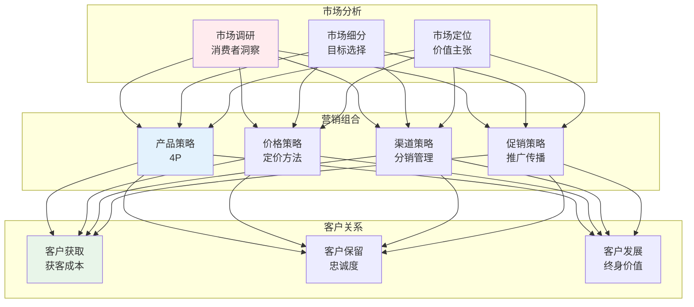
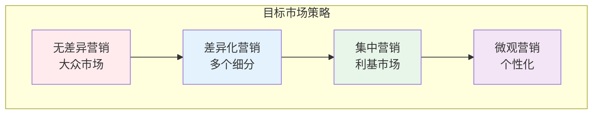
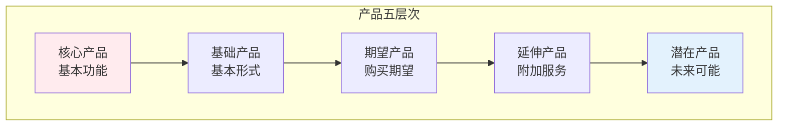
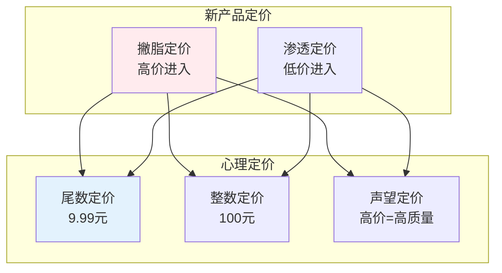
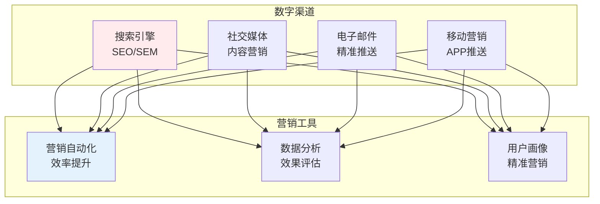

# 市场营销

> **核心观点**：市场营销是研究如何创造、沟通、传递和交换有价值产品的学科，以满足顾客需求。

---

## 📊 营销管理框架



---

## 🎯 STP战略

### 市场细分

| 细分维度 | 变量 | 例子 |
|----------|------|------|
| 地理细分 | 区域、城市规模 | 华东、一线城市 |
| 人口细分 | 年龄、收入、教育 | 年轻白领 |
| 心理细分 | 生活方式、价值观 | 环保主义者 |
| 行为细分 | 使用频率、忠诚度 | 重度用户 |

### 目标市场选择



### 市场定位

| 定位策略 | 描述 | 例子 |
|----------|------|------|
| 属性定位 | 强调产品特征 | 高性能 |
| 利益定位 | 强调用户利益 | 省钱 |
| 使用定位 | 强调使用场景 | 运动时使用 |
| 竞争定位 | 对比竞争对手 | 比XX更好 |
| 质量定位 | 强调品质 | 高端品质 |

---

## 📦 产品策略

### 产品层次



### 产品生命周期

| 阶段 | 特征 | 营销策略 |
|------|------|----------|
| 导入期 | 销量低、成本高 | 建立知名度 |
| 成长期 | 销量快速增长 | 扩大市场份额 |
| 成熟期 | 销量稳定 | 差异化竞争 |
| 衰退期 | 销量下降 | 收割或退出 |

### 品牌策略

```
品牌策略类型：
1. 品牌延伸：利用已有品牌
2. 多品牌：不同品牌不同定位
3. 新品牌：全新品牌进入
4. 合作品牌：品牌联合
```

---

## 💰 价格策略

### 定价方法

| 方法 | 原理 | 适用场景 |
|------|------|----------|
| 成本加成 | 成本+利润 | 传统产品 |
| 竞争导向 | 参考竞争对手 | 同质化产品 |
| 价值导向 | 用户感知价值 | 差异化产品 |
| 心理定价 | 心理感知 | 零售产品 |

### 价格策略



---

## 📣 促销策略

### 促销组合

| 工具 | 特点 | 适用场景 |
|------|------|----------|
| 广告 | 非人员、大众传播 | 品牌推广 |
| 人员推销 | 面对面、针对性 | 复杂产品 |
| 销售促进 | 短期刺激 | 促进销售 |
| 公共关系 | 建立形象 | 品牌建设 |

### 数字营销



---

## 🤝 客户关系管理

### 客户价值

| 指标 | 公式 | 意义 |
|------|------|------|
| 客户获取成本 | 总成本/新客户数 | 获客效率 |
| 客户终身价值 | 平均消费×留存年限 | 客户价值 |
| 客户忠诚度 | 重复购买率 | 忠诚程度 |

### 客户关系策略

```
客户关系策略：
1. 基本型：完成交易
2. 反应型：售后联系
3. 可靠型：主动沟通
4. 主动型：持续关怀
5. 伙伴型：深度合作
```

---

## 🎯 核心结论

### 营销管理原则

1. **顾客导向**：一切从顾客需求出发
2. **价值创造**：为顾客创造价值
3. **整合营销**：协调一致的传播
4. **关系营销**：建立长期关系
5. **社会营销**：考虑社会利益

### 营销发展趋势

```
营销四大趋势：
1. 数字化：线上渠道重要
2. 个性化：精准营销
3. 内容营销：价值输出
4. 社交化：口碑传播
```

---

## 📚 参考文献

1. 科特勒《市场营销原理》
2. 菲利普·科特勒《营销管理》
3. 特劳特《定位》
4. 里斯《品牌的起源》
5. 唐·舒尔茨《整合营销传播》
6. 赛斯·高汀《紫牛》
7. 杰克·特劳特《营销战》
8. 《市场营销学》- 吴健安