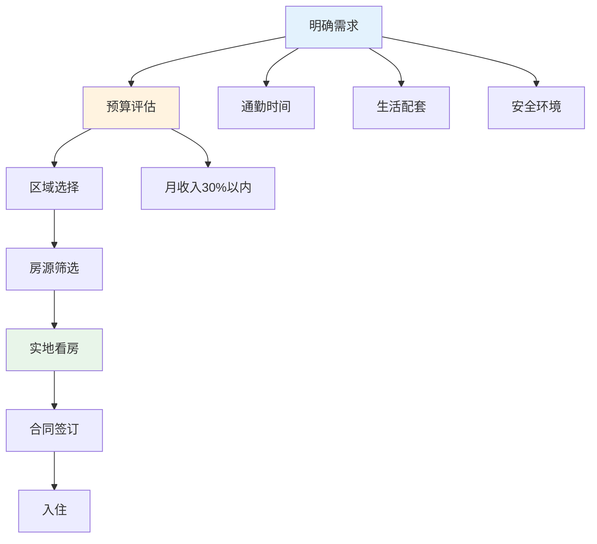
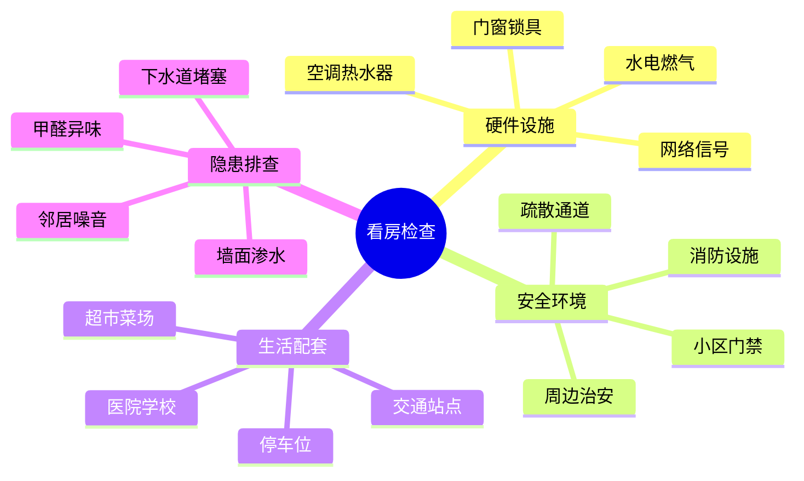
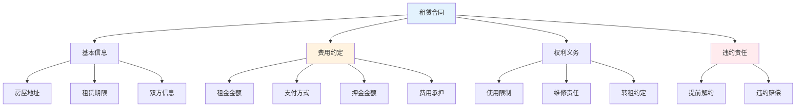
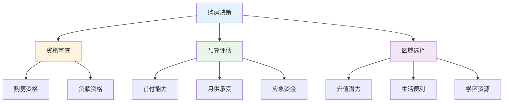
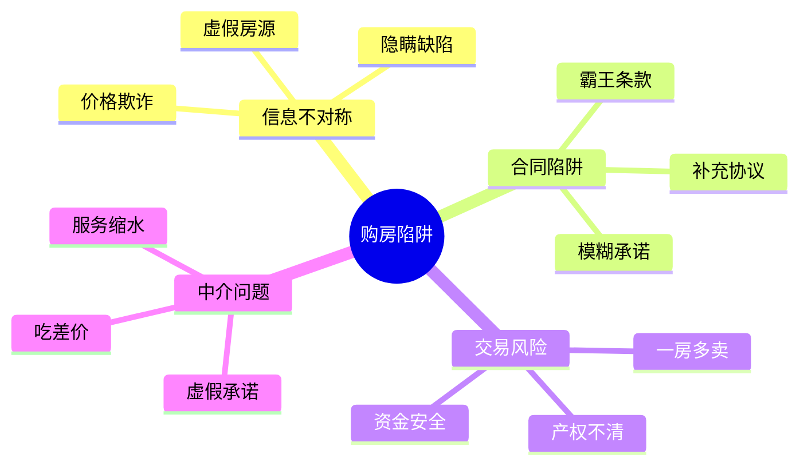
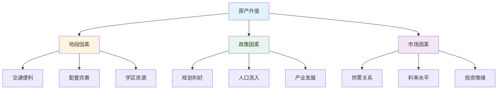

# 房产租赁 — 租房购房避坑指南

> 房产是大多数人一生中最大的支出，但90%的人不了解核心规律
> 目标：掌握租房购房的关键知识，避免踩坑

---

## 一、租房核心规律

### 1.1 租房决策流程

### 1.2 租房渠道对比

| 渠道 | 优点 | 缺点 | 适合人群 |
|------|------|------|----------|
| 长租平台 | 房源多、有保障 | 中介费高 | 预算充足 |
| 中介公司 | 房源真实、服务好 | 费用高 | 时间有限 |
| 业主直租 | 无中介费、灵活 | 需辨别真伪 | 经验丰富 |
| 朋友介绍 | 安全、无费用 | 房源有限 | 人脉广 |

---

## 二、看房检查清单

### 2.1 必查项目

### 2.2 看房时间建议

| 时间段 | 检查内容 | 目的 |
|--------|----------|------|
| 白天 | 采光、通风 | 了解居住舒适度 |
| 晚上 | 安全、噪音 | 了解实际居住环境 |
| 周末 | 邻居、交通 | 了解生活便利性 |
| 雨天 | 渗水、排水 | 了解房屋质量 |

---

## 三、合同签订要点

### 3.1 租赁合同核心条款

### 3.2 合同陷阱对照表

| 陷阱 | 外行做法 | 内行做法 |
|------|----------|----------|
| 押金条款模糊 | 不在意 | 明确退还条件和时间 |
| 维修责任不清 | 不关注 | 明确房东/租客责任 |
| 提前解约 | 不考虑 | 约定双方解约条件 |
| 费用包含不清 | 不核实 | 列出所有包含费用 |
| 房屋交接 | 不仔细 | 详细记录房屋现状 |

---

## 四、购房核心规律

### 4.1 购房决策框架

### 4.2 房贷选择

| 类型 | 利率 | 特点 | 适合人群 |
|------|------|------|----------|
| 公积金贷款 | 最低 | 额度有限 | 公积金充足 |
| 组合贷款 | 中等 | 公积金+商贷 | 公积金不足 |
| 商业贷款 | 较高 | 额度灵活 | 公积金无/少 |

---

## 五、购房避坑指南

### 5.1 常见购房陷阱

### 5.2 看房重点检查

| 项目 | 外行做法 | 内行做法 |
|------|----------|----------|
| 产权 | 不核实 | 查询产权证 |
| 房龄 | 不关心 | 影响贷款年限 |
| 户型 | 只看面积 | 实际使用率 |
| 配套 | 听销售说 | 实地考察 |
| 物业 | 不了解 | 调查口碑 |

---

## 六、房产投资要点

### 6.1 升值因素分析

### 6.2 投资决策要点

| 因素 | 外行做法 | 内行做法 |
|------|----------|----------|
| 时机 | 追涨杀跌 | 逆向思维 |
| 区域 | 只看价格 | 看潜力 |
| 产品 | 只看户型 | 看流动性 |
| 杠杆 | 过度负债 | 适度杠杆 |
| 持有 | 短期投机 | 长期持有 |

---

## 七、物业交接清单

### 7.1 入住检查清单

- [ ] 水电燃气表底数记录
- [ ] 家具家电清点
- [ ] 门窗锁具检查
- [ ] 墙面地面记录
- [ ] 下水道通畅测试
- [ ] 网络/电视信号测试
- [ ] 空调/热水器运行测试
- [ ] 钥匙数量确认

### 7.2 退租检查清单

- [ ] 房屋恢复原状
- [ ] 费用结清
- [ ] 押金退还确认
- [ ] 房东签字确认
- [ ] 水电燃气过户/销户
- [ ] 网络/电视移机/销户
- [ ] 物品搬离
- [ ] 钥匙归还

---

## 八、落地清单

### 租房前准备

- [ ] 明确需求：通勤、预算、生活配套
- [ ] 选择渠道：对比不同平台
- [ ] 预算规划：月租不超收入30%
- [ ] 合同学习：了解基本条款
- [ ] 证据意识：保留所有凭证

### 购房前准备

- [ ] 资格确认：购房资格、贷款资格
- [ ] 预算评估：首付、月供、应急资金
- [ ] 区域研究：规划、配套、学区
- [ ] 产权核实：产权清晰、无纠纷
- [ ] 专业咨询：律师、评估师

---

## 九、推荐阅读

- 《买房这些事儿》— 购房入门
- 《租房合同范本》— 合同参考
- 《房产投资实战》— 投资指南
- 《城市规划原理》— 区域选择
- 《物业管理条例》— 物业知识
