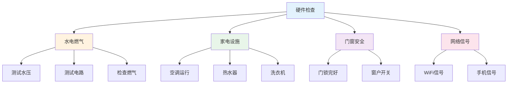
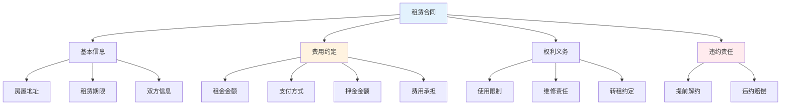

# 租房实战指南 — 避免租房坑的方法

> 80%的租房纠纷源于合同不规范和检查不到位

---

## 一、看房检查清单

### 1.1 硬件设施检查

### 1.2 看房时间建议

| 时间段 | 检查内容 | 目的 |
|--------|----------|------|
| 白天 | 采光、通风 | 居住舒适度 |
| 晚上 | 安全、噪音 | 实际环境 |
| 雨天 | 渗水、排水 | 房屋质量 |
| 周末 | 邻居、交通 | 生活便利性 |

---

## 二、合同签订要点

### 2.1 租赁合同核心条款

### 2.2 合同陷阱对照

| 陷阱 | 正确做法 |
|------|----------|
| 押金条款模糊 | 明确退还条件和时间 |
| 维修责任不清 | 明确房东/租客责任 |
| 提前解约无约定 | 约定双方解约条件 |
| 费用包含不清 | 列出所有包含费用 |

---

## 三、入住检查清单

### 3.1 入住前检查

- [ ] 水电燃气表底数记录
- [ ] 家具家电清点
- [ ] 门窗锁具检查
- [ ] 墙面地面记录
- [ ] 下水道通畅测试
- [ ] 网络/电视信号测试
- [ ] 空调/热水器运行测试
- [ ] 钥匙数量确认

### 3.2 退租检查清单

- [ ] 房屋恢复原状
- [ ] 费用结清
- [ ] 押金退还确认
- [ ] 房东签字确认
- [ ] 水电燃气过户/销户
- [ ] 网络/电视移机/销户
- [ ] 物品搬离
- [ ] 钥匙归还

---

## 四、租房避坑指南

### 4.1 常见陷阱

| 陷阱 | 表现 | 应对 |
|------|------|------|
| 假房源 | 图片与实际不符 | 实地看房 |
| 中介费 | 高额中介费 | 谈判或直租 |
| 押金不退 | 各种理由扣押金 | 合同明确+拍照 |
| 随意涨价 | 提前解约涨价 | 合同约定涨幅 |

### 4.2 维权方法

- 协商解决
- 12345投诉
- 消协投诉
- 法律途径

---

## 五、行动清单

### 看房时

- [ ] 检查硬件设施
- [ ] 了解周边环境
- [ ] 核实房东身份
- [ ] 询问物业情况

### 签约时

- [ ] 审查合同条款
- [ ] 明确费用分担
- [ ] 约定维修责任
- [ ] 保留所有凭证

### 入住时

- [ ] 详细检查记录
- [ ] 拍照留证
- [ ] 确认费用结清
- [ ] 保存合同副本

---

> **记住：租房是小事，但涉及权益就是大事。多检查、多记录、多谨慎。**
