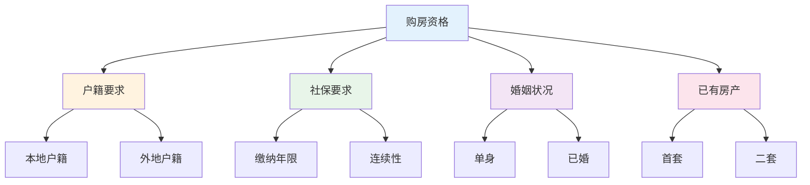
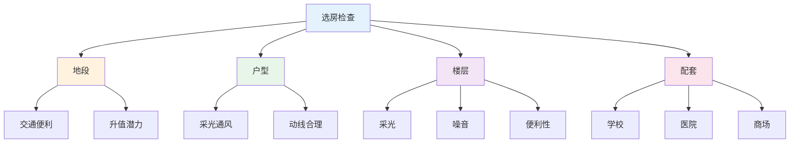
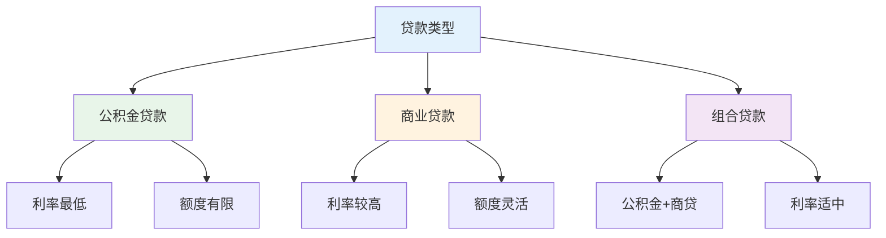
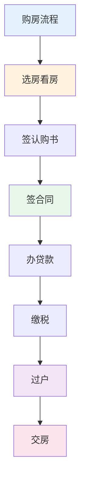

# 购房实战指南 — 买房不踩坑的方法

> 房子是大多数人一生中最大的支出，必须谨慎

---

## 一、购房资格审查

### 1.1 购房资格检查

### 1.2 贷款资格

| 条件 | 要求 | 说明 |
|------|------|------|
| 年龄 | 18-65岁 | 完全民事行为能力 |
| 收入 | 月供<50%收入 | 还款能力证明 |
| 信用 | 无严重逾期 | 征信良好 |
| 社保 | 连续缴纳 | 部分城市要求 |

---

## 二、选房要点

### 2.1 选房检查清单

### 2.2 户型评估

| 指标 | 标准 | 说明 |
|------|------|------|
| 得房率 | >75% | 实际使用面积 |
| 采光 | 南向为主 | 通风采光 |
| 动静分区 | 明确 | 公私分离 |
| 干湿分离 | 明确 | 卫生间设计 |

---

## 三、贷款选择

### 3.1 贷款类型对比

### 3.2 还款方式

| 方式 | 特点 | 适合人群 |
|------|------|----------|
| 等额本息 | 月供固定 | 收入稳定 |
| 等额本金 | 月供递减 | 收入较高 |

---

## 四、产权核实

### 4.1 产权检查清单

- [ ] 产权证是否真实
- [ ] 产权人是否清晰
- [ ] 是否有抵押
- [ ] 是否有查封
- [ ] 是否有租赁
- [ ] 房龄是否影响贷款

### 4.2 风险规避

| 风险 | 应对方法 |
|------|----------|
| 产权不清 | 查询产权证 |
| 抵押房 | 解押后再交易 |
| 一房多卖 | 网签备案 |
| 共有人不同意 | 所有人签字 |

---

## 五、购房避坑指南

### 5.1 常见陷阱

| 陷阱 | 表现 | 应对 |
|------|------|------|
| 虚假房源 | 低价吸引 | 实地看房 |
| 隐瞒缺陷 | 不告知问题 | 详细检查 |
| 合同陷阱 | 霸王条款 | 律师审查 |
| 中介吃差价 | 费用不透明 | 明确约定 |

### 5.2 交易流程

---

## 六、行动清单

### 选房阶段

- [ ] 确认购房资格
- [ ] 评估购买力
- [ ] 研究区域规划
- [ ] 多看多比较

### 签约阶段

- [ ] 审查产权
- [ ] 审查合同
- [ ] 贷款预审
- [ ] 律师把关

### 交房阶段

- [ ] 验房检查
- [ ] 费用结清
- [ ] 产权过户
- [ ] 物业交接

---

> **记住：买房是大事，多看、多比、多谨慎，才能不后悔。**
