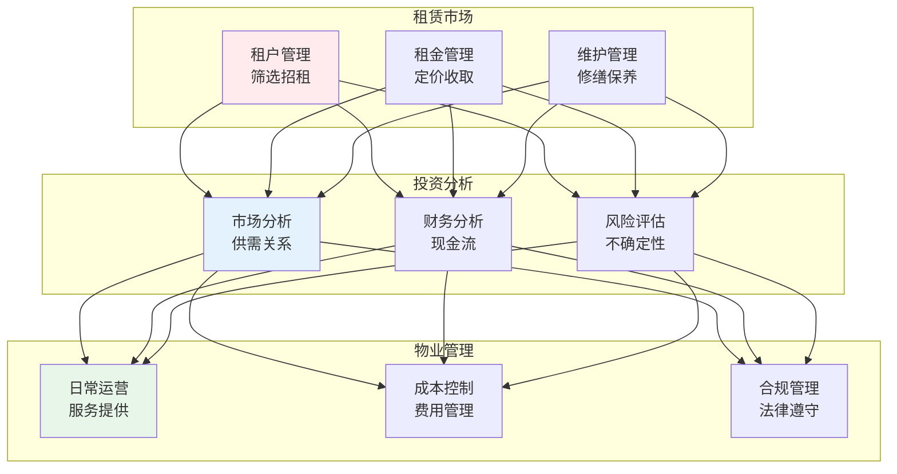
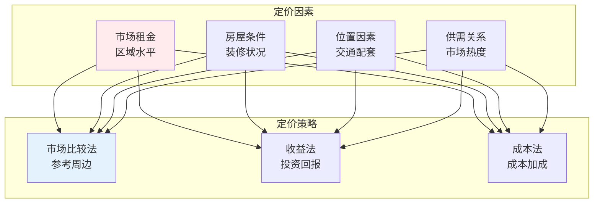
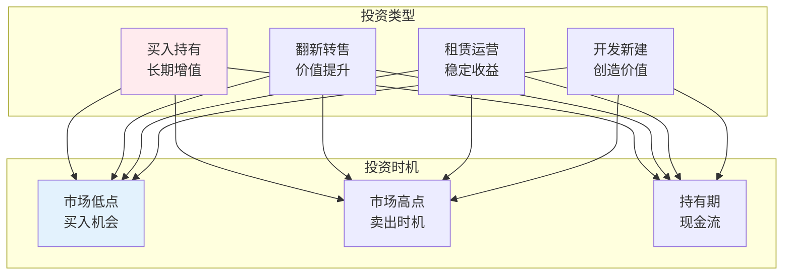

# 房产租赁

## 🗂️ 内容导航

| 名称 | 说明 | 链接 |
|------|------|------|
| 房产租赁 — 租房购房避坑指南 |  | [进入](01-real-estate.md) |
| 租房实战指南 — 避免租房坑的方法 |  | [进入](01-renting-guide.md) |
| 购房实战指南 — 买房不踩坑的方法 |  | [进入](02-buying-guide.md) |

---


> **核心观点**：房地产是重要的投资和生活资产，理解租赁和投资原理是资产管理的关键。

---

## 📊 房地产体系



---

## 🏠 租赁管理

### 租户筛选

| 筛选内容 | 方法 | 目的 |
|----------|------|------|
| 信用调查 | 信用报告 | 评估信用风险 |
| 收入验证 | 工资单、银行流水 | 确保支付能力 |
| 背景调查 | 前房东联系 | 了解历史行为 |
| 工作验证 | 工作证明 | 确认稳定性 |

### 租金定价



### 租赁合同

| 条款 | 内容 | 要点 |
|------|------|------|
| 租期 | 租赁期限 | 起止日期 |
| 租金 | 金额及支付方式 | 付款时间 |
| 押金 | 押金金额及退还 | 扣除条件 |
| 维修 | 维修责任划分 | 责任明确 |
| 提前终止 | 解约条件 | 违约责任 |

---

## 💰 投资分析

### 投资指标

| 指标 | 公式 | 意义 |
|------|------|------|
| 毛租金收益率 | 年租金/房价 | 现金回报 |
| 净租金收益率 | 净收入/房价 | 实际回报 |
| 资本化率 | 净运营收入/房价 | 投资回报 |
| 现金对现金回报 | 年现金流/初始投资 | 杠杆效果 |

### 投资策略



### 风险管理

```
房地产投资风险：
1. 市场风险：房价波动
2. 流动性风险：难以快速变现
3. 租赁风险：空置、违约
4. 利率风险：贷款成本变化
5. 政策风险：法规变化
```

---

## 🔧 物业管理

### 日常运营

| 服务 | 内容 | 目标 |
|------|------|------|
| 维修服务 | 日常修缮 | 保持房屋状况 |
| 保洁服务 | 公共区域清洁 | 环境整洁 |
| 安全管理 | 门禁、监控 | 安全保障 |
| 客户服务 | 投诉处理 | 满意度提升 |

### 成本控制

| 成本类型 | 控制方法 |
|----------|----------|
| 维护成本 | 预防性维护 |
| 能源成本 | 节能措施 |
| 管理成本 | 流程优化 |
| 保险成本 | 风险管理 |

---

## 🎯 核心结论

### 房产投资原则

1. **位置优先**：地段是关键
2. **现金流为王**：稳定收入
3. **长期持有**：耐心等待增值
4. **分散投资**：降低风险
5. **持续学习**：市场变化

### 租赁管理要点

```
租赁管理四要点：
1. 严格筛选：选择好租户
2. 合理定价：市场竞争力
3. 及时维护：保持房屋状况
4. 良好沟通：建立信任关系
```

---

## 📚 参考文献

1. 罗伯特·清崎《富爸爸穷爸爸》
2. 迈克尔·伊angers《房地产投资全书》
3. 《房地产经济学》- 人民大学
4. 《物业管理》- 人民大学
5. 《房地产投资分析》
6. 《租赁管理实务》
7. 《房地产金融》
8. 《房地产估价》