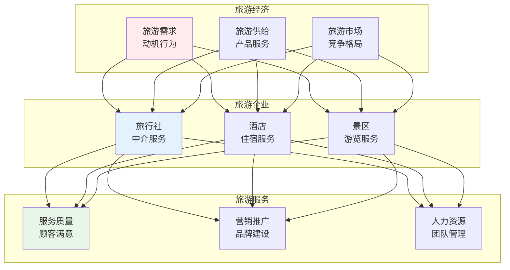
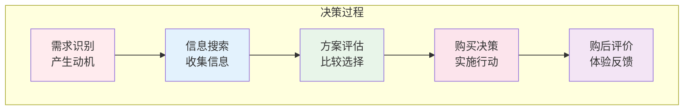
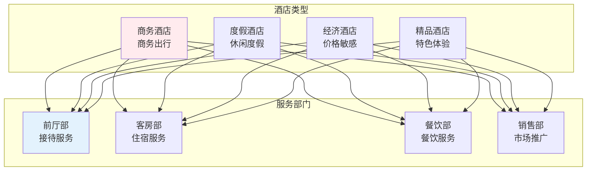

# 旅游管理

> **核心观点**：旅游管理是研究旅游业运营规律、提升旅游服务质量的学科，是服务业的重要组成部分。

---

## 📊 旅游管理体系



---

## 🎯 旅游需求

### 旅游动机

| 动机类型 | 内涵 | 例子 |
|----------|------|------|
| 休闲度假 | 放松身心 | 海滩度假 |
| 文化体验 | 增长见识 | 博物馆参观 |
| 探险猎奇 | 追求刺激 | 徒步探险 |
| 社交需求 | 增进关系 | 家庭出游 |
| 商务出行 | 工作需要 | 会议商务 |

### 旅游者行为



---

## 🏨 旅游企业

### 旅行社管理

| 业务类型 | 服务内容 | 目标市场 |
|----------|----------|----------|
| 团队旅游 | 组织团队出游 | 大众市场 |
| 自由行 | 单项服务组合 | 年轻群体 |
| 定制旅游 | 个性化服务 | 高端市场 |
| 在线旅游 | 平台服务 | 互联网用户 |

### 酒店管理



### 景区管理

| 管理内容 | 目标 | 方法 |
|----------|------|------|
| 游客管理 | 流量控制 | 预约系统 |
| 设施管理 | 设备维护 | 预防性维护 |
| 安全管理 | 保障安全 | 应急预案 |
| 环境管理 | 保护生态 | 可持续发展 |

---

## 📈 旅游营销

### 营销策略

| 策略 | 内容 | 工具 |
|------|------|------|
| 品牌营销 | 形象塑造 | 品牌定位 |
| 网络营销 | 线上推广 | 社交媒体 |
| 体验营销 | 沉浸体验 | 主题活动 |
| 口碑营销 | 用户推荐 | 评价管理 |

### 数字化转型

```
旅游数字化趋势：
1. 在线预订：OTA平台
2. 智慧景区：数字化服务
3. 大数据：精准营销
4. 虚拟现实：体验升级
```

---

## 🎯 核心结论

### 旅游管理原则

1. **以客为尊**：顾客满意度第一
2. **服务至上**：优质服务是核心
3. **创新驱动**：产品服务创新
4. **可持续发展**：保护环境资源
5. **数字化转型**：拥抱技术变革

### 旅游发展趋势

```
旅游四大趋势：
1. 体验化：注重体验质量
2. 个性化：定制服务需求
3. 智慧化：数字技术应用
4. 绿色化：可持续发展
```

---

## 📚 参考文献

1. 《旅游学概论》- 人民大学
2. 《旅游经济学》- 人民大学
3. 《酒店管理》- 人民大学
4. 《旅行社管理》- 人民大学
5. 《景区管理》- 人民大学
6. 《旅游市场营销》- 人民大学
7. 《旅游心理学》- 人民大学
8. 《智慧旅游》