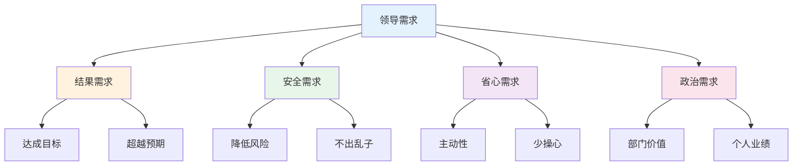
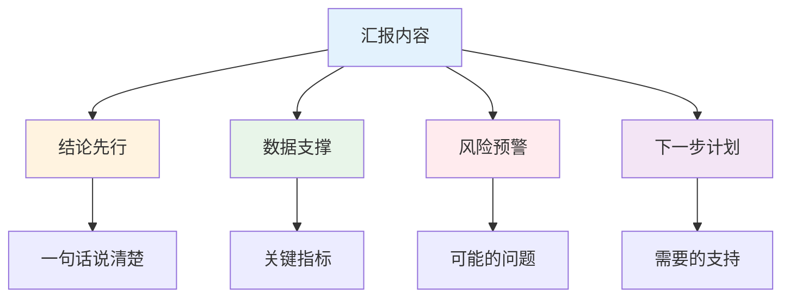
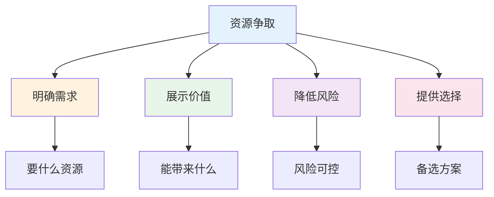
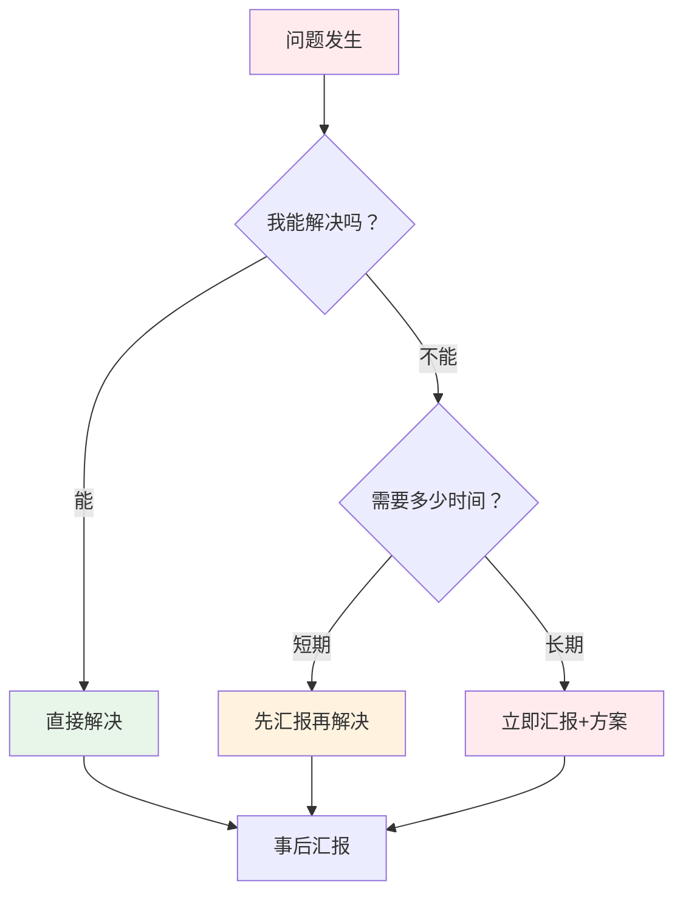
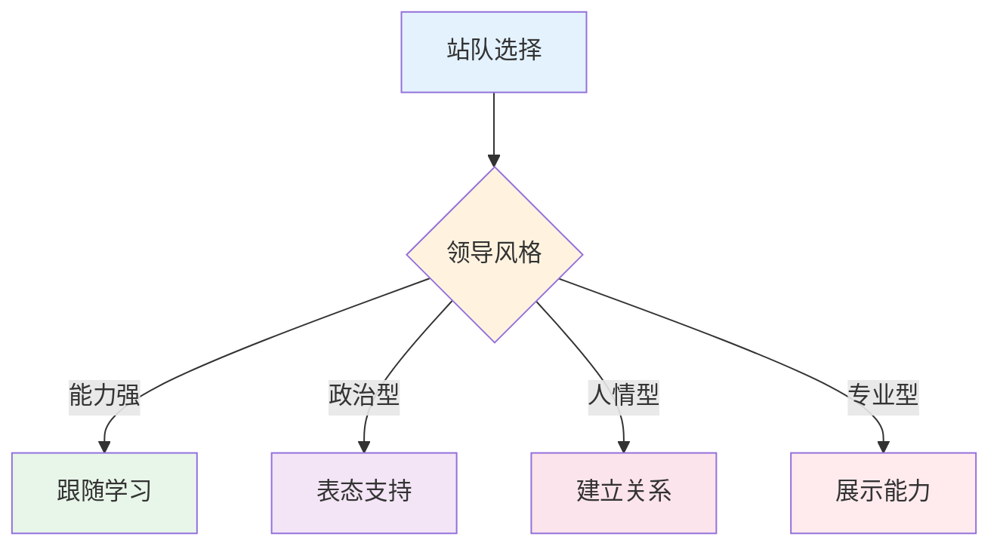

# 向上管理实战 — 如何管理你的领导

> 管理领导不是讨好，而是让双方都成功

---

## 一、理解领导的核心诉求

### 1.1 领导四层需求



### 1.2 领导类型分析

| 类型 | 特点 | 应对策略 |
|------|------|----------|
| 结果导向 | 只看结果 | 用数据说话 |
| 细节控 | 关注过程 | 及时汇报细节 |
| 政治型 | 关注站队 | 表忠心+能力 |
| 人情型 | 关注关系 | 多沟通多互动 |
| 专家型 | 关注专业 | 专业能力过硬 |

---

## 二、高效汇报框架

### 2.1 汇报金字塔



### 2.2 汇报模板

**日常汇报：**
```
【事项】一句话说清楚
【进展】目前状态+关键数据
【问题】遇到的障碍+已尝试的方案
【请求】需要的支持+预期收益
【时间】需要回复的deadline
```

**争取资源：**
```
【背景】当前状况
【目标】预期结果
【方案】具体计划
【ROI】投入产出比
【风险】可能问题+应对方案
```

### 2.3 汇报误区

| 误区 | 正确做法 |
|------|----------|
| 流水账 | 三点核心+数据 |
| 只说问题 | 问题+方案 |
| 推卸责任 | 承担责任+解决方案 |
| 越级汇报 | 逐级汇报 |
| 信息不全 | 准备充分再汇报 |

---

## 三、资源争取技巧

### 3.1 资源争取框架



### 3.2 案例：争取项目预算

**错误做法：**
```
领导，这个项目需要50万预算，因为成本很高。
```

**正确做法：**
```
领导，这个项目需要50万预算，可以带来200万收入（ROI 4:1）。
这是详细预算表，风险点是XX，我已经准备了应对方案。
您看是按这个方案执行，还是需要调整？
```

---

## 四、问题处理技巧

### 4.1 问题处理原则



### 4.2 问题汇报模板

```
【问题】一句话说清楚
【影响】对项目/业务的影响
【原因】初步分析
【方案】解决方案（至少2个）
【建议】推荐方案+理由
【时间】需要的支持时间
```

---

## 五、职场政治

### 5.1 站队原则



### 5.2 避免站队错误

| 错误 | 后果 | 正确做法 |
|------|------|----------|
| 两面讨好 | 两边都不信任 | 选择一方 |
| 背后议论 | 传到领导耳朵 | 正面沟通 |
| 越级汇报 | 直接领导不满 | 逐级汇报 |
| 公开反对 | 领导面子挂不住 | 私下沟通 |

---

## 六、案例复盘

### 6.1 成功案例：晋升总监

**背景：** 从高级经理晋升总监

**关键动作：**
1. 主动承担跨部门项目
2. 定期向高层汇报
3. 培养团队成员
4. 建立跨部门关系

**结果：** 2年晋升总监

**启示：**
1. 做领导关心的事
2. 提升可见度
3. 培养团队

### 6.2 失败案例：被边缘化

**背景：** 从核心项目调到边缘项目

**错误动作：**
1. 只做份内事
2. 不主动汇报
3. 不建立关系
4. 抱怨不公平

**结果：** 被边缘化，最终离职

**教训：**
1. 主动出击
2. 建立关系
3. 提升可见度

---

## 七、行动清单

### 向上管理

- [ ] 分析领导类型和诉求
- [ ] 建立定期汇报机制
- [ ] 主动争取资源
- [ ] 及时处理问题
- [ ] 建立信任关系

### 个人成长

- [ ] 提升专业能力
- [ ] 建立跨部门关系
- [ ] 培养团队成员
- [ ] 打造个人品牌
- [ ] 规划职业发展

---

> **记住：职场的本质是交换。你能提供什么价值，决定你能得到什么回报。**
