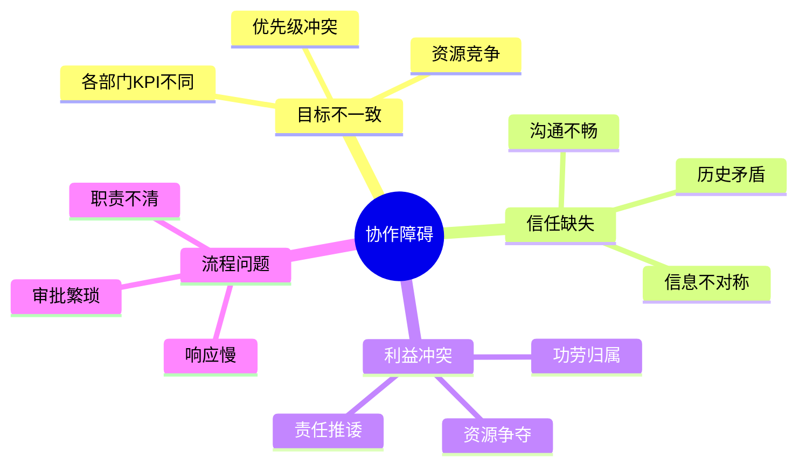
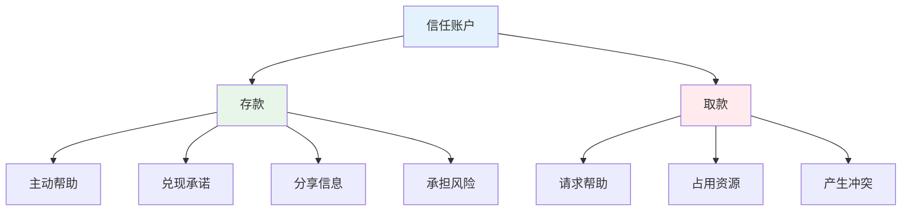
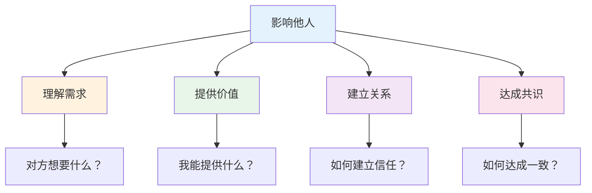
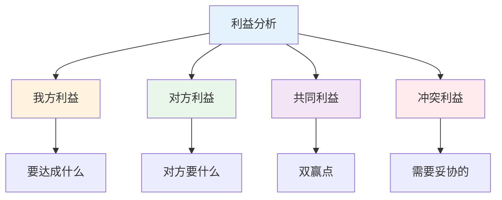
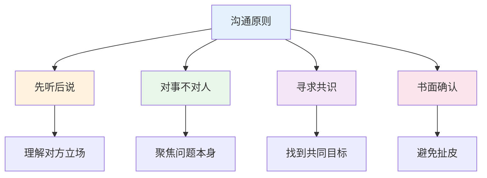

# 跨部门协作 — 无职权影响力的实战方法

> 没有权力时，如何影响他人完成目标

---

## 一、跨部门协作核心规律

### 1.1 协作成功公式

```
协作效果 = 共同目标 × 信任基础 × 利益绑定 × 沟通效率
```

### 1.2 协作障碍分析



---

## 二、建立信任账户

### 2.1 信任积累方法



### 2.2 信任建立案例

**场景：** 需要技术部门支持

**错误做法：**
```
你们必须在本周五前完成，否则项目延期你们负责。
```

**正确做法：**
```
这个项目对公司的XX目标很重要，我已经向领导汇报了技术部门的支持。
如果遇到困难，我可以协调资源。完成后，功劳主要归技术部门。
```

---

## 三、非职权影响力

### 3.1 影响力来源

| 来源 | 说明 | 如何建立 |
|------|------|----------|
| 专业权威 | 领域专家 | 深度学习+实践 |
| 信息优势 | 掌握关键信息 | 广泛收集+分析 |
| 关系网络 | 人脉资源 | 主动社交+维护 |
| 利益绑定 | 让对方受益 | 找到共赢点 |
| 向上借力 | 领导支持 | 获得授权 |

### 3.2 影响力框架



---

## 四、利益协调技巧

### 4.1 利益分析框架



### 4.2 利益协调策略

| 策略 | 适用场景 | 具体做法 |
|------|----------|----------|
| 互惠 | 双方需求对等 | 我帮你，你帮我 |
| 交换 | 各有需求 | 资源互换 |
| 补偿 | 一方受损 | 提供补偿 |
| 妥协 | 双方对等 | 各退一步 |
| 合作 | 可能双赢 | 共同做大 |

---

## 五、沟通技巧

### 5.1 跨部门沟通原则



### 5.2 沟通话术模板

**请求帮助：**
```
你好，我是XX部门的[名字]。
我们在做[项目]，需要你们部门的[支持]。
这对公司的[目标]很重要，领导也很关注。
完成后，功劳主要归你们。
```

**处理冲突：**
```
我理解你的顾虑，让我们先看看共同目标是什么。
问题的根源是什么？我们怎么解决对双方都好？
```

---

## 六、案例复盘

### 6.1 成功案例：推动跨部门项目

**背景：** 需要3个部门协作完成项目

**关键动作：**
1. 找到共同目标：公司战略级项目
2. 建立信任：先帮助各部门解决小问题
3. 利益绑定：明确各部分工和收益
4. 定期同步：每周进度会议

**结果：** 项目按时完成，获得公司表彰

**启示：**
1. 共同目标是基础
2. 信任需要积累
3. 利益要明确

### 6.2 失败案例：协作失败

**背景：** 项目需要技术部门支持

**错误动作：**
1. 没有提前沟通
2. 强行要求支持
3. 不顾对方困难
4. 功劳全部独占

**结果：** 技术部门消极配合，项目延期

**教训：**
1. 提前建立关系
2. 尊重对方利益
3. 共享功劳

---

## 七、行动清单

### 建立信任

- [ ] 主动帮助其他部门
- [ ] 兑现承诺
- [ ] 分享信息
- [ ] 承担风险

### 影响他人

- [ ] 理解对方需求
- [ ] 提供价值
- [ ] 建立关系
- [ ] 达成共识

### 处理冲突

- [ ] 先听后说
- [ ] 对事不对人
- [ ] 寻求共识
- [ ] 书面确认

---

> **记住：跨部门协作的本质是交换。你能提供什么，决定你能得到什么。**
