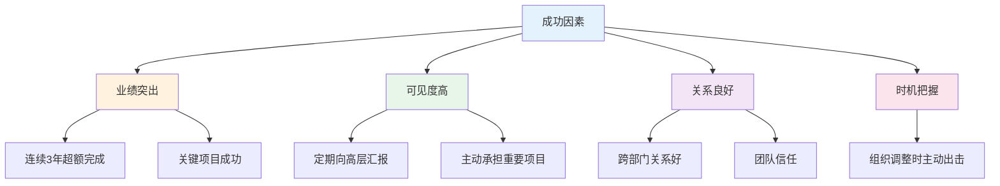
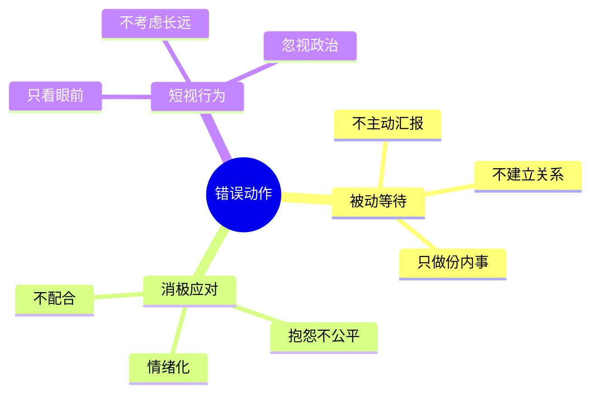
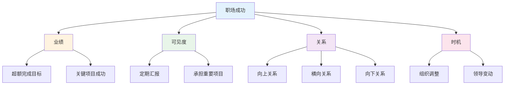
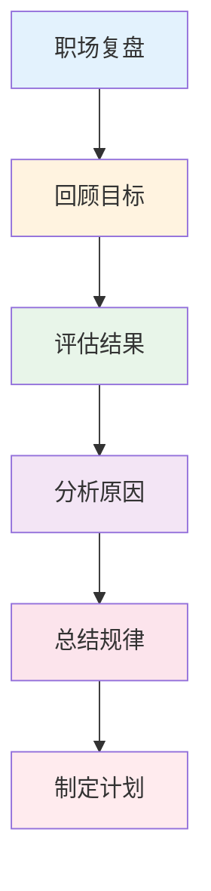

# 职场案例复盘 — 成功与失败的规律

> 从真实案例中学习职场智慧

---

## 一、成功案例分析

### 1.1 案例：3年从专员到总监

**背景：** 普通员工，3年晋升总监

**关键动作：**


**结果：** 3年从专员到总监

**可复制的：**
1. 业绩是基础
2. 可见度要主动
3. 关系需要积累
4. 时机要把握

### 1.2 案例：成功推动变革

**背景：** 推动部门数字化转型

**关键动作：**
1. 找到痛点：效率低、成本高
2. 争取支持：获得高层认可
3. 小范围试点：用数据说话
4. 逐步推广：减少阻力

**结果：** 成功推动变革，获得晋升

**启示：**
1. 变革要循序渐进
2. 用数据说话
3. 争取关键支持

---

## 二、失败案例分析

### 2.1 案例：被边缘化

**背景：** 从核心项目调到边缘项目

**错误动作：**


**结果：** 被边缘化，最终离职

**教训：**
1. 主动出击
2. 建立关系
3. 提升可见度

### 2.2 案例：晋升失败

**背景：** 连续2次晋升失败

**错误原因：**
1. 只做执行，不做管理
2. 不培养团队
3. 不建立关系
4. 只关注短期

**结果：** 连续2次晋升失败

**教训：**
1. 要有管理思维
2. 要培养团队
3. 要建立关系
4. 要有长远规划

---

## 三、成功规律总结

### 3.1 成功要素模型



### 3.2 成功概率公式

```
成功概率 = 业绩 × 可见度 × 关系 × 时机
```

| 因素 | 权重 | 说明 |
|------|------|------|
| 业绩 | 35% | 基础条件 |
| 可见度 | 25% | 让领导看到 |
| 关系 | 25% | 支持者 |
| 时机 | 15% | 顺势而为 |

---

## 四、失败规律总结

### 4.1 常见死因

| 死因类型 | 具体表现 | 预防措施 |
|----------|----------|----------|
| 业绩不达标 | 目标未完成 | 提升能力 |
| 可见度低 | 领导不知道你 | 主动汇报 |
| 关系差 | 没有支持者 | 建立关系 |
| 站错队 | 跟错领导 | 判断形势 |
| 政治幼稚 | 不懂规则 | 学习规则 |

### 4.2 失败案例框架

```
【案例背景】
- 职位：
- 公司：
- 时间：

【关键事件】
- 事件1：
- 事件2：
- 事件3：

【错误决策】
- 决策1：
- 决策2：
- 决策3：

【结果】
- 最终结果：

【教训】
- 做错了什么：
- 可改进的：
- 预防措施：
```

---

## 五、复盘框架

### 5.1 职场复盘流程



### 5.2 复盘检查清单

**业绩维度：**
- [ ] 目标是否达成？
- [ ] 超额完成了什么？
- [ ] 哪些做得好？
- [ ] 哪些可以改进？

**关系维度：**
- [ ] 向上关系如何？
- [ ] 横向关系如何？
- [ ] 向下关系如何？
- [ ] 有支持者吗？

**可见度维度：**
- [ ] 领导知道我做了什么？
- [ ] 我承担了重要项目吗？
- [ ] 我有展示机会吗？
- [ ] 我建立了个人品牌吗？

---

## 六、行动清单

### 每月复盘

- [ ] 回顾本月目标
- [ ] 评估完成情况
- [ ] 分析成功/失败原因
- [ ] 制定下月计划

### 每季度复盘

- [ ] 评估业绩表现
- [ ] 评估关系状态
- [ ] 评估可见度
- [ ] 调整职业策略

### 每年复盘

- [ ] 总结年度成果
- [ ] 评估职业发展
- [ ] 制定下年目标
- [ ] 规划长期发展

---

> **记住：职场是长跑，不是短跑。持续积累，才能持续成功。**
