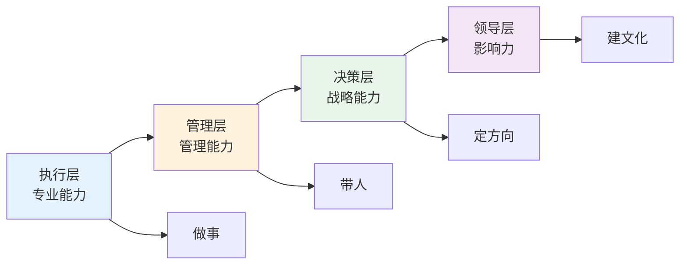
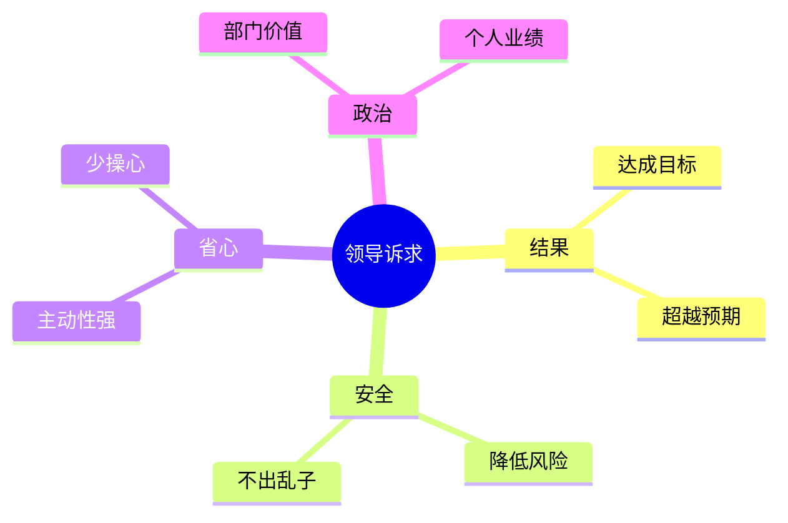
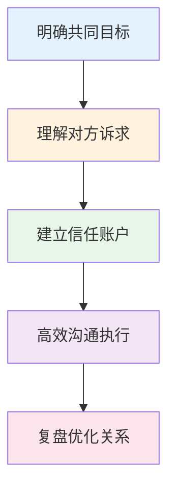
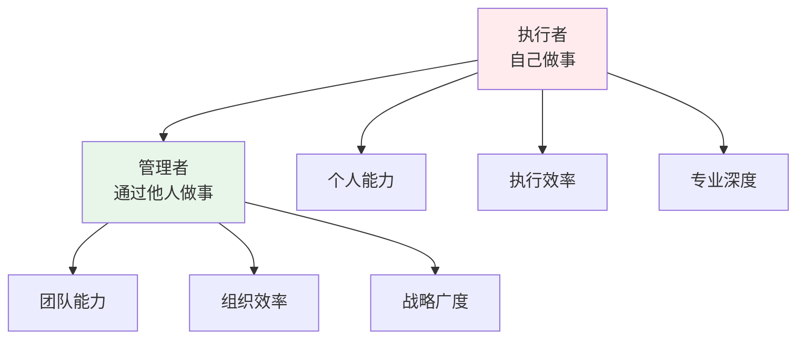
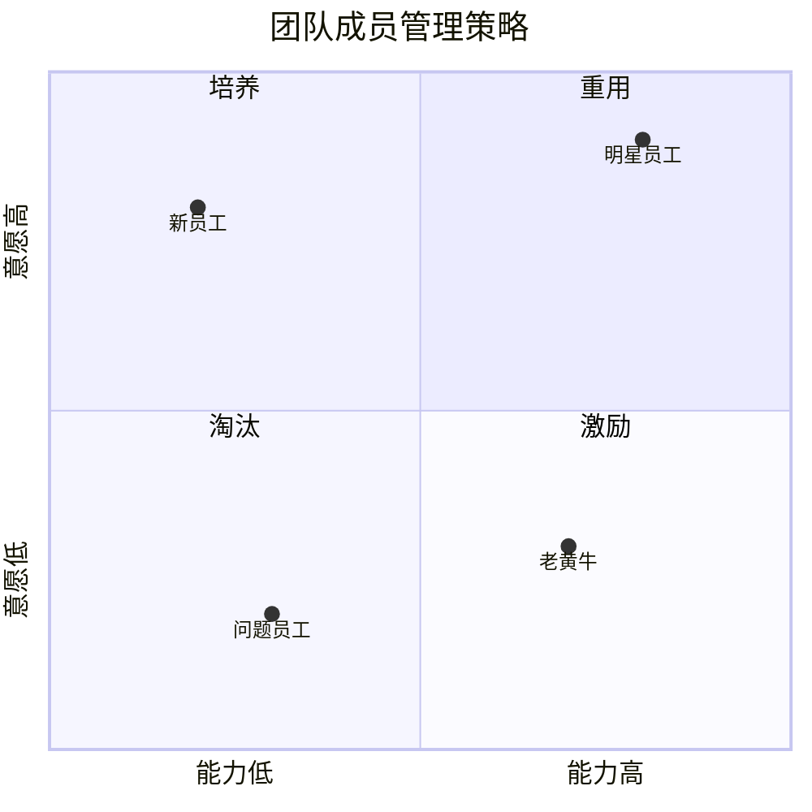
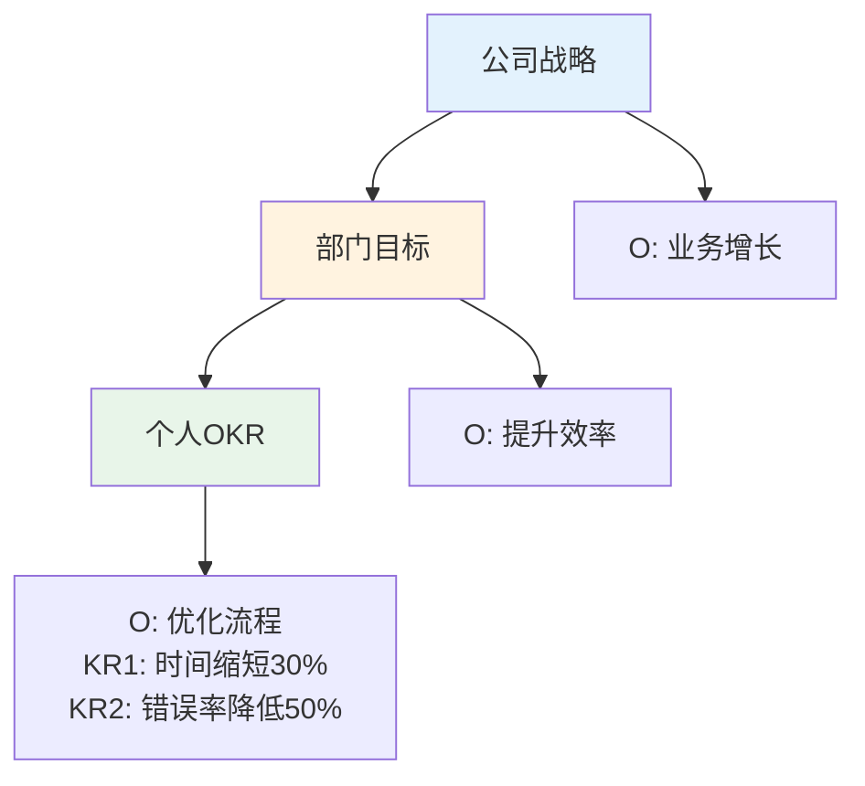
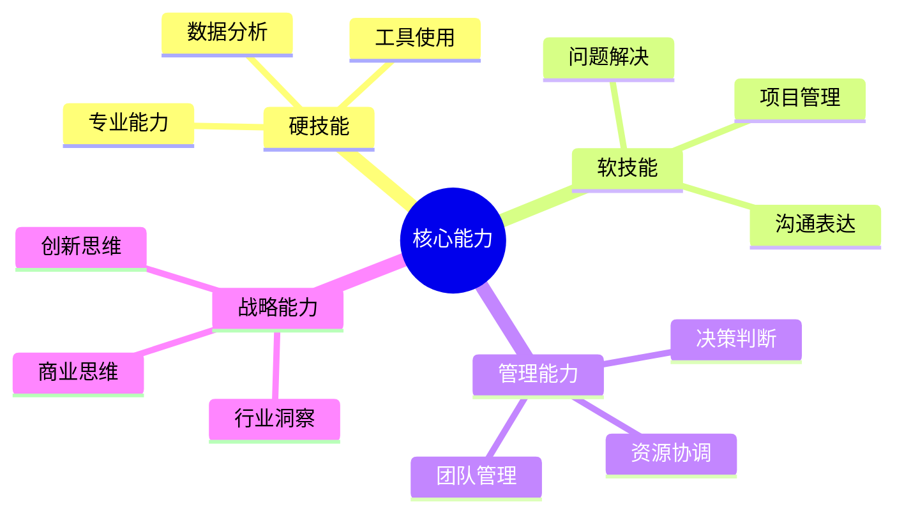
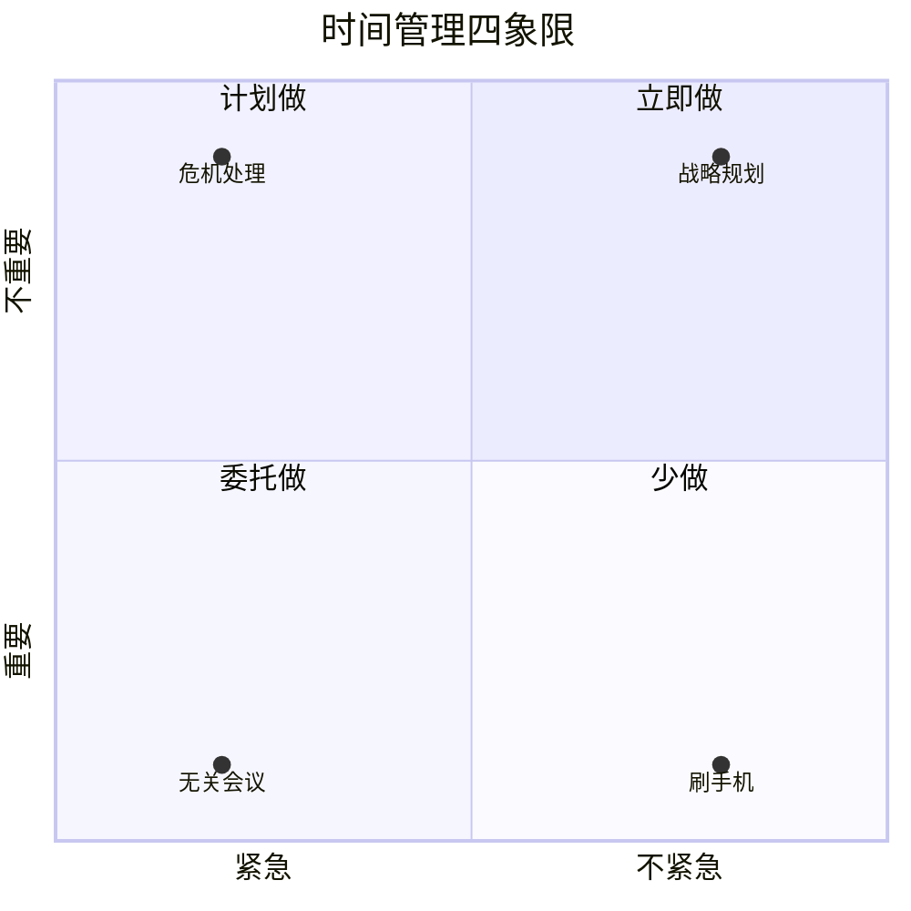
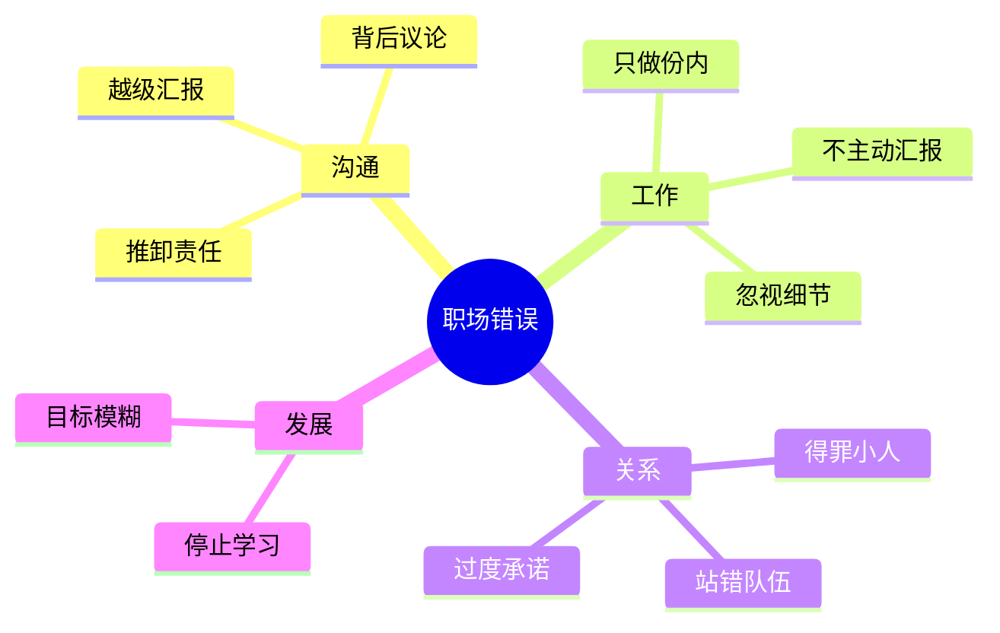

# 职场管理 — 从执行者到领导者的跃迁

> 80%的职场人停留在执行层，只有20%的人掌握晋升的核心规律
> 目标：理解职场晋升逻辑，掌握向上管理和团队管理的方法论

---

## 一、职场晋升规律

### 1.1 职业发展路径



### 1.2 晋升核心公式

**晋升 = 业绩 × 可见度 × 关系 × 时机**

| 要素 | 外行踩坑 | 内行做法 |
|------|----------|----------|
| 业绩 | 埋头苦干 | 做领导关心的事 |
| 可见度 | 闷声干活 | 主动汇报+展示 |
| 关系 | 只做本职 | 建立跨部门关系 |
| 时机 | 等待机会 | 主动创造机会 |

---

## 二、向上管理

### 2.1 理解领导的核心诉求



### 2.2 汇报框架

**外行汇报：** "我做了A、B、C..."
**内行汇报：** "结论先行 + 关键数据 + 风险预警 + 下一步计划"

| 场景 | 外行做法 | 内行做法 |
|------|----------|----------|
| 日常汇报 | 流水账 | 三点核心+数据支撑 |
| 争取资源 | 强调困难 | 强调ROI |
| 项目延期 | 推卸责任 | 主动预警+补救方案 |
| 功劳归属 | 独占功劳 | 归功于团队和领导 |

### 2.3 向上管理模板

```
【事项】一句话说清楚
【进展】目前状态+关键数据
【问题】遇到的障碍+已尝试的方案
【请求】需要的支持+预期收益
【时间】需要回复的deadline
```

---

## 三、跨部门协作

### 3.1 协作核心规律



**外行踩坑 vs 内行做法：**

| 场景 | 外行做法 | 内行做法 |
|------|----------|----------|
| 跨部门求助 | 直接提要求 | 先帮对方解决问题 |
| 资源争夺 | 零和博弈 | 寻找共赢方案 |
| 意见分歧 | 坚持己见 | 寻求共同目标 |
| 产生矛盾 | 向上告状 | 私下沟通解决 |

### 3.2 非职权影响力

**没有权力时，如何影响他人：**

1. **专业权威**：成为领域专家
2. **信息优势**：掌握关键信息
3. **关系网络**：建立广泛人脉
4. **利益绑定**：让对方看到好处
5. **向上借力**：借助领导影响力

---

## 四、团队管理

### 4.1 管理者角色转变



### 4.2 团队管理四象限



| 类型 | 特征 | 管理策略 |
|------|------|----------|
| 明星员工 | 能力强、意愿高 | 授权+挑战性工作 |
| 老黄牛 | 能力强、意愿低 | 激励+关怀 |
| 新员工 | 能力低、意愿高 | 培养+指导 |
| 问题员工 | 能力低、意愿低 | 明确要求+限期改进 |

### 4.3 1:1会议框架

```
【开场】近况如何？（5分钟）
【进展】项目/目标进展（10分钟）
【困难】遇到的挑战（10分钟）
【支持】需要什么帮助（5分钟）
【成长】个人发展（5分钟）
【反馈】相互反馈（5分钟）
```

---

## 五、绩效管理

### 5.1 OKR设定原则



**OKR vs KPI：**

| 维度 | OKR | KPI |
|------|-----|-----|
| 目标 | 挑战性目标 | 合理目标 |
| 关注点 | 过程和结果 | 只看结果 |
| 激励 | 内在驱动 | 外在激励 |
| 适用 | 创新型工作 | 重复性工作 |

### 5.2 绩效面谈框架

```
【开场】说明目的（2分钟）
【自评】让员工先自评（10分钟）
【反馈】给予具体反馈（15分钟）
【讨论】共同分析原因（10分钟）
【计划】制定改进计划（10分钟）
【支持】表达支持态度（3分钟）
```

---

## 六、关键能力培养

### 6.1 职场核心能力



### 6.2 时间管理矩阵



**外行踩坑 vs 内行做法：**

| 象限 | 外行做法 | 内行做法 |
|------|----------|----------|
| 重要紧急 | 焦虑应对 | 提前预防 |
| 重要不紧急 | 经常忽略 | 主动规划 |
| 紧急不重要 | 全部亲自做 | 委托他人 |
| 不重要不浪费 | 大量时间 | 极力避免 |

---

## 七、职场避坑指南

### 7.1 致命错误TOP10



### 7.2 职场生存法则

| 场景 | 外行做法 | 内行做法 |
|------|----------|----------|
| 遇到不公平 | 抱怨发泄 | 收集证据+理性沟通 |
| 被抢功劳 | 忍气吞声 | 记录贡献+适时展示 |
| 背黑锅 | 当场翻脸 | 事后复盘+划清界限 |
| 领导画饼 | 全盘相信 | 关注实际行动 |
| 同事甩锅 | 直接冲突 | 书面确认+责任到人 |

---

## 八、落地清单

### 执行层晋升

- [ ] 成为领域专家
- [ ] 主动承担额外责任
- [ ] 建立跨部门关系
- [ ] 定期向上汇报
- [ ] 打造个人品牌

### 管理层晋升

- [ ] 培养团队成员
- [ ] 建立管理体系
- [ ] 提升战略思维
- [ ] 扩大影响力范围
- [ ] 交出可复制的业绩

---

## 九、推荐阅读

- 《10人以下小团队管理手册》— 管理入门
- 《关键对话》— 高效沟通
- 《高效能人士的七个习惯》— 自我管理
- 《原则》— 决策思维
- 《从优秀到卓越》— 组织管理
