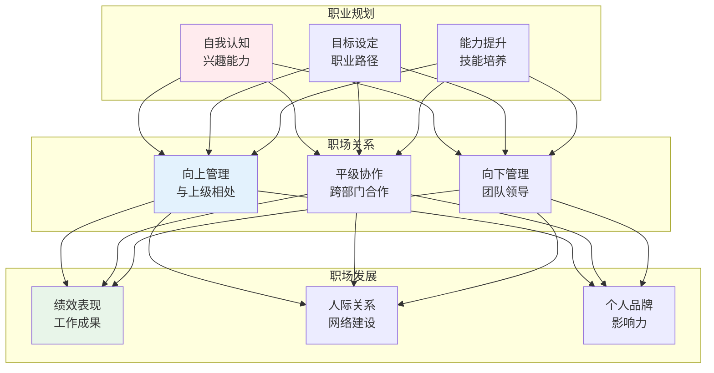
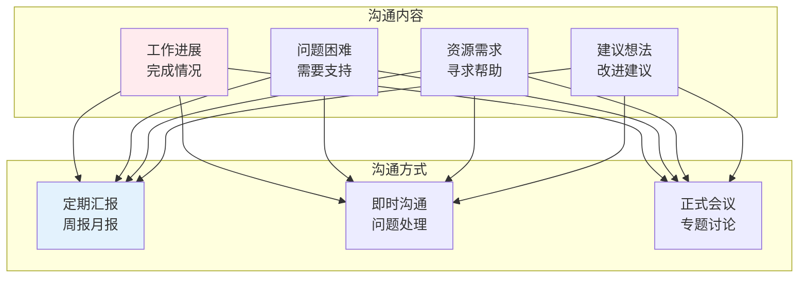
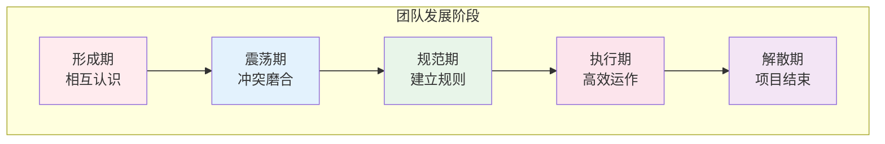
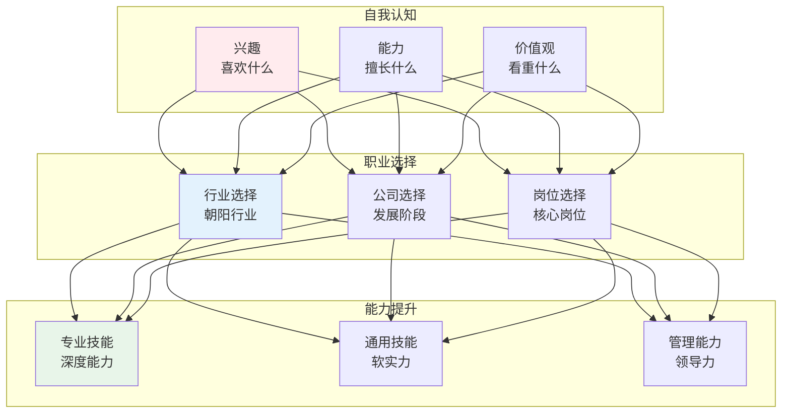

# 职场管理

## 🗂️ 内容导航

| 名称 | 说明 | 链接 |
|------|------|------|
| managing up practice |  | [进入](01-managing-up-practice.md) |
| 跨部门协作 — 无职权影响力的实战方法 |  | [进入](02-cross-department-collaboration.md) |
| 职场案例复盘 — 成功与失败的规律 |  | [进入](03-workplace-case-studies.md) |
| 职场管理 — 从执行者到领导者的跃迁 |  | [进入](03-workplace-management.md) |

---


> **核心观点**：职场是个人发展的重要平台，理解职场规则和管理技巧是职业成功的关键。

---

## 📊 职场体系



---

## 🎯 向上管理

### 与上级相处原则

| 原则 | 内涵 | 实践 |
|------|------|------|
| 主动沟通 | 及时汇报进展 | 定期汇报 |
| 理解期望 | 明确上级需求 | 确认目标 |
| 提供方案 | 带着解决方案 | 问题+建议 |
| 承担责任 | 主动担当 | 不推诿 |

### 沟通技巧



---

## 🤝 跨部门协作

### 协作原则

| 原则 | 内涵 | 实践 |
|------|------|------|
| 共同目标 | 利益一致 | 明确共同利益 |
| 相互尊重 | 平等对待 | 尊重专业 |
| 有效沟通 | 信息共享 | 及时透明 |
| 互利共赢 | 双赢思维 | 合作共赢 |

### 冲突解决

```
冲突解决四步骤：
1. 识别冲突：发现分歧
2. 分析原因：理解立场
3. 寻求方案：共同协商
4. 达成共识：落实行动
```

---

## 👥 团队管理

### 团队发展阶段



### 激励方法

| 方法 | 内容 | 适用场景 |
|------|------|----------|
| 物质激励 | 薪酬奖金 | 基本需求 |
| 精神激励 | 认可表扬 | 尊重需求 |
| 发展激励 | 培训晋升 | 自我实现 |
| 环境激励 | 工作氛围 | 归属感 |

### 绩效管理

| 环节 | 内容 | 工具 |
|------|------|------|
| 目标设定 | KPI/OKR | SMART原则 |
| 过程辅导 | 持续反馈 | 1对1会议 |
| 绩效评估 | 考核评价 | 360度评估 |
| 结果应用 | 奖惩晋升 | 绩效面谈 |

---

## 💡 职业发展

### 职业规划



### 职业转型

| 转型类型 | 特点 | 挑战 |
|----------|------|------|
| 行业转型 | 跨行业 | 行业知识 |
| 职能转型 | 跨职能 | 技能转移 |
| 管理转型 | 技术→管理 | 角色转变 |
| 创业转型 | 打工→创业 | 风险承受 |

---

## 🎯 核心结论

### 职场成功要素

1. **专业能力**：核心竞争力
2. **人际关系**：合作网络
3. **沟通能力**：表达协调
4. **学习能力**：持续成长
5. **适应能力**：应对变化

### 职场智慧

```
职场智慧四要素：
1. 知行合一：说到做到
2. 换位思考：理解他人
3. 积极主动：主动担当
4. 持续学习：终身成长
```

---

## 📚 参考文献

1. 卡耐基《人性的弱点》
2. 彼得·德鲁克《卓有成效的管理者》
3. 斯蒂芬·柯维《高效能人士的七个习惯》
4. 刘润《5分钟商学院》
5. 吴军《见识》
6. 《职场心理学》
7. 《职业发展规划》
8. 《团队管理》