# 生物侦探的探险手册

> **费曼学习法**：生物不是背名词，是看懂生命怎么"活"。  
> 如果你不能用种豆芽、养蚂蚁、看心跳给小学生讲清楚，说明你还没真正懂。

---

## 🎯 一句话理解生物

**生物就是研究"活着是怎么回事"的学问！**  

从一颗种子长成大树，从受精卵变成婴儿，从单细菌分裂成亿万，从恐龙灭绝到鸟类飞翔——**生命在不断进化、适应、延续。**

---

## 🧬 生物侦探的五大"生命拼图"

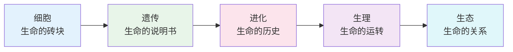

| 拼图块 | 核心问题 | 生活超能力 | 经典探索 |
|--------|----------|------------|----------|
| **细胞** | 生命最小单位长啥样？ | 显微镜看世界、细胞分裂、癌细胞 | 观察洋葱表皮、口腔上皮、血液 |
| **遗传** | 为什么像爸像妈？ | DNA提取、基因编辑、亲子鉴定 | 豌豆杂交、提取香蕉DNA、构建DNA模型 |
| **进化** | 物种从哪来到哪去？ | 化石挖掘、系统发育树、达尔文雀 | 观察细菌耐药、模拟自然选择 |
| **生理** | 身体怎么运转？ | 心跳、呼吸、消化、免疫、神经 | 测心率、肺活量、反应速度、解剖模型 |
| **生态** | 生物怎么相处？ | 食物链、碳循环、生物多样性 | 瓶中生态系统、校园物种调查 |

---

## 🏗️ 细胞：生命的"乐高积木"

### 细胞长啥样？

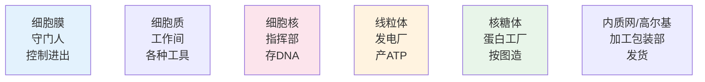

### 两大阵营：原核 vs 真核

| 特征 | **原核生物**（细菌、古菌） | **真核生物**（植物、动物、真菌、原生生物） |
|------|----------------------------|--------------------------------------------|
| **有无核膜** | ❌ 没有，DNA游在细胞质 | ✅ 有核膜，DNA在核里 |
| **有无细胞器** | ❌ 只有核糖体 | ✅ 线粒体、内质网、高尔基... |
| **大小** | 小（1-10微米） | 大（10-100微米） |
| **分裂方式** | 二分裂（简单） | 有丝分裂/减数分裂（复杂） |
| **例子** | 大肠杆菌、蓝藻、乳酸菌 | 你、我、树、蘑菇、酵母、草履虫 |

> **冷知识**：你的身体里细菌数量 ≈ 你自己的细胞数量！肠道菌群是"隐形器官"。

### 植物细胞 vs 动物细胞

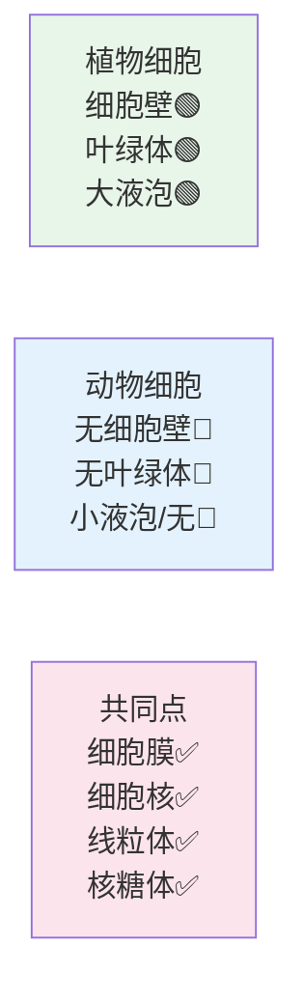

**记忆口诀**：植物有"墙"(细胞壁)、有"厨房"(叶绿体做饭)、有"大水缸"(液泡)；动物靠"跑"、靠"吃"、靠"灵活"。

---

## 🧬 遗传：生命的"源代码"

### DNA：双螺旋梯子

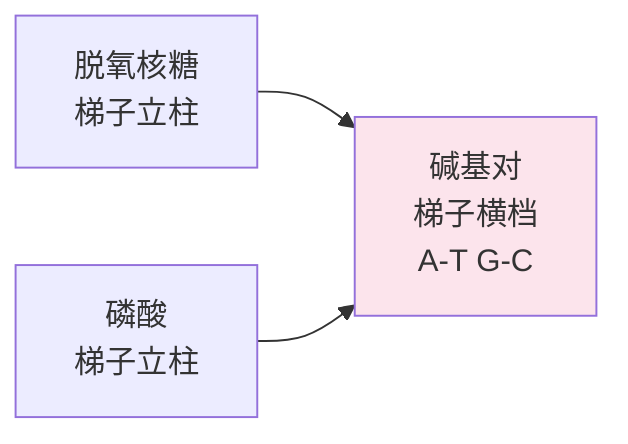

| 碱基 | 全名 | 配对规则 | 氢键数 |
|------|------|----------|--------|
| **A** | 腺嘌呤 | A = T | 2个 |
| **T** | 胸腺嘧啶 | T = A | 2个 |
| **G** | 鸟嘌呤 | G ≡ C | 3个 |
| **C** | 胞嘧啶 | C ≡ G | 3个 |

**记忆口诀**：**A抱T，G抱C**；AT两条线，GC三条线（更结实）。

### 中心法则：生命的"打印流程"

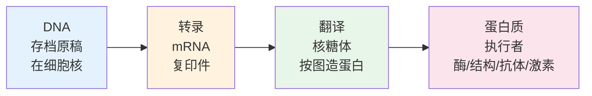

> **一句话**：DNA → RNA → 蛋白质 → 性状  
> **基因** = 一段有功能的DNA = 一条造蛋白的说明书

### 孟德尔豌豆实验 → 遗传定律

| 定律 | 内容 | 口诀 | 例子 |
|------|------|------|------|
| **分离定律** | 等位基因分离进配子 | 杂合子自交，表现型3:1 | 高茎×矮茎 → F1全高，F2高:矮=3:1 |
| **自由组合定律** | 不同基因自由组合 | 两对性状，9:3:3:1 | 黄圆×绿皱 → F2 黄圆:黄皱:绿圆:绿皱 |

---

## 🦋 进化：生命的"长跑"

### 达尔文三步走

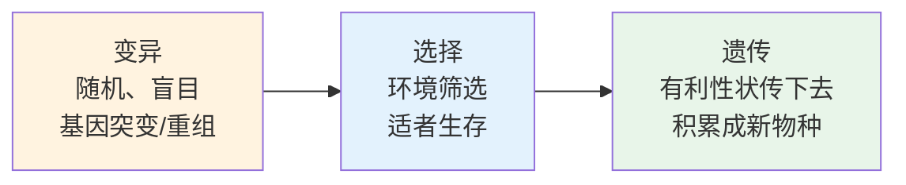

### 进化证据大全
| 证据类型 | 例子 | 说明 |
|----------|------|------|
| **化石** | 始祖鸟、马的进化系列、露西 | 过渡型、时间序列 |
| **同源器官** | 人手、蝙蝠翼、鲸鳍、马前肢 | 骨骼结构相同，功能不同 → 共同祖先 |
| **相似器官** | 鸟翼、昆虫翼、飞机翼 | 功能相同，结构不同 → 收敛进化 |
| **退化器官** | 阑尾、尾椎、耳肌、智齿 | 祖先有用，现在退化 |
| **胚胎发育** | 鱼/鸟/人早期都有鳃裂、尾巴 | 个体发育重演系统发育 |
| **分子生物学** | DNA/蛋白序列相似度 | 人猩猩DNA 98%相似、细胞色素c高度保守 |

### 自然选择实况秀
- **胡椒蛾**：工业革命前白蛾多→烟尘树黑→黑蛾隐蔽存活→黑蛾变多→治理污染→白蛾又多
- **抗生素耐药**：吃药不彻底→剩下耐药菌→繁殖→全成耐药菌（**超级细菌**来了！）
- **达尔文雀**：加拉帕戈斯群岛，嘴型适应不同食物（种子、昆虫、仙人掌花蜜）

---

## ⚙️ 生理：身体是台精密机器

### 人体八大系统（团队作战）

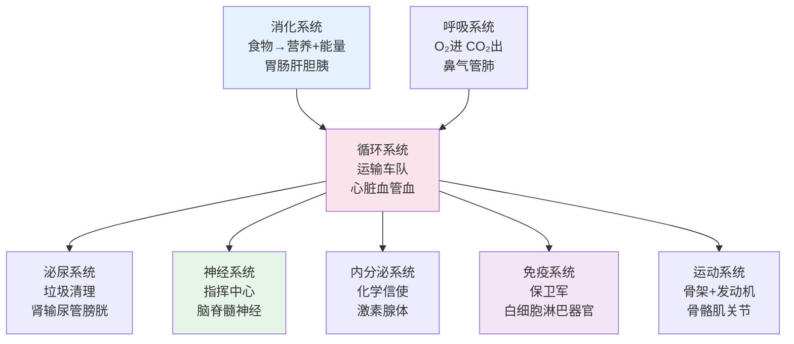

### 稳态：身体的"恒温器"

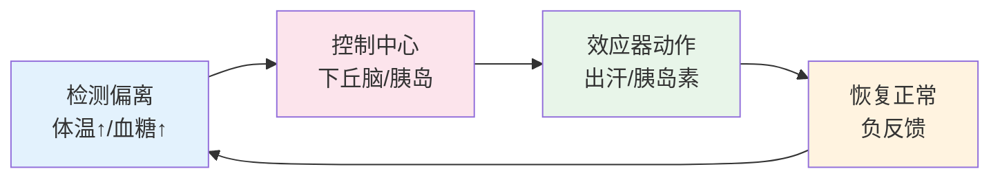

**例子**：
- 热了 → 出汗、血管扩张、不想动 → 体温降
- 血糖高 → 胰岛素↑ → 细胞吃糖、肝存糖 → 血糖降
- 缺氧 → 心跳加快、呼吸加深、造血素↑ → 供氧增

---

## 🌿 生态：生命大连连看

### 能量流动：单向、递减

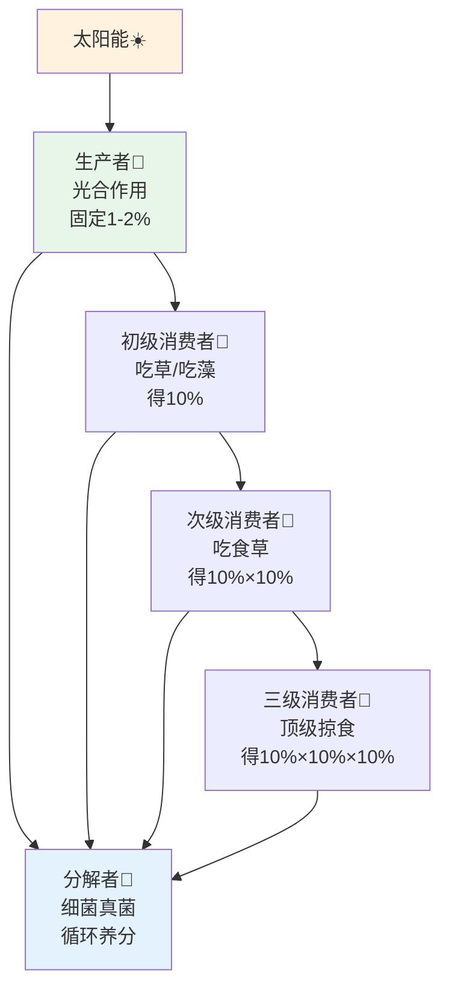

**十 percent 定律**：每级只传10%能量 → **食物链通常4-5级** → 顶级掠食者最少

### 物质循环：原子不灭

| 循环 | 关键角色 | 关键过程 | 人类影响 |
|------|----------|----------|----------|
| **碳循环** | CO₂ ↔ 有机物 | 光合作用/呼吸/燃烧/风化 | 燃烧化石燃料→温室效应 |
| **氮循环** | N₂ ↔ 氨/硝酸盐 | 固氮/硝化/反硝化/同化 | 化肥过量→水体富营养化 |
| **水循环** | H₂O 三态 | 蒸发/凝结/降水/径流/渗透 | 森林砍伐→水循环破坏 |
| **磷循环** | 磷酸盐 | 岩石风化→土壤→生物→沉积 | 洗涤剂磷→赤潮 |

---

## 🌍 生物多样性：地球的"保险单"

### 三个层次
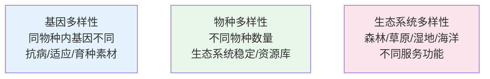

**第六次大灭绝正在发生** → 主因：栖息地丧失、过度开发、污染、入侵物种、气候变化

---

## 🎮 生物闯关游戏

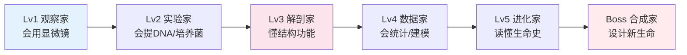

**每关必做探索**：
- ✅ Lv1：显微镜看：洋葱细胞、酵母出芽、水熊虫、血液、花粉管生长
- ✅ Lv2：提取香蕉/猕猴桃/口腔细胞 DNA（洗洁精+盐+酒精）
- ✅ Lv3：解剖花朵（数雄蕊雌蕊）、观察鱼鳃/心脏、模型拆装人体器官
- ✅ Lv4：校园物种调查（四样方法）、种群密度估算、生长曲线绘制
- ✅ Lv5：构建系统发育树、模拟自然选择（豆子捡拾游戏）、比较同源器官
- ✅ Lv6：设计转基因生物（发光植物？产药牛奶？）、CRISPR基因编辑设计

---

## 🔗 生物 → 其他科学的传送门

| 传送门 | 生物概念 | 科学应用 |
|--------|----------|----------|
| → 化学 | 生物大分子、酶、代谢 | 生物化学、药物设计、代谢工程 |
| → 物理 | 生物力学、生物光学、热力学 | 生物材料、医学影像、神经信号 |
| → 数学/统计 | 种群遗传、进化建模、生态模型 | 群体遗传学、流行病模型、系统生物学 |
| → 地理/气候 | 生物地理学、古气候代用指标 | 物种分布模型、冰芯花粉、古环境重建 |
| → 信息/AI | 神经网络、基因算法、DNA存储 | 深度学习启发、生物计算、数据存储 |
| → 医学/工程 | 组织工程、合成生物学、仿生学 | 器官芯片、人造器官、仿生机器人、生物制造 |

---

## 💡 给小学生的生物秘籍

> **生命不在书本里，在泥土里、水里、树上、你我身体里。**

1. **养一样东西**：豆芽、蚕、蚂蚁、金鱼、多肉、发芽土豆——**养活它，就懂它的需求**
2. **多用显微镜**：哪怕最便宜的儿童显微镜，**看一滴水、一片叶、一根头发、一点血**——新世界打开
3. **记观察日记**：画图、记时间、记变化、问为什么——**达尔文、法布尔都是从记日记开始的**
4. **去野外**：公园、植物园、海边、山上——数物种、听鸟叫、找脚印、看共生
5. **关心身体**：测心率、量肺活量、记饮食、观察伤口愈合——**最好的生物教材是你自己**

---

## 📖 本周任务清单

- [ ] 用显微镜观察：洋葱表皮细胞（加碘液）、口腔上皮细胞（加亚甲基蓝）、酵母出芽、池水微生物
- [ ] 提取DNA：香蕉/猕猴桃/草莓 + 洗洁精 + 食盐 + 冷酒精 → 白色絮状DNA
- [ ] 种豆芽/绿豆：记录每天变化（胚根→胚芽→子叶展开→真叶），画生长曲线
- [ ] 校园/小区物种大调查：拍照记录 10 种植物、5 种昆虫、3 种鸟，做简单分类
- [ ] 做"瓶中生态系统"：大可乐瓶 + 水草 + 螺/虾 + 水 + 阳光 → 观察 2 周不喂食
- [ ] 解释给家人：为什么疫苗能预防病？（抗原→抗体→记忆B细胞→二次免疫应答）

---

**生物侦探口号：看细胞、读基因、溯进化、懂生理、护生态！** 🧬🔬🌱✨