# 生物学知识体系

> **第一性原理**：生物学是研究生命现象和生命活动规律的科学。所有生命现象都可以从细胞层面理解。

---

## 📚 生物学的公理体系

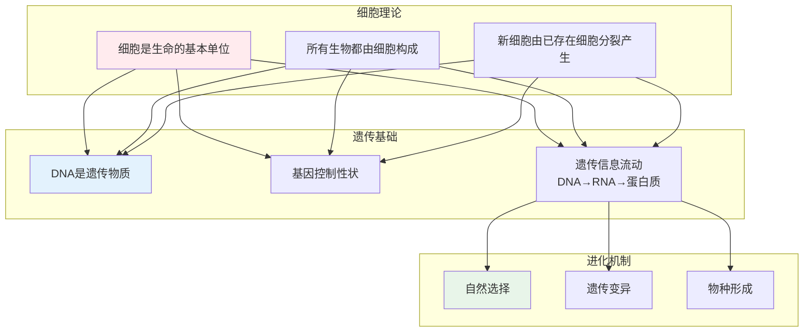

---

## 一、细胞生物学 Cell Biology

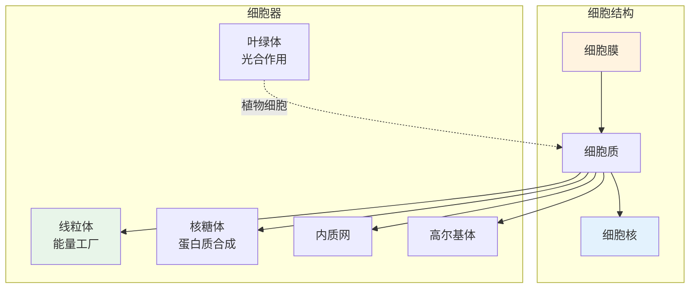

### 细胞分裂

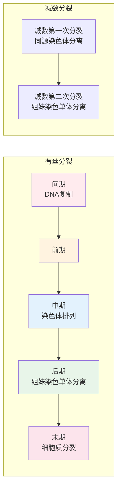

---

## 二、遗传学 Genetics

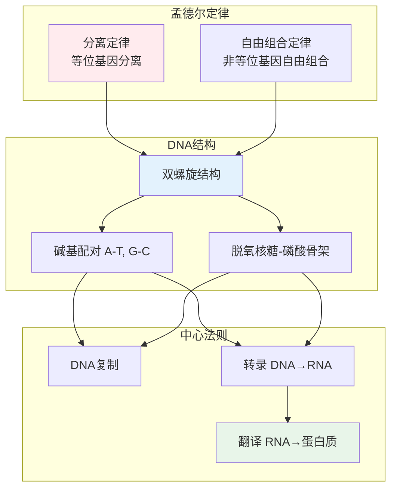

### 基因表达调控

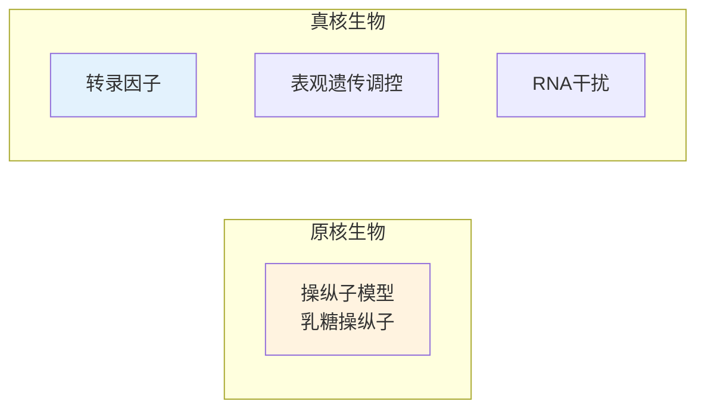

---

## 三、进化论 Evolution

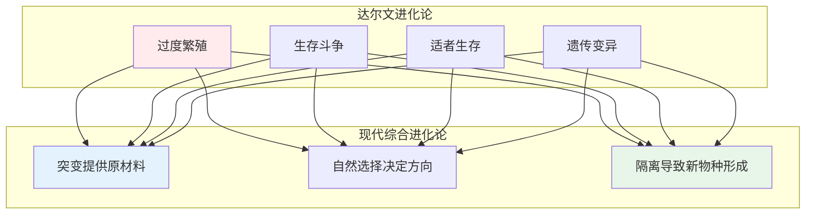

### 物种形成

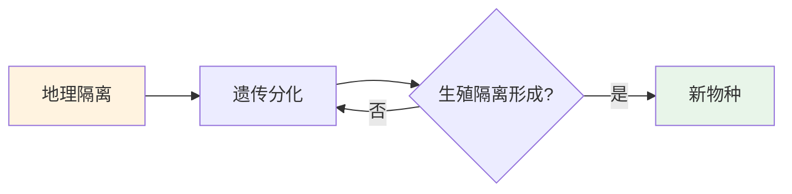

---

## 四、生态学 Ecology

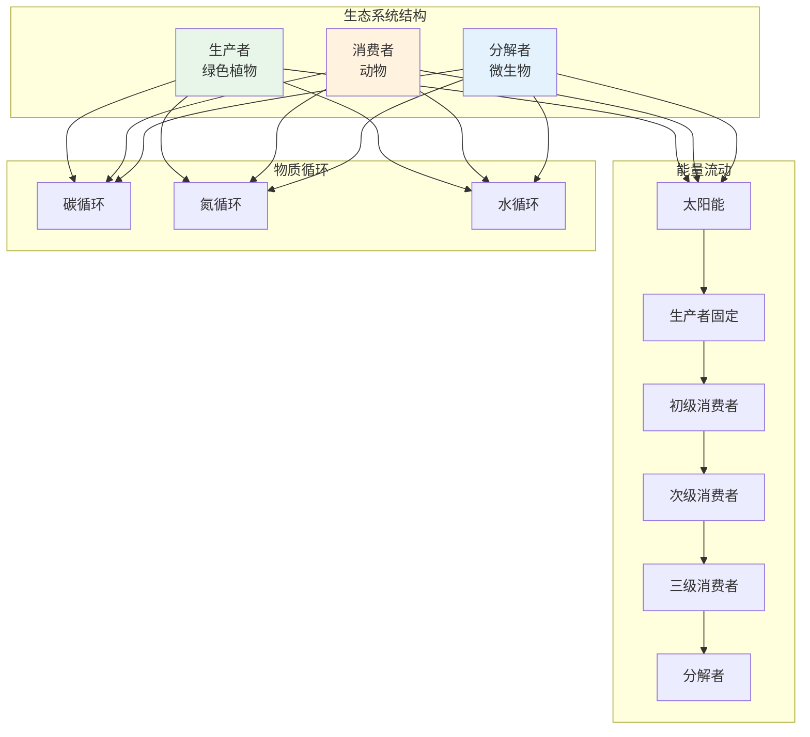

---

## 五、生理学 Physiology

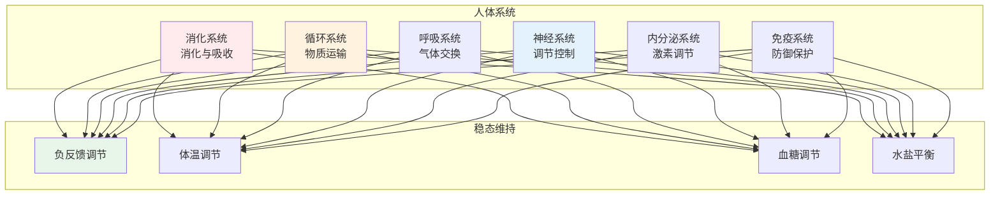

---

## 六、生物学思维方式

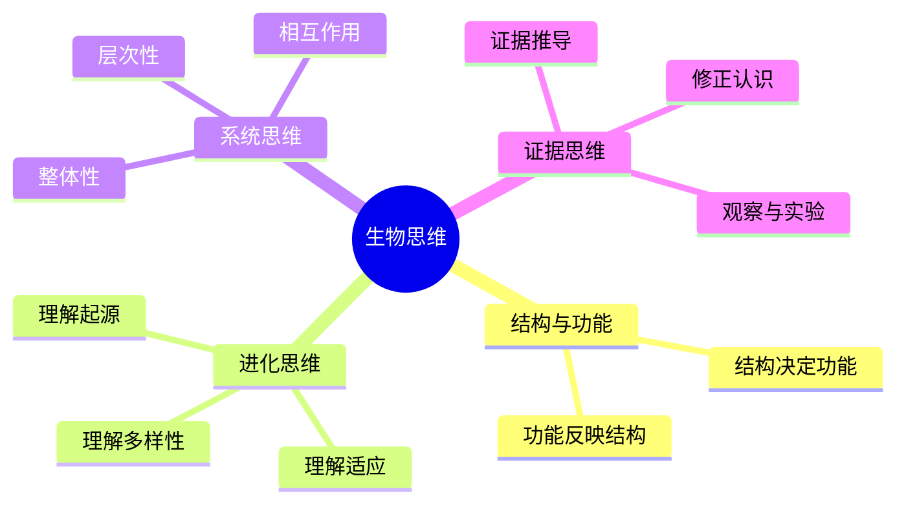

---

## 📖 学习路径

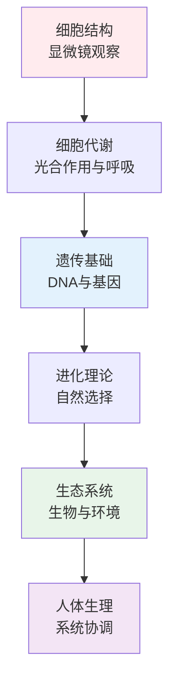

---

## 参考文献

1. 《细胞生物学》- 翟中和
2. 《遗传学》- 刘祖洞
3. 《生态学》- 孙儒泳
4. 《生理学》- 朱清时