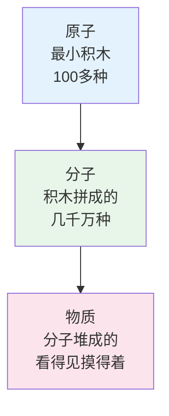
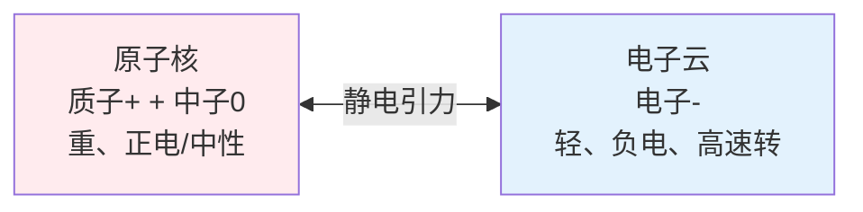
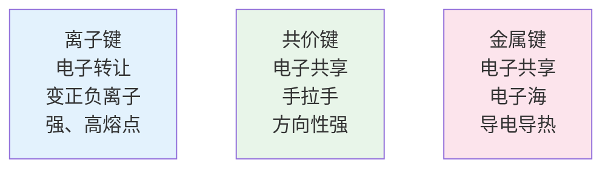
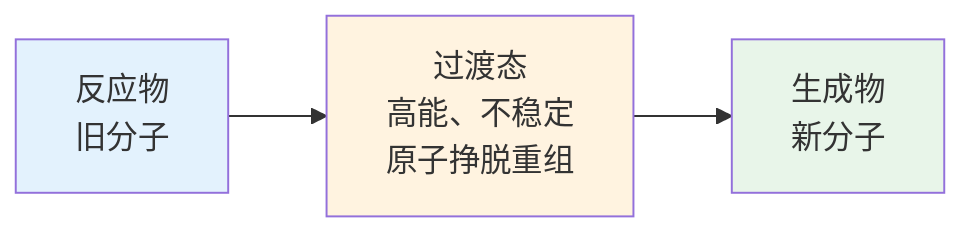
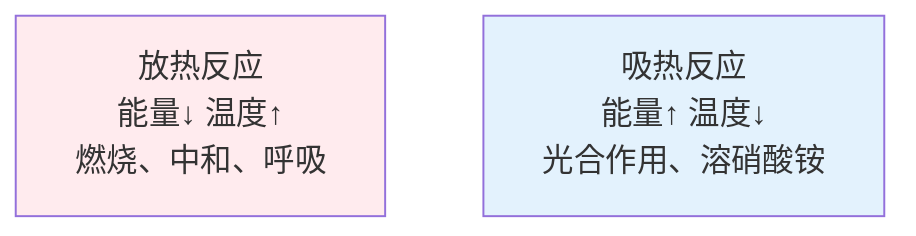
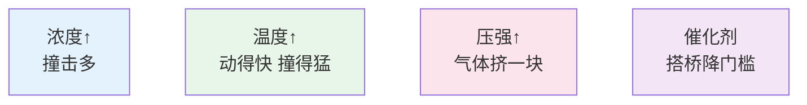
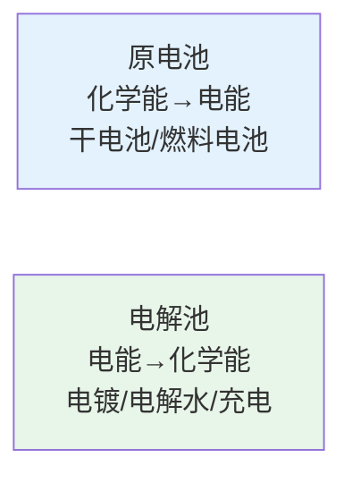
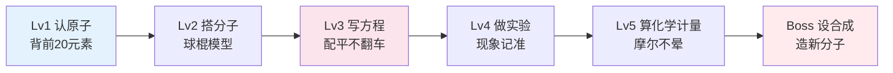

# 化学侦探的魔法实验室

> **费曼学习法**：化学不是背方程式，是看懂物质怎么"变身"。  
> 如果你不能用乐高积木、厨房做饭、吹泡泡给小学生讲清楚，说明你还没真正懂。

---

## 🎯 一句话理解化学

**化学就是研究"物质怎么变身"的学问！**  

铁生锈、木头烧成灰、面粉变面包、食物变能量、电池放电、光合作用——**全是化学反应在搞事情。**

---

## 🧱 化学侦探的三种"乐高积木"

| 积木级别 | 名字 | 大小 | 例子 | 比喻 |
|----------|------|------|------|------|
| **第1级** | **原子** | 极小（10⁻¹⁰米） | 氢H、氧O、碳C、铁Fe、金Au | 单个乐高颗粒 |
| **第2级** | **分子** | 小（几个原子） | 水H₂O、氧气O₂、二氧化碳CO₂、糖C₆H₁₂O₆ | 积木拼的小房子 |
| **第3级** | **物质** | 看得见 | 一杯水、一口气、一块糖、一颗钻石 | 成堆的积木城堡 |

> **核心秘密**：只有100多种原子，却能拼出几千万种分子，组成世界上所有的东西！

---

## 🔬 原子内部：微型太阳系

| 粒子 | 电荷 | 质量 | 位置 | 作用 |
|------|------|------|------|------|
| **质子** | +1 | 重 | 原子核 | 决定是谁（元素序数） |
| **中子** | 0 | 重 | 原子核 | 增加重量、稳定核 |
| **电子** | -1 | 极轻 | 核外层 | 决定性格（化学性质）、导电 |

**元素周期表** = 原子的"身份证大全"
- **序数** = 质子数 = 电子数 = 谁
- **族/周期** = 电子排布 = 性格如何

---

## 🤝 化学键：原子怎么"牵手"

### 三种牵手方式
| 牵手方式 | 谁和谁牵手 | 怎么牵 | 例子 | 性格 |
|----------|------------|--------|------|------|
| **离子键** | 金属 + 非金属 | 电子"给"你，变正负离子，靠电吸引 | 食盐NaCl、氧化铁Fe₂O₃ | 硬脆、高熔点、水溶导电 |
| **共价键** | 非金属 + 非金属 | 电子"共享"，手拉手成分子 | 水H₂O、氧气O₂、二氧化碳CO₂、糖 | 分子晶体、低熔沸点 |
| **金属键** | 金属 + 金属 | 电子"公用"，成电子海 | 铜Cu、铁Fe、金Au、铝Al | 导电导热、延展性强 |

**生活翻译**：
- 食盐溶于水 → 离子键散了，Na⁺和Cl⁻自由游
- 糖溶于水 → 分子整个散开，共价键没断
- 铜线导电 → 电子海里电子自由跑

---

## 🎭 化学反应：分子大变身

### 反应 = 旧键断、新键连、原子重排

### 四大基础反应类型

| 类型 | 口诀 | 方程式模板 | 生活例子 |
|------|------|------------|----------|
| **化合反应** | A+B→AB | 两个变一个 | 铁+氧气→铁锈、氢气+氧气→水 |
| **分解反应** | AB→A+B | 一个变两个 | 电解水、高锰酸钾制氧、石灰石煅烧 |
| **置换反应** | A+BC→AC+B | 单个挤走一个 | 锌+硫酸铜→铜+硫酸锌、铁+稀盐酸 |
| **复分解反应** | AB+CD→AD+CB | 两对交换伙伴 | 酸碱中和、沉淀反应、胃酸过多吃碱 |

---

## ⚡ 能量视角：吸热 vs 放热

**判断口诀**：
- 感觉热、火焰、爆炸 → **放热**（能量卖出去了）
- 感觉冷、要加热、要光照 → **吸热**（能量买进来了）

---

## 🌡️ 反应快慢：催化剂魔法

### 影响速度的四因素

**催化剂** = 化学反应的"媒人"、**自己不变、帮别人成事**、降低活化能垒！

> **生活里的催化剂**：
> - 酶（消化酶、洗衣粉酶）= 生物催化剂
> - 汽车尾气催化器 = 把有毒气变无害
> - 合成氨铁催化剂 = 养活全球一半人口（化肥）

---

## 🧪 厨房就是化学实验室

### 做饭 = 化学反应现场

| 菜品 | 化学原理 | 关键反应 |
|------|----------|----------|
| **烤面包/烤肉** | 美拉德反应 | 氨基酸+糖 高温→褐色香味 |
| **炒糖色** | 焦糖化反应 | 糖高温脱水→焦糖色+香味 |
| **发面/酿酒** | 酵母发酵 | 糖→酒精+CO₂（酶催化） |
| **腌菜/泡菜** | 乳酸发酵 | 糖→乳酸（防腐增味） |
| **嫩肉粉/木瓜酶** | 酶解蛋白质 | 蛋白酶剪断蛋白→变嫩 |
| **双皮奶/豆腐** | 蛋白质变性凝固 | 加热/酸/盐/吉丁酶→网状结构 |

---

## 🔋 电化学：化学能 ⇄ 电能

**原电池口诀**：负极失电子（氧化）、正极得电子（还原）、电子流向正极、电流方向相反。

**生活应用**：
- 干电池：锌壳(负) + 二氧化锰(正) + 电解质膏
- 充电电池：充电=电解池，放电=原电池（可逆）
- 燃料电池：氢气+氧气→水+电（火箭、氢能车）

---

## 🌍 绿色化学：对地球好

### 12条原则（简版）
1. **防废胜治废** → 别产生垃圾
2. **原子经济性** → 原料全变产品，零浪费
3. **少毒/无毒** → 别用剧毒试剂
4. **常温常压** → 省能源
5. **可再生原料** → 用秸秆、废弃物替石油
6. **可降解** → 用完能烂、不污染

> **例子**：可降解塑料（玉米淀粉做）、水性漆（不用苯）、超市收费塑料袋

---

## 🎮 化学闯关游戏

**每关必做实验**（家庭版/学校版）：
- ✅ Lv1：元素卡片配对游戏、元素周期表拼图
- ✅ Lv2：用彩泥+牙签搭：水、甲烷、葡萄糖、DNA片段
- ✅ Lv3：白醋+小苏打→火山喷发（酸碱中和）、紫甘蓝指示剂变色
- ✅ Lv4：铜片+浓盐酸+过氧化氢→绿色火焰（铜离子焰色反应）
- ✅ Lv5：称量反应物、算理论产率、算得率
- ✅ Lv6：设计合成路线：苯→阿司匹林（真实药物合成）

---

## 🔗 化学 → 其他科学的传送门

| 传送门 | 化学概念 | 科学应用 |
|--------|----------|----------|
| → 物理 | 量子力学、热力学、光谱 | 原子结构、反应动力学、物质鉴定 |
| → 生物 | 有机化学、酶催化、DNA | 代谢、遗传、药物设计、基因工程 |
| → 地理 | 地球化学、循环 | 碳循环、氮循环、矿产成因、海水成分 |
| → 环境 | 污染化学、治理 | 光化学烟雾、酸雨、重金属治理、水处理 |
| → 材料 | 聚合、晶体、复合 | 塑料、陶瓷、超导、纳米、智能材料 |
| → 医药 | 药物化学、药代动力学 | 新药研发、靶向药、疫苗、抗生素 |

---

## 💡 给小学生的化学秘籍

> **化学是最酷的魔术，道具是原子，舞台是分子。**

1. **动手搭模型**：买个球棍模型（或用彩泥+牙签），搭水、甲烷、乙醇、葡萄糖——**搭会了，结构就懂了**
2. **厨房做实验**：醋+小苏打、牛奶+洗洁精、紫甘蓝水变色、隐形墨水（柠檬汁写字烤出来）
3. **看现象猜本质**：起泡=产气、变色=新物质、放热=温度升、沉淀=不溶物
4. **背口诀不背方程**："酸碱中和生成盐和水"、"金属活动顺序钾钙钠镁铝锌铁锡铅氢铜汞银铂金"
5. **安全第一**：护目镜、手套、通风、标签、废液分类——**化学家命最贵**

---

## 📖 本周任务清单

- [ ] 用彩泥+牙签搭：H₂O、CO₂、CH₄、C₂H₅OH、C₆H₁₂O₆
- [ ] 做"火山喷发"：小苏打+白醋+洗洁精+红色素
- [ ] 做"紫甘蓝指示剂"：煮紫甘蓝水，分装测：醋、肥皂水、苏打水、柠檬汁
- [ ] 写并配平：镁条燃烧、铁生锈、电解水、酸碱中和、石灰石高温分解
- [ ] 解释给家人：为什么切洋葱流泪？（硫化合物→眼睛刺激）
- [ ] 找家里5种"化学产品"看成分表：洗发水、牙膏、洗衣液、防晒霜、保鲜膜

---

**化学侦探口号：认原子、搭分子、断旧键、连新键、变身无限！** 🧪⚗️✨