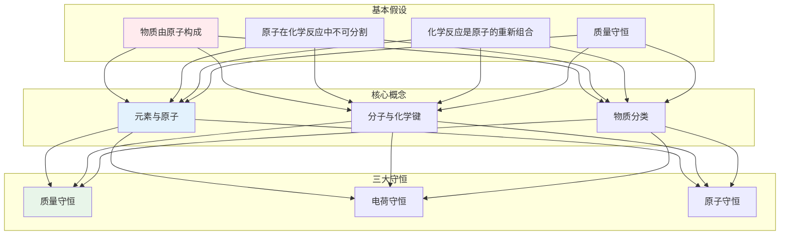
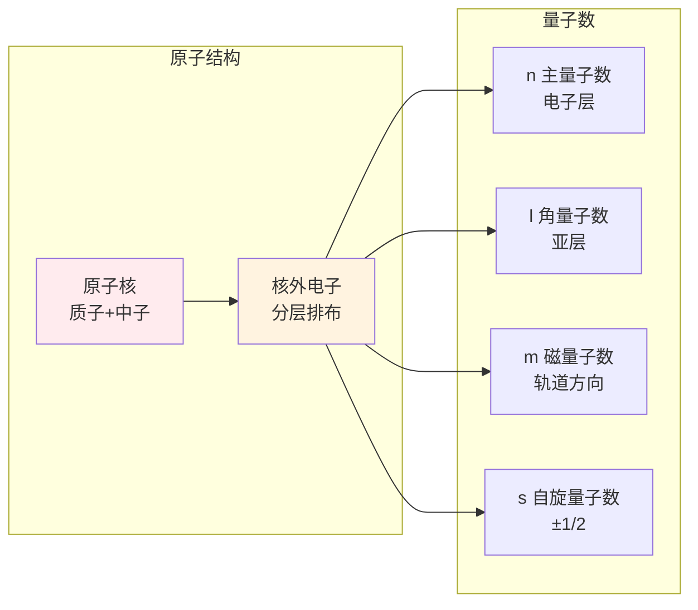
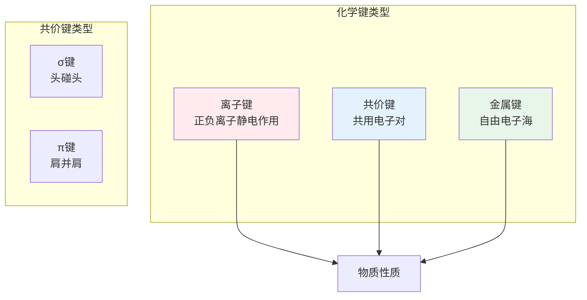
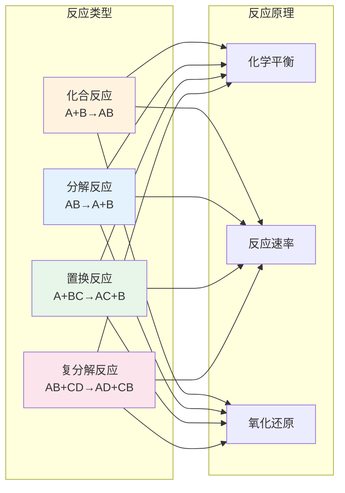
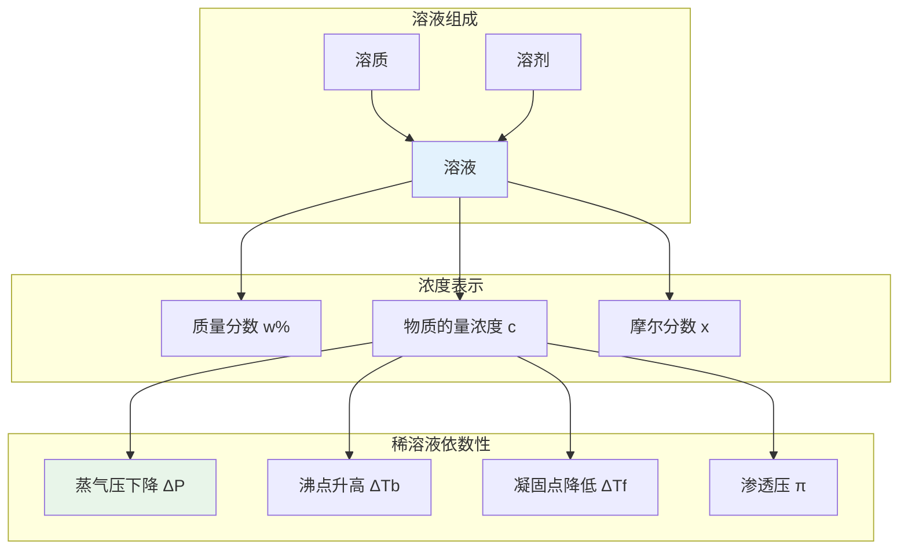
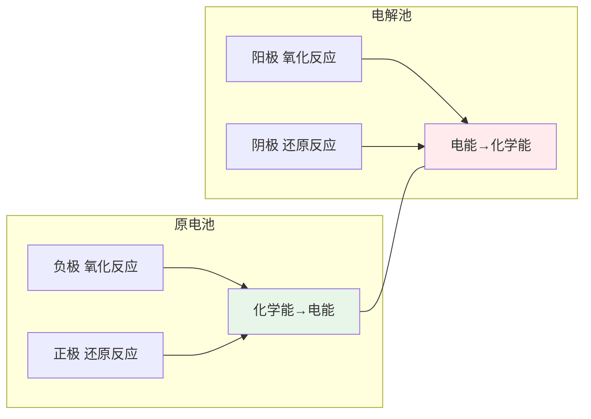
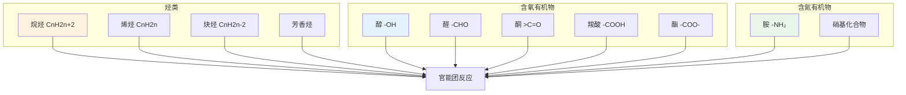
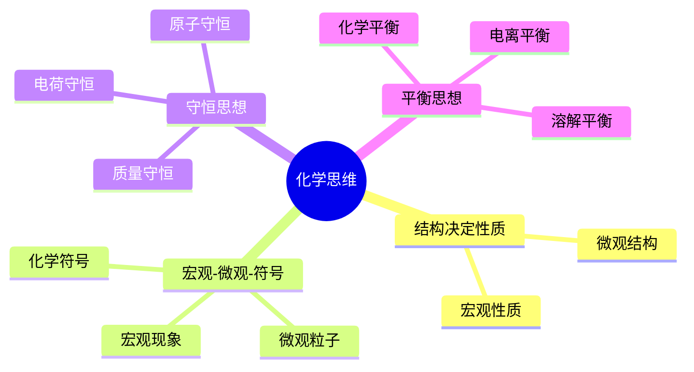
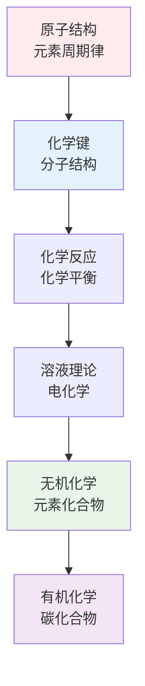

# 化学知识体系

> **第一性原理**：化学是研究物质的组成、结构、性质和变化规律的学科。一切化学现象都可以从原子分子层面理解。

---

## 📚 化学的公理体系



---

## 一、原子结构 Atomic Structure



### 核外电子排布规则

| 规则 | 内容 |
|------|------|
| 泡利不相容 | 同一原子中没有两个电子具有完全相同的四个量子数 |
| 洪特规则 | 电子优先单独占据轨道且自旋平行 |
| 能量最低 | 电子优先填入能量低的轨道 |

---

## 二、化学键 Chemical Bonding



### 化学键比较

| 键类型 | 特点 | 熔沸点 | 导电性 | 典型物质 |
|--------|------|--------|--------|----------|
| 离子键 | 无方向性、无饱和性 | 高 | 熔融导电 | NaCl |
| 共价键 | 有方向性、有饱和性 | 差异大 | 一般不导电 | H₂O |
| 金属键 | 无方向性、无饱和性 | 差异大 | 良导体 | Fe |

---

## 三、化学反应 Reaction Chemistry



### 化学平衡

**平衡常数表达式**：
```
        [C]^c[D]^d
K = ─────────────
        [A]^a[B]^b
```

**勒夏特列原理**：改变平衡条件，平衡向减弱这种改变的方向移动。

---

## 四、溶液理论 Solution Theory



---

## 五、电化学 Electrochemistry



### 能斯特方程
```
        RT      Q
E = E° - ── · ln ──
        nF      1
```

---

## 六、有机化学 Organic Chemistry



---

## 七、化学思维方式



---

## 📖 学习路径



---

## 参考文献

1. 《普通化学原理》- 华彤文
2. 《无机化学》- 武汉大学
3. 《有机化学》- 邢其毅
4. 《物理化学》- 傅献彩