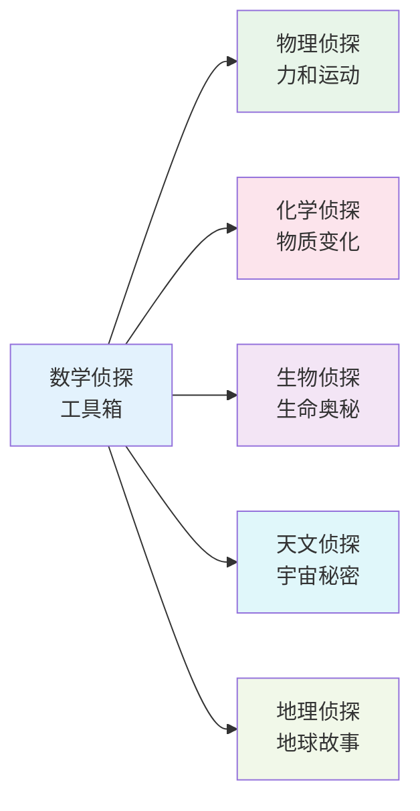
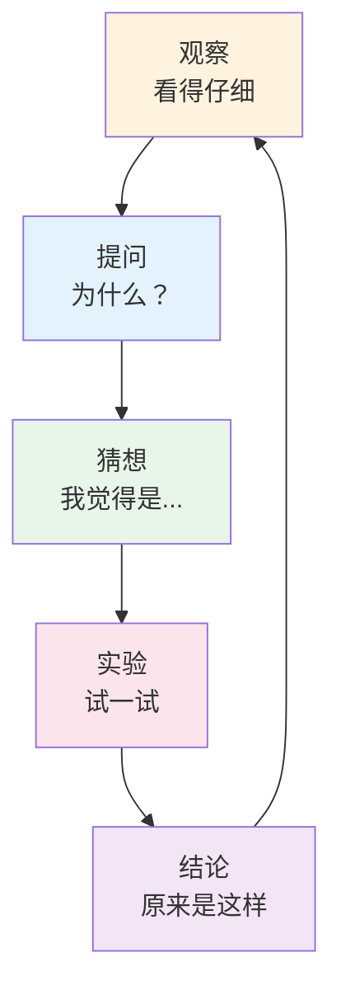
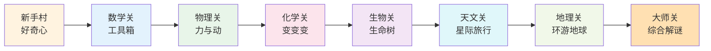

# 自然科学

> **费曼学习法**：大自然是最好的老师，科学就是读懂它的"说明书"！
> 
> 如果你不能用简单的话给小学生讲清楚，说明你还没真正理解。

---

## 🎯 一句话理解自然科学

**自然科学就是研究"为什么"的学问！**

为什么苹果会掉下来？为什么天空是蓝色的？为什么人会生病？为什么星星会发光？
自然科学就是用**观察、猜想、实验、验证**这四步，来回答这些问题的。

---

## 🏗️ 自然科学的"六大侦探"

每个学科就像一个侦探，专门破解大自然的一种谜题：



| 侦探名字 | 专长 | 口头禅 | 去哪里找TA |
|----------|------|--------|------------|
| **数学侦探** | 逻辑、数字、图形 | "我来帮你量一量、算一算" | 所有学科都要用到TA |
| **物理侦探** | 力、能量、光、声、电 | "万事万物都有规律" | 踢球、坐过山车、开灯 |
| **化学侦探** | 原子、分子、反应 | "变身！变身！" | 做饭、生锈、燃烧、消化 |
| **生物侦探** | 细胞、基因、生态 | "生命在进化" | 养花、养宠物、看医生 |
| **天文侦探** | 星星、行星、宇宙 | "抬头看天" | 看日出、数星星、问外星人 |
| **地理侦探** | 山川、气候、资源 | "脚下有路" | 旅行、看天气预报、喝水 |

---

## 🔬 科学家的"四步走"秘籍



> **小贴士**：爱因斯坦小时候也爱问"为什么"，牛顿被苹果砸了也在想"为什么"。  
> **你也可以是小小科学家！** 只要敢问、敢猜、敢试。

---

## 📚 每个侦探的"装备箱"（点击进入）

| 侦探 | 核心装备 | 入门任务 | 进阶挑战 |
|------|----------|----------|----------|
| [数学侦探](mathematics/index.md) | 数字、图形、逻辑 | 学会数数、认识图形 | 解方程、证几何 |
| [物理侦探](physics/index.md) | 力、能量、波 | 推小车、荡秋千 | 造火箭、发电 |
| [化学侦探](chemistry/index.md) | 原子、分子、反应 | 做火山实验、写隐形信 | 合成新材料 |
| [生物侦探](biology/index.md) | 细胞、基因、生态 | 种豆芽、观察小蚂蚁 | 读懂DNA |
| [天文侦探](astronomy/index.md) | 望远镜、光谱、引力 | 认北斗七星、看月相 | 发现新行星 |
| [地理侦探](geography/index.md) | 地图、指南针、岩石 | 画家乡地图、分辨云 | 预测天气 |

---

## 🎮 自然科学闯关游戏



**通关奖励**：
- 🥉 铜牌：会用放大镜、显微镜、望远镜
- 🥈 银牌：能用"为什么"解释身边现象
- 🥇 金牌：能设计实验验证自己的猜想
- 💎 钻石：能用跨学科知识解决真问题

---

## 🔗 跨学科"传送门"

自然科学不是孤岛，它们手拉手：

| 传送门 | 从这里跳到那里 | 例子 |
|--------|----------------|------|
| 数学 → 物理 | 用方程描述运动 | 抛物线 = 二次函数 |
| 物理 → 化学 | 能量驱动反应 | 点火 = 热能启动反应 |
| 化学 → 生物 | 分子组成生命 | DNA = 化学大分子 |
| 生物 → 地理 | 生物适应环境 | 仙人掌防水 = 沙漠生存 |
| 地理 → 天文 | 地球是颗星星 | 白天黑夜 = 地球自转 |
| 天文 → 物理 | 宇宙大爆炸 | 元素起源 = 恒星核聚变 |

---

## 💡 给小学生（和大朋友）的话

> **大自然不考试，只给谜题。**  
> **科学不是背答案，是练"破案"本领。**  
> 
> 1. **多看看**：蚂蚁搬家、云变形、影子长短
> 2. **多问问**：为什么彩虹是弯的？为什么冰能浮在水上？
> 3. **多试试**：用柠檬汁写隐形信、用吸管吹泡泡、用磁铁找铁钉
> 4. **多记记**：画观察日记、记实验数据、写猜想笔记
> 
> **记住：每个诺贝尔奖得主，小时候都是"问题最多的孩子"！**

---

## 📖 建议阅读顺序

```
第1周：数学侦探入门（工具箱准备好）
第2周：物理侦探入门（力和运动）
第3周：化学侦探入门（神奇变身）
第4周：生物侦探入门（生命观察）
第5周：天文侦探入门（仰望星空）
第6周：地理侦探入门（脚下路长）
第7周起：挑战跨学科案例（火箭、气候、基因...）
```

---

**每个科学家都曾经是初学者！现在，拿起你的放大镜，出发吧！** 🔬✨