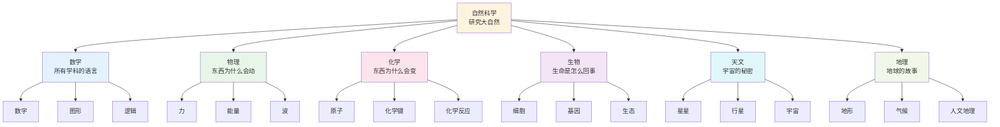
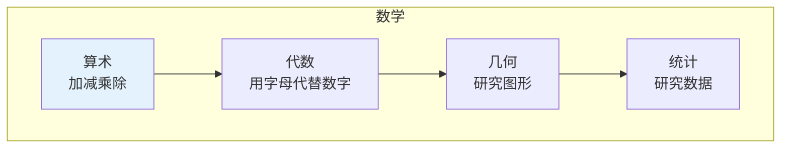
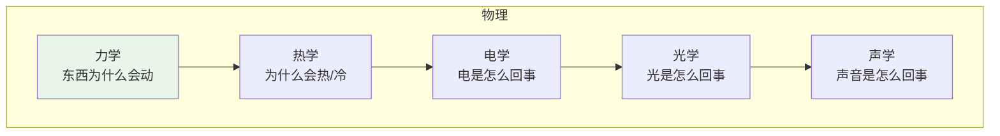
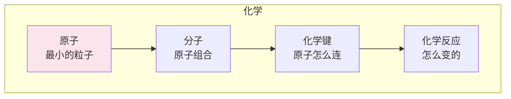
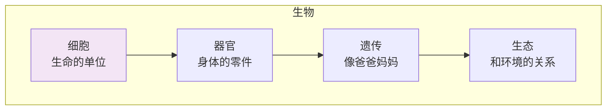
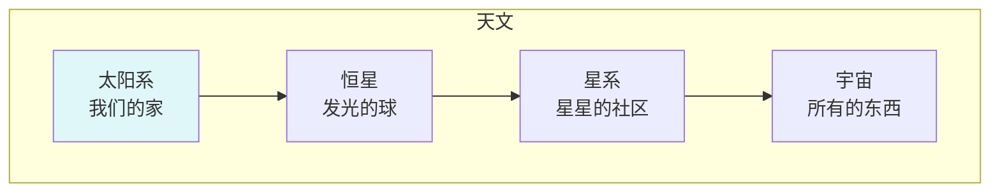
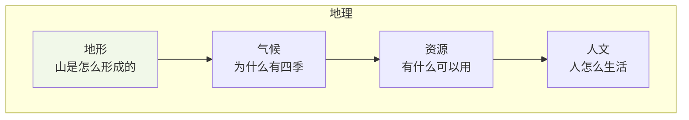
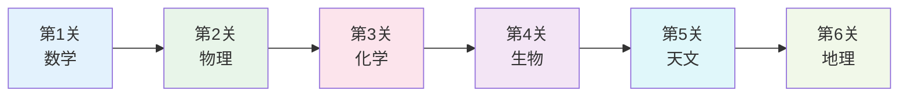

# 自然科学

> **费曼学习法**：大自然是最好的老师，科学就是读懂它的"说明书"！

---

## 🎯 一句话理解自然科学

**自然科学就是研究大自然是怎么运作的！**

为什么苹果会掉下来？为什么天空是蓝色的？为什么人会生病？自然科学就是回答这些问题的！

---

## 🏗️ 自然科学的"积木塔"

---

## 📚 每个积木块详解

### 🔢 数学（所有学科的语言）

**用小学生的话说**：数学就是研究"数"和"形"的学问，是所有科学的"语言"！

| 积木块 | 小学生版解释 | 生活中的例子 |
|--------|--------------|--------------|
| 算术 | 加减乘除 | 买东西算钱 |
| 代数 | 用字母代替数字 | x + 5 = 10 |
| 几何 | 研究图形 | 正方形、圆形 |
| 统计 | 研究数据 | 班级平均分 |

---

### ⚡ 物理（东西为什么会动）

**用小学生的话说**：物理就是研究"力"和"运动"的学问！

| 积木块 | 小学生版解释 | 生活中的例子 |
|--------|--------------|--------------|
| 力学 | 东西为什么会动 | 推秋千、踢球 |
| 烏学 | 为什么会热/冷 | 空调、暖气 |
| 电学 | 电是怎么回事 | 电灯、电视 |
| 光学 | 光是怎么回事 | 影子、彩虹 |
| 声学 | 声音是怎么回事 | 说话、唱歌 |

---

### 🧪 化学（东西为什么会变）

**用小学生的话说**：化学就是研究"物质"是怎么变化的！

| 积木块 | 小学生版解释 | 生活中的例子 |
|--------|--------------|--------------|
| 原子 | 最小的粒子 | 积木块 |
| 分子 | 原子组合 | 积木搭的房子 |
| 化学键 | 原子怎么连 | 胶水粘积木 |
| 化学反应 | 怎么变的 | 铁生锈、纸燃烧 |

---

### 🌱 生物（生命是怎么回事）

**用小学生的话说**：生物就是研究"活的东西"是怎么生活的！

| 积木块 | 小学生版解释 | 生活中的例子 |
|--------|--------------|--------------|
| 细胞 | 生命的单位 | 积木块 |
| 器官 | 身体的零件 | 心脏、肺 |
| 遗传 | 像爸爸妈妈 | 眼睛像爸爸 |
| 生态 | 和环境的关系 | 树和鸟的关系 |

---

### 🌟 天文（宇宙的秘密）

**用小学生的话说**：天文就是研究"星星"和"宇宙"的学问！

| 积木块 | 小学生版解释 | 生活中的例子 |
|--------|--------------|--------------|
| 太阳系 | 我们的家 | 太阳、地球、月亮 |
| 恒星 | 发光的球 | 太阳 |
| 星系 | 星星的社区 | 银河系 |
| 宇宙 | 所有的东西 | 所有的星星和空间 |

---

### 🌍 地理（地球的故事）

**用小学生的话说**：地理就是研究"地球"长什么样的学问！

| 积木块 | 小学生版解释 | 生活中的例子 |
|--------|--------------|--------------|
| 地形 | 山是怎么形成的 | 高山、平原 |
| 气候 | 为什么有四季 | 春夏秋冬 |
| 资源 | 有什么可以用 | 水、石油 |
| 人文 | 人怎么生活 | 城市、乡村 |

---

## 🎮 自然科学闯关游戏

**闯关秘籍**：
1. **第1关**：学数学（所有学科的基础）
2. **第2关**：学物理（理解力和运动）
3. **第3关**：学化学（理解物质变化）
4. **第4关**：学生物（理解生命）
5. **第5关**：学天文（理解宇宙）
6. **第6关**：学地理（理解地球）

---

## 💡 给小学生的话

> 大自然是最有趣的老师！
> 
> 多观察、多提问、多思考！
> 
> 科学家就是从"为什么"开始的！

---

**每个科学家都曾经是初学者！**