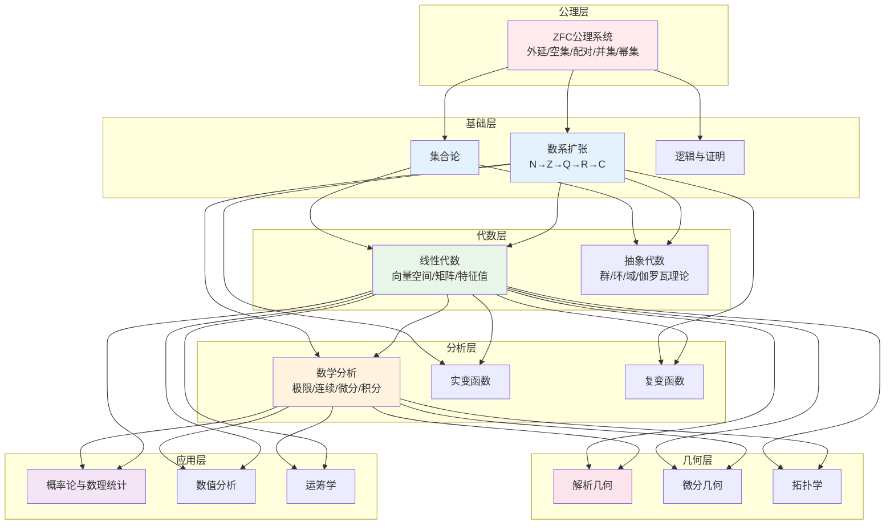
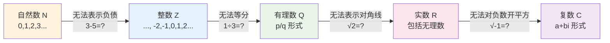
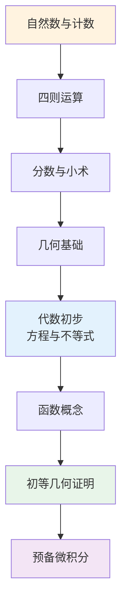

# 数学知识体系

> **核心思想**：数学是研究数量、结构、变化和空间的学科。从最简单的计数开始，通过公理化方法逐步构建起宏伟的理论大厦。

---

## 📚 配套课程

### 小学阶段（3-6年级）
- [思维培养讲义](思维培养讲义.md) - 完整30课，从零开始构建数学思维

---

## 一、数学的公理体系



---

## 二、数系扩张历程



---

## 三、核心定理关系图

```mermaid
graph TB
    subgraph 集合论基础
        S1[康托尔定理<br/>|A| < |P(A)|]
        S2[德摩根律]
        S3[容斥原理]
    end
    
    subgraph 数系性质
        N1[有理数稠密性]
        N2[实数完备性<br/>确界原理/柯西准则]
        N3[代数基本定理<br/>n次多项式有n个根]
    end
    
    subgraph 代数结构
        A1[群论<br/>拉格朗日定理]
        A2[环与域]
        A3[线性代数<br/>维数定理/谱定理]
    end
    
    subgraph 分析核心
        AN1[ε-δ定义]
        AN2[中值定理<br/>罗尔/拉格朗日/柯西]
        AN3[微积分基本定理]
    end
    
    subgraph 概率统计
        P1[概率公理]
        P2[大数定律]
        P3[中心极限定理]
    end
    
    S1 & S2 & S3 --> N1 & N2
    N2 --> AN1 & AN2
    AN2 --> AN3
    A1 & A2 & A3 --> AN1
    AN3 --> P1
    P1 --> P2 & P3
    
    style S1 fill:#ffebee
    style N2 fill:#e3f2fd
    style AN3 fill:#e8f5e9
    style P3 fill:#f3e5f5
```

---

## 四、数学方法论

```mermaid
mindmap
  root((数学方法))
    公理化方法
      从少数公理出发
      逻辑演绎推导
      建立完整体系
    抽象化方法
      提取共同结构
      统一不同现象
      发现深层联系
    数学归纳法
      基础步：证明n=0成立
      归纳步：P(n)→P(n+1)
      结论：对所有n成立
    反证法
      假设结论不成立
      推出矛盾
      证明原结论成立
    构造性方法
      直接给出对象
      证明存在性
    类比与归纳
      从特殊到一般
      从具体到抽象
```

---

## 五、重要公式速查

| 领域 | 核心公式 | 意义 |
|------|----------|------|
| 欧拉公式 | $e^{i\pi} + 1 = 0$ | 联系五大常数 |
| 勾股定理 | $a^2 + b^2 = c^2$ | 直角三角形性质 |
| 二次公式 | $x = \frac{-b \pm \sqrt{b^2-4ac}}{2a}$ | 一元二次方程解 |
| 泰勒展开 | $f(x) = \sum \frac{f^{(n)}(a)}{n!}(x-a)^n$ | 函数局部逼近 |
| 高斯积分 | $\int_{-\infty}^{\infty} e^{-x^2}dx = \sqrt{\pi}$ | 正态分布基础 |
| 傅里叶变换 | $\hat{f}(\xi) = \int f(x)e^{-2\pi i x\xi}dx$ | 信号频域分析 |

---

## 📖 学习建议

### 初学者路径


### 核心能力培养
- 逻辑推理能力
- 抽象思维能力
- 空间想象能力
- 计算准确能力
- 问题解决能力

---

## 参考文献

1. 欧几里得《几何原本》
2. 华罗庚《高等数学引论》
3. 丘维声《抽象代数基础》
4. Rudin《数学分析原理》
5. Halmos《朴素集合论》