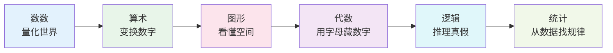
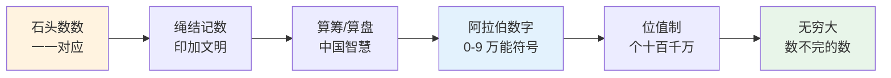
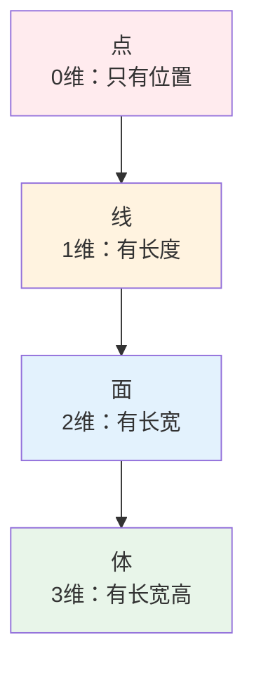
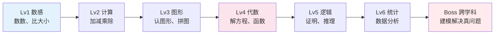

# 数学侦探的工具箱

## 🗂️ 内容导航

| 名称 | 说明 | 链接 |
|------|------|------|
| 小学数学思维培养讲义 | 从计数到抽象，深入浅出构建数学思维 | [进入](01-math-thinking.md) |

---


> **费曼学习法**：数学不是背公式，是练"逻辑肌肉"。  
> 如果你不能用积木、糖果、画图给小学生讲清楚，说明你还没真正懂。

---

## 🎯 一句话理解数学

**数学就是研究"规律"的语言。**  

数数是规律，图形是规律，找规律、用规律、证规律——这就是数学的全部秘密。

---

## 🧰 数学侦探的六件"神器"



| 神器 | 小学生版说明 | 生活超能力 | 进阶形态 |
|------|-------------|------------|----------|
| **数数** | 1、2、3...把东西变成数字 | 分糖果、数台阶、排队报数 | 无穷大、负数、小数 |
| **算术** | 加减乘除，数字玩魔术 | 买东西算钱、分披萨、算时间 | 方程、函数、微积分 |
| **图形** | 点线面体，空间搭积木 | 折纸飞机、拼拼图、看地图 | 几何证明、拓扑学 |
| **代数** | 用 x、y 藏起数字玩捉迷藏 | "我猜你想的数"、解谜题 | 方程组、矩阵、群论 |
| **逻辑** | 真假对错，推理不翻车 | 破案游戏、辩论不被绕、写代码 | 形式逻辑、证明论 |
| **统计** | 从一堆数据里找规律 | 班级平均分、天气预报、选零食 | 概率论、机器学习 |

---

## 🧮 数数的进化史（从石头到无穷大）



> **小故事**：以前没有"0"，人类数几千年都数不出"没有"！  
> 印度数学家发明"0"，才让数字能表示"空"，数学才真正起飞。

---

## ➕ 算术四大魔法（加减乘除）

### 加法 = 合在一起
```
🍎 + 🍎 = 🍎🍎
3 + 2 = 5
```
**口诀**：谁和谁凑十？十凑满了进一位。

### 减法 = 拿走一些
```
🍎🍎🍎 - 🍎 = 🍎🍎
5 - 1 = 4
```
**口诀**：不够减？向邻居借一十。

### 乘法 = 快速加法
```
3 × 4 = 3 + 3 + 3 + 3 = 12
```
**口诀**：一一得一，一二得二...九九八十一，背熟最轻松！

### 除法 = 平均分
```
12 ÷ 3 = 4
(12个糖果，3个小朋友，每人4个)
```
**秘密**：除法是乘法的"逆操作"，乘法表倒着背就是除法！

---

## 🔺 图形侦探：从点到立体



| 维度 | 名字 | 例子 | 趣味事实 |
|------|------|------|----------|
| 0维 | 点 | 铅笔尖、星星 | 无大小，只有位置 |
| 1维 | 线 | 绳子、铅笔画 | 只有长度，蚂蚁只能前进后退 |
| 2维 | 面 | 纸、桌面、屏幕 | 有长宽，画画的世界 |
| 3维 | 体 | 积木、苹果、人 | 有长宽高，我们生活的世界 |

**动手做**：
- 用牙签和橡皮泥搭：正四面体(4面)、正方体(6面)、正八面体(8面)
- 把纸剪成"网"，折成盒子 → 这就是"展开图"！

---

## 🔤 代数：字母捉迷藏

### 为什么要用字母？
> 因为**还不知道的数字**，我们用 x、y、z 来代表！

```
谜题：我想了个数，乘以3，加5，得20。这个数是几？
方程：3x + 5 = 20
解法：3x = 15 → x = 5
```

### 代数三步走
1. **设未知数**：设这个数为 x
2. **列方程**：用等式把题目"翻译"成数学语言
3. **解方程**：把 x 单独留在等号一边

**进阶玩法**：
- 一元一次方程：`ax + b = 0` （直线）
- 一元二次方程：`ax² + bx + c = 0` （抛物线）
- 方程组：两条线的交点 = 解

---

## 🧠 逻辑侦探：真假推理

### 三大基本规则
| 规则 | 说明 | 例子 |
|------|------|------|
| **同一律** | A 就是 A | 1+1=2，永远是2 |
| **不矛盾律** | A 不能既是真又是假 | "我在睡觉"和"我醒着"不能同时真 |
| **排中律** | 非真即假，没有中间 | 数字要么是奇数，要么是偶数 |

### 推理小游戏
```
大前提：所有的鸟都会飞
小前提：企鹅是鸟
结论：企鹅会飞 ✈️ ❌（错误！大前提不对）

大前提：所有的哺乳动物都用肺呼吸
小前提：鲸鱼是哺乳动物
结论：鲸鱼用肺呼吸 ✅（正确！）
```

---

## 📊 统计：从数据里听声音

### 三个"代表数"
| 名字 | 怎么算 | 什么时候用 |
|------|--------|------------|
| **平均数** | 全部加起来 ÷ 个数 | 算班级平均分 |
| **中位数** | 排队站中间的数 | 算收入水平（不受大款影响） |
| **众数** | 出现最多的数 | 选最受欢迎的零食口味 |

### 图表超能力
- **条形图**：比大小（谁最高？）
- **折线图**：看变化（温度升降、长高曲线）
- **饼图**：看占比（零花钱花哪了？）

---

## 🎮 数学闯关游戏



**每关必练**：
- ✅ Lv1：数豆子、分水果、排队报数
- ✅ Lv2：买菜算钱、做饭量料、算时间
- ✅ Lv3：折纸、搭积木、画地图
- ✅ Lv4：解谜题、找规律、编程序
- ✅ Lv5：玩数独、破案游戏、辩论赛
- ✅ Lv6：记天气、统计零花钱、做调查

---

## 🔗 数学 → 其他科学的传送门

| 传送门 | 数学工具 | 科学应用 |
|--------|----------|----------|
| → 物理 | 方程、函数、微积分 | 运动轨迹、电路分析、火箭轨道 |
| → 化学 | 比例、对数、统计 | 化学计量、pH值、反应速率 |
| → 生物 | 统计、概率、建模 | 种群增长、基因遗传、流行病传播 |
| → 天文 | 几何、三角、微积分 | 行星轨道、恒星距离、宇宙年龄 |
| → 地理 | 统计、几何、坐标 | 人口分布、地图投影、气候模型 |
| → AI/IT | 线性代数、概率、优化 | 机器学习、神经网络、数据挖掘 |

---

## 💡 给小学生的数学秘籍

> **数学不是天赋，是练出来的"肌肉"。**

1. **动手操作**：用积木、豆子、纸片、绳子——**看得见、摸得着**才懂得深
2. **多画图**：画图解题、画函数图像、画几何图——**一图胜千言**
3. **找规律**：1, 3, 5, 7... 下一个是？1, 1, 2, 3, 5, 8... 下一个是？
3. **问为什么**：为什么乘法交换律成立？为什么除数不能为0？
4. **敢犯错**：算错一道题，比对十道题收获大——**错题本是宝藏**
5. **玩游戏**：数独、魔方、汉诺塔、编程小游戏——**玩着就学会了**

---

## 📖 本周任务清单

- [ ] 用豆子演示：加法、乘法、除法
- [ ] 用牙签+橡皮泥搭：三棱锥、正方体、正八面体
- [ ] 设计一个"猜数字"游戏给家长玩（用代数）
- [ ] 记录一周早晚温度，画折线图
- [ ] 找生活中的"斐波那契数列"（花瓣、松果、蜗牛壳）

---

**数学侦探口号：找规律、用逻辑、证猜想、解大案！** 🕵️‍♂️🔢✨