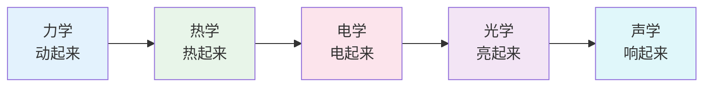
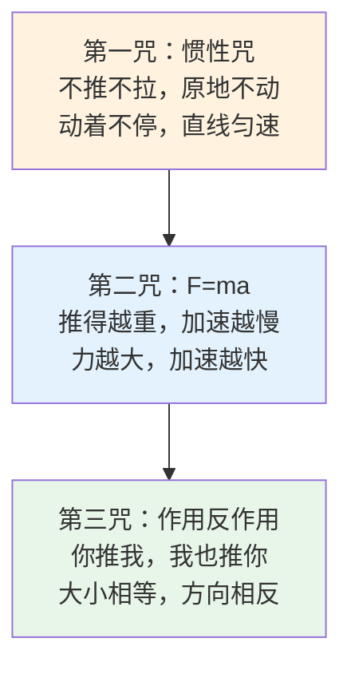
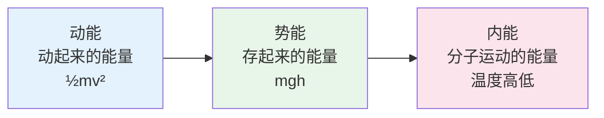
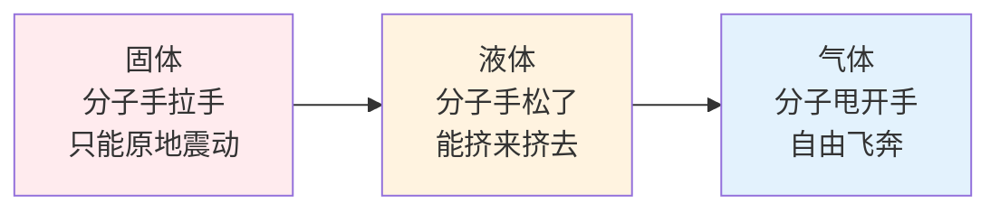
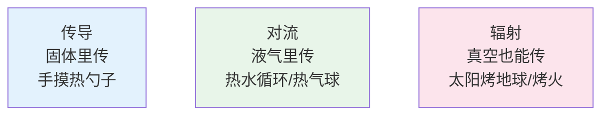
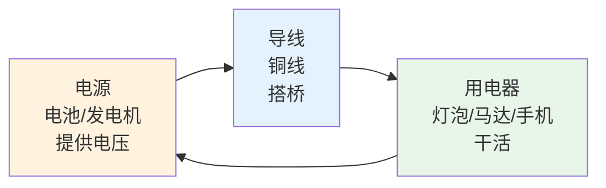
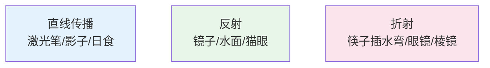
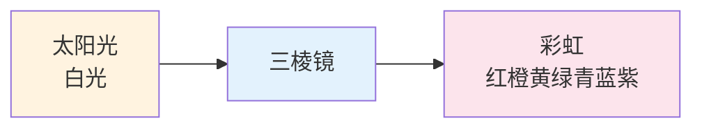
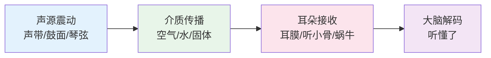
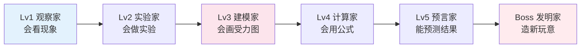

# 物理侦探的魔法笔记

> **费曼学习法**：物理不是背定律，是看懂世界运行的"源代码"。  
> 如果你不能用推小车、荡秋千、吹泡泡给小学生讲清楚，说明你还没真正懂。

---

## 🎯 一句话理解物理

**物理就是研究"怎么动"、"为什么动"的学问。**  

从苹果掉地上，到火箭上天；从冰块融化，到闪电劈下；从手电筒发光，到手机通话——**物理无处不在。**

---

## ⚡ 物理侦探的五大"魔法石"



| 魔法石 | 核心问题 | 生活超能力 | 经典实验 |
|--------|----------|------------|----------|
| **力学** | 为什么动？怎么动？ | 踢球、骑车、荡秋千、过山车 | 斜面实验、摆、抛物线 |
| **热学** | 什么是热？热去哪了？ | 空调、冰箱、保温杯、发动机 | 冰水混合、热气球、斯特林发动机 |
| **电学** | 电是什么？怎么用？ | 灯泡、手机、电脑、闪电 | 静电吸纸屑、电路搭建、电磁铁 |
| **光学** | 光是什么？怎么传播？ | 镜子、眼镜、相机、彩虹、光纤 | 棱镜分光、小孔成像、激光 |
| **声学** | 声音怎么传？怎么听？ | 说话、唱歌、听诊器、B超 | 杯子电话、驻波、多普勒效应 |

---

## 🏃 力学：万物皆动

### 牛顿三大咒语（定律）



**生活翻译版**：
- **第一咒**：不系安全带，急刹车飞出去（惯性）
- **第二咒**：推空车容易，推满车难（F=ma）
- **第三咒**：蹬墙跳远、火箭喷气、游泳蹬水

### 三种"能量钱包"



**能量守恒定律**：能量不灭，只转移、变身！
> 过山车：高处势能多 → 冲下去变动能 → 爬坡变势能 → 最后摩擦变热（内能）

---

## 🔥 热学：分子在跳舞

### 温度 = 分子跳舞的剧烈程度



| 状态 | 分子动作 | 体积 | 形状 | 例子 |
|------|----------|------|------|------|
| 固体 | 原地抖动 | 固定 | 固定 | 冰、铁、石头 |
| 液体 | 挤来挤去 | 固定 | 不固定 | 水、油、汞 |
| 气体 | 疯狂飞奔 | 不固定 | 不固定 | 空气、蒸汽、氦气 |

### 热传递三兄弟



---

## ⚡ 电学：看不见的小精灵

### 电荷：原子里的"正负标签"
- **质子** = 正电荷（+）
- **电子** = 负电荷（-）
- **中子** = 中性（0）

**同性相斥，异性相吸** —— 这就是电的性格！

### 电路三要素



### 欧姆定律（电路的"乘法表"）
```
电压 = 电流 × 电阻
V = I × R

水管类比：
水压(电压) = 水流速度(电流) × 管子细度(电阻)
```

**动手做**：
- 柠檬电池（铜片+锌片+柠檬 = 能亮小灯泡！）
- 电磁铁（铁钉+铜线+电池 = 吸回形针）
- 简单电路（电池+导线+小灯泡+开关）

---

## 💡 光学：光是个调皮鬼

### 光的三个性格



### 颜色的秘密
> **白光 = 七色光混合**（红橙黄绿青蓝紫）



**为什么天空是蓝的？** → 蓝光波短，最爱撞气分子乱飞（瑞利散射）
**为什么夕阳是红的？** → 路程长，蓝光散光，剩下红光穿过来

---

## 🔊 声学：空气在震动

### 声音 = 物体震动 → 空气震动 → 耳膜震动 → 大脑听到



### 声音三要素
| 要素 | 决定因素 | 例子 |
|------|----------|------|
| **音调** | 频率（震动快慢） | 压缩琴弦音调变高、男声低女声高 |
| **响度** | 振幅（震动大小） | 用力敲鼓、离喇叭近 |
| **音色** | 波形（震动形状） | 钢琴和小提琴拉同一个音也不同 |

**冷知识**：
- 声音在固体传最快（铁轨听火车）、液体次之、气体最慢
- 月球上没有空气，所以**月球上没声音**！宇航员要用无线电说话

---

## 🎮 物理闯关游戏



**每关必玩实验**：
- ✅ Lv1：观察影子变化、听声音辨方向、摸物体温度
- ✅ Lv2：纸飞机比飞远、自制弹弓、吸管吸水
- ✅ Lv3：画小车受力图、分析秋千能量、画光路图
- ✅ Lv4：算滑滑梯速度、算电路电流、算杠杆省力
- ✅ Lv5：预测抛物线落点、预测冰水混合温度
- ✅ Lv6：自制简易电动机、简易望远镜、保温杯

---

## 🔗 物理 → 其他科学的传送门

| 传送门 | 物理概念 | 科学应用 |
|--------|----------|----------|
| → 化学 | 能量、电子、量子 | 化学键、反应速率、电化学 |
| → 生物 | 力学、热力学、光学 | 肌肉收缩、体温调节、视觉、超声 |
| → 天文 | 万有引力、光谱、相对论 | 行星轨道、恒星寿命、黑洞、大爆炸 |
| → 地理 | 热对流、流体力学 | 大气环流、洋流、地震波、风成地貌 |
| → 医学 | 射线、核磁、超声 | X光片、CT、MRI、B超、放疗 |
| → 工程 | 力学、热学、电磁学 | 桥梁、发动机、芯片、卫星、火箭 |

---

## 💡 给小学生的物理秘籍

> **物理不在书本里，在生活里。**

1. **多问"为什么"**：为什么自行车骑快了不倒？为什么吸管能吸水？为什么冬天摸铁冷摸棉不冷？
2. **多做实验**：**动手一次，胜过读十遍**——自制火箭、造潜水艇、搭电路、做棱镜
3. **会画图**：受力图、光路图、电路图、相变图——**物理画图一半对**
4. **会估算**：不用算出精确数，估个数量级——这叫"费米估算"
5. **找规律**：同类现象归一类——抛物线、单摆、弹簧、行星都是"简谐运动"家族

---

## 📖 本周任务清单

- [ ] 用纸板和吸管做一个"气压火箭"
- [ ] 用棱镜（或水杯+手电筒）在墙上投出彩虹
- [ ] 搭一个简单电路：电池+导线+小灯泡+自制开关
- [ ] 用两个纸杯+绳子做"杯子电话"，测最远多远能听清
- [ ] 观察一次日落/日出，记录太阳位置和影子变化
- [ ] 解释给家人听：为什么热气球能飞起来？

---

**物理侦探口号：看现象、找规律、做实验、懂原理、会预测！** 🔬⚡🚀