# 物理学知识体系

> **第一性原理**：物理学是从最基本的自然规律出发，理解物质、能量、空间和时间的学科。

---

## 📚 物理学的公理体系

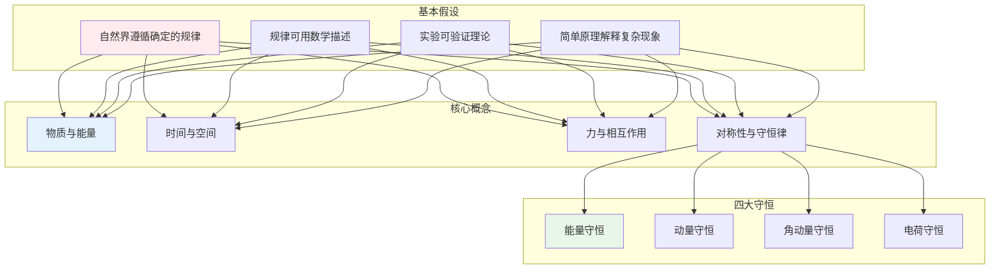

---

## 一、力学 Mechanics

### 牛顿三大定律

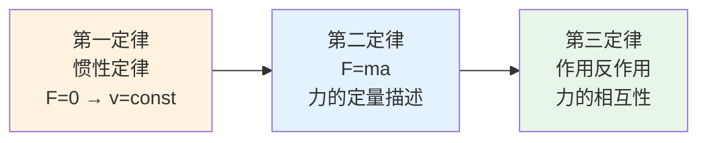

### 力学知识体系

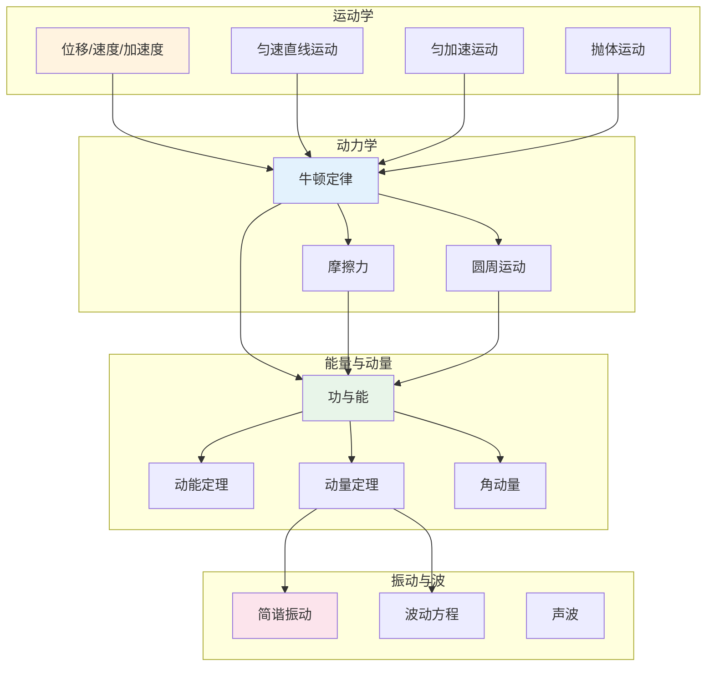

### 重要定理

| 定理 | 公式 | 意义 |
|------|------|------|
| 动能定理 | $W = \Delta E_k = \frac{1}{2}mv^2 - \frac{1}{2}mv_0^2$ | 功是能量转化的量度 |
| 动量定理 | $Ft = \Delta p = mv - mv_0$ | 冲量是动量变化的量度 |
| 万有引力 | $F = G\frac{m_1m_2}{r^2}$ | 解释天体运动 |
| 胡克定律 | $F = -kx$ | 弹性体的恢复力 |

---

## 二、热学 Thermodynamics

### 热力学四大定律

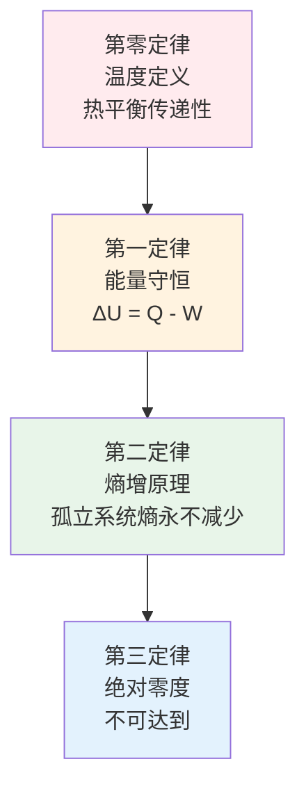

### 核心概念关系

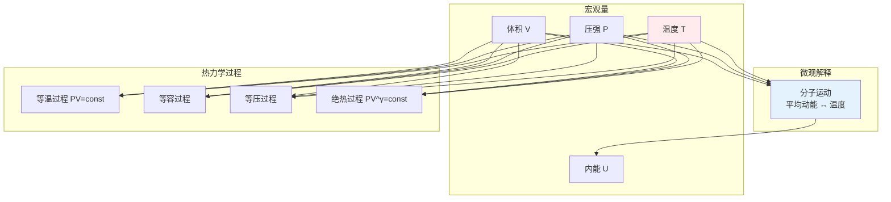

---

## 三、电磁学 Electromagnetism

### 麦克斯韦方程组

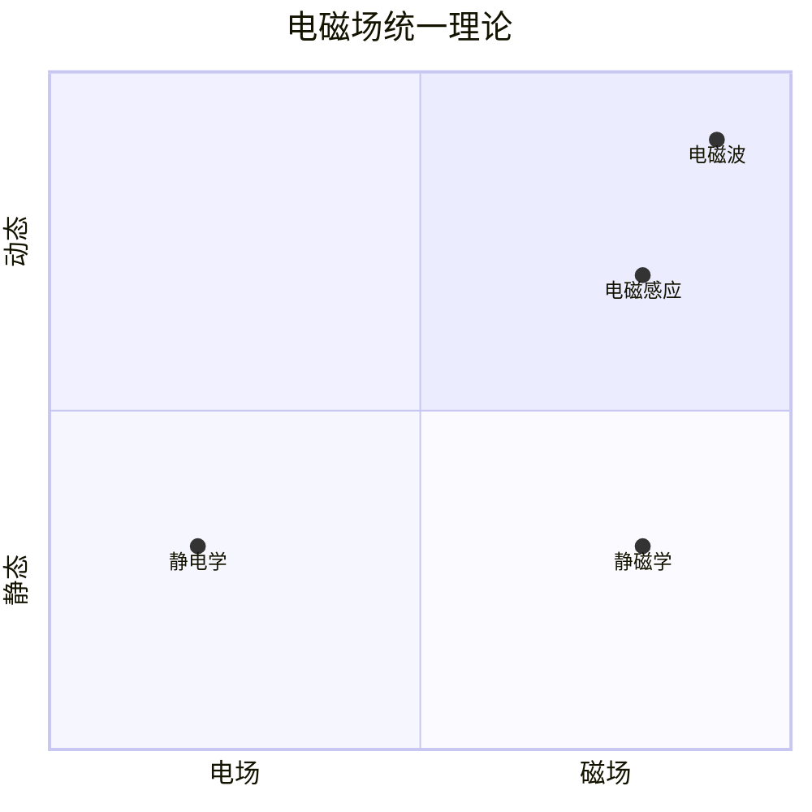

### 电磁学核心方程

```
∇·E = ρ/ε₀        高斯定律（电荷产生电场）
∇·B = 0            磁高斯定律（无磁单极）
∇×E = -∂B/∂t     法拉第定律（变化磁场产生电场）
∇×B = μ₀J + μ₀ε₀∂E/∂t  安培-麦克斯韦定律
```

### 重要定律

| 定律 | 公式 | 意义 |
|------|------|------|
| 库仑定律 | $F = k\frac{q_1q_2}{r^2}$ | 电荷间相互作用 |
| 欧姆定律 | $V = IR$ | 电路基本关系 |
| 法拉第定律 | $\varepsilon = -\frac{d\Phi}{dt}$ | 电磁感应 |

---

## 四、光学 Optics

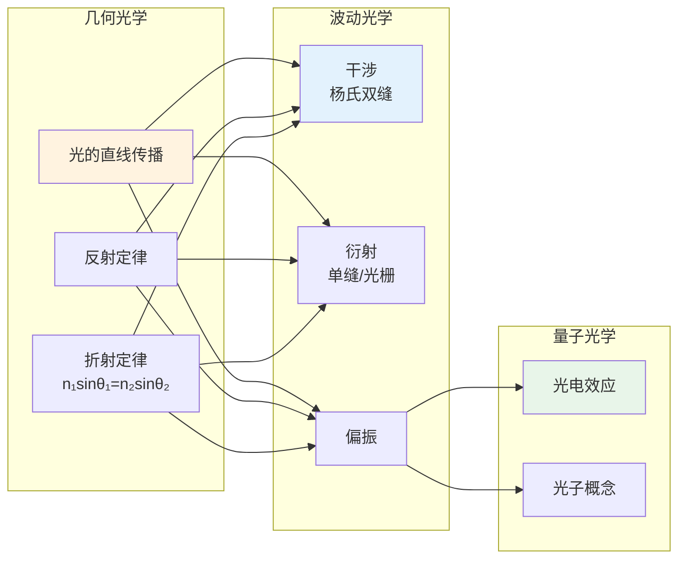

---

## 五、近代物理 Modern Physics

### 相对论

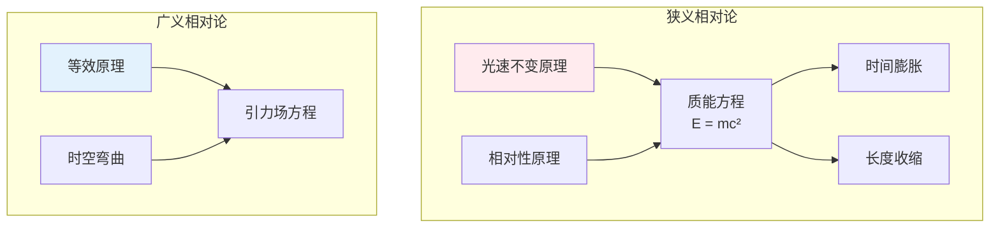

### 量子力学

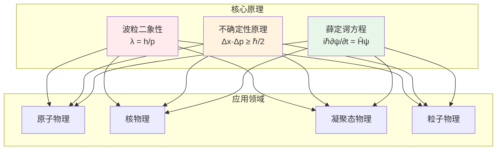

---

## 六、物理学思维方式

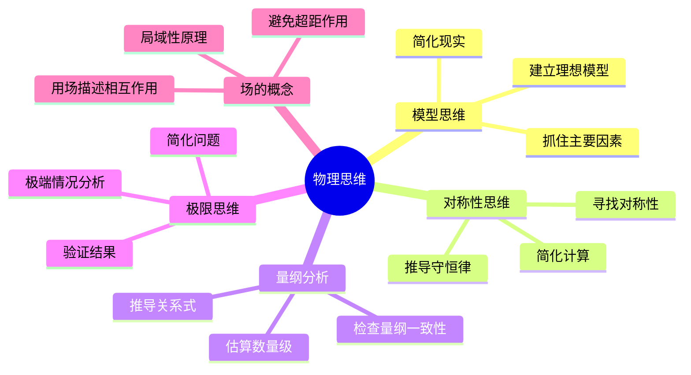

---

## 📖 学习路径

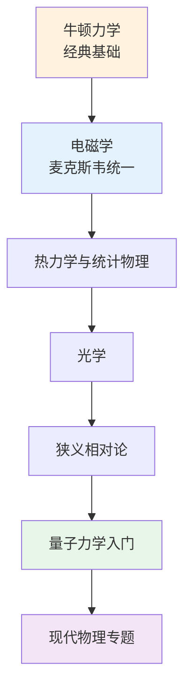

---

## 参考文献

1. 《力学》- 朗道
2. 《电动力学》- 格里菲斯
3. 《热力学与统计物理》- 汪志诚
4. 《费曼物理学讲义》