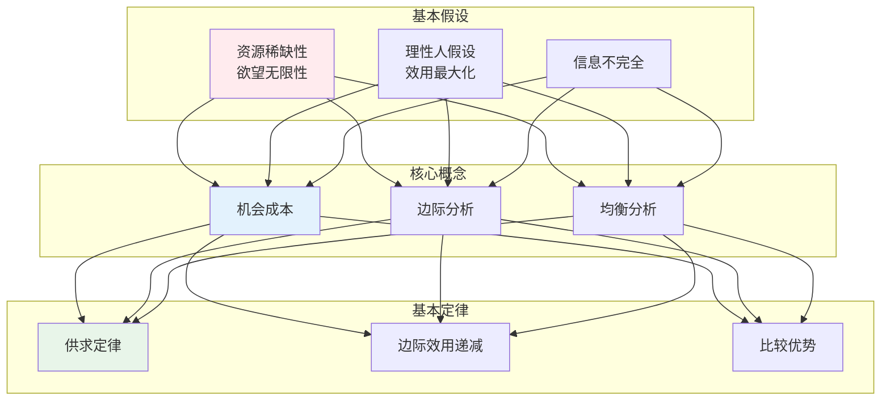
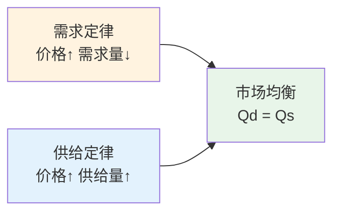
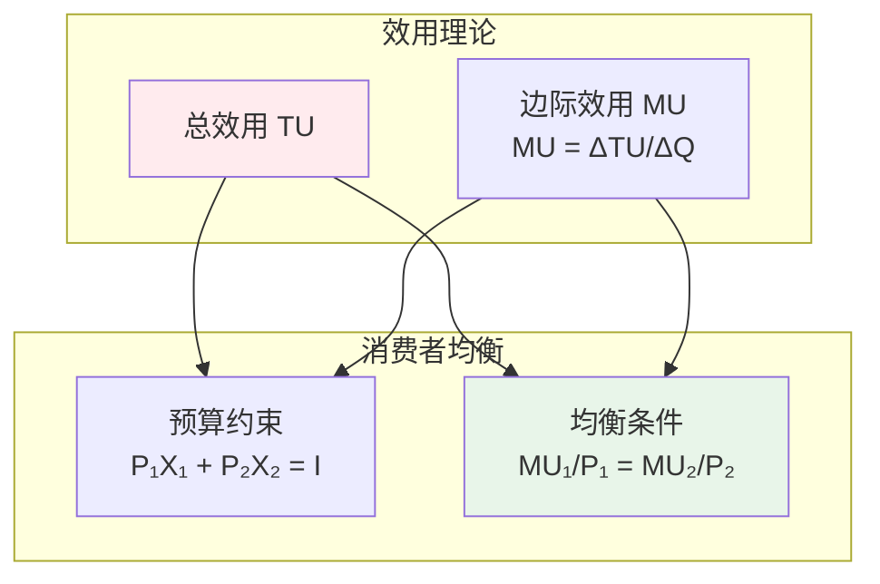
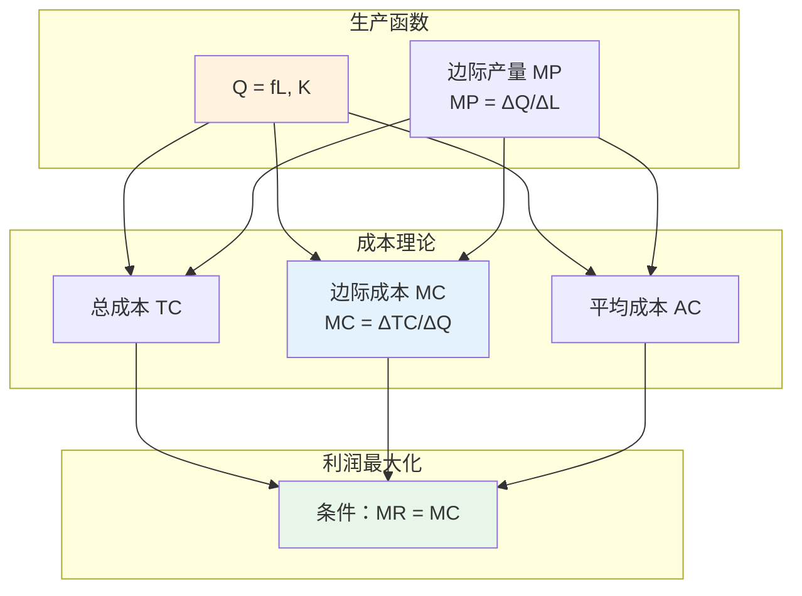
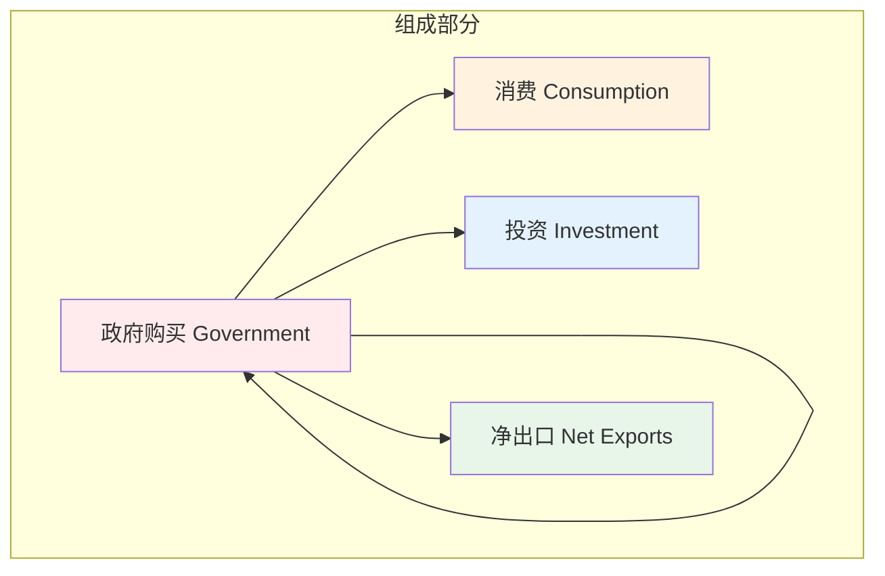
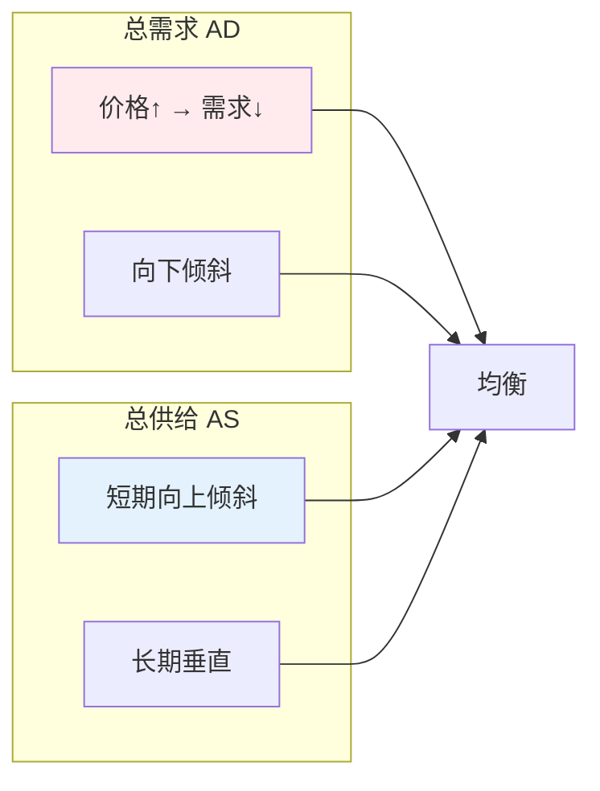
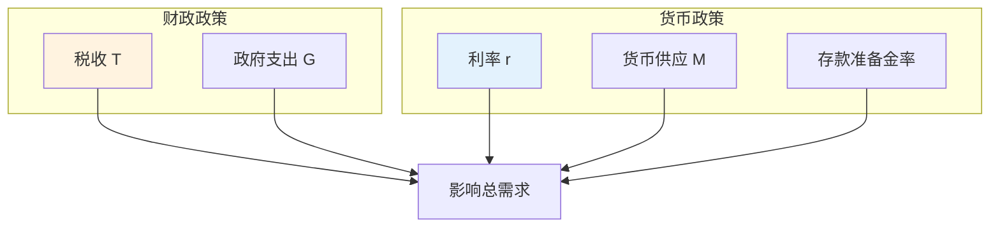
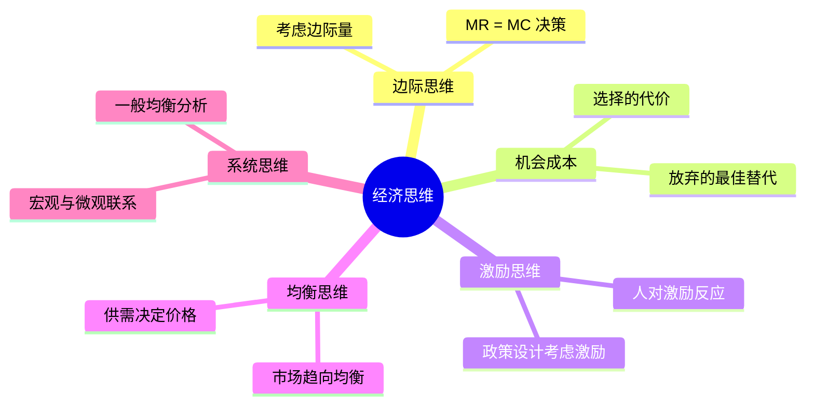
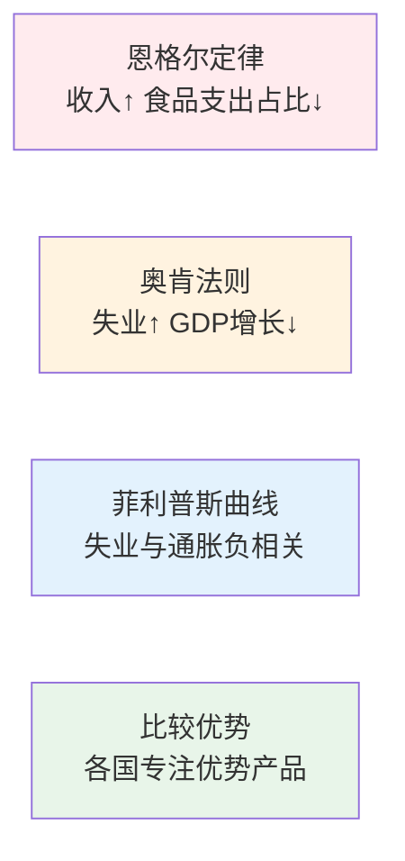
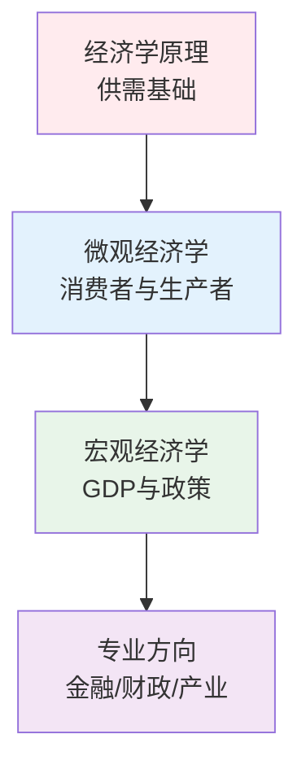

# 经济学知识体系

## 🗂️ 内容导航

| 名称 | 说明 | 链接 |
|------|------|------|
| 投资理财 | 理解投资原理与理财实战方法 | [进入](investment/index.md) |

---

> **第一性原理**：经济学是研究如何在资源稀缺的条件下做出选择，以实现最大满足的学科。

---

## 📚 经济学的公理体系

---

## 一、微观经济学 Microeconomics

### 供需模型

### 消费者行为

### 生产者理论

### 市场结构

---

## 二、宏观经济学 Macroeconomics

### GDP核算

### 总需求-总供给模型

### 政策工具

---

## 三、经济学思维方式

---

## 四、重要经济定律

---

## 📖 学习路径

---

## 参考文献

1. 《经济学原理》- 曼昆
2. 《微观经济学》- 平狄克
3. 《宏观经济学》- 曼昆
4. 《国富论》- 亚当·斯密