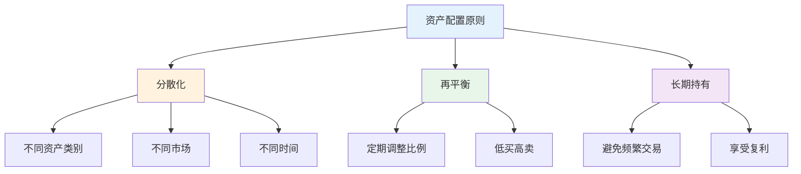
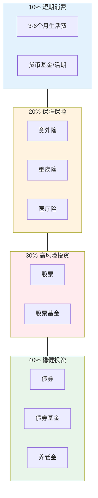
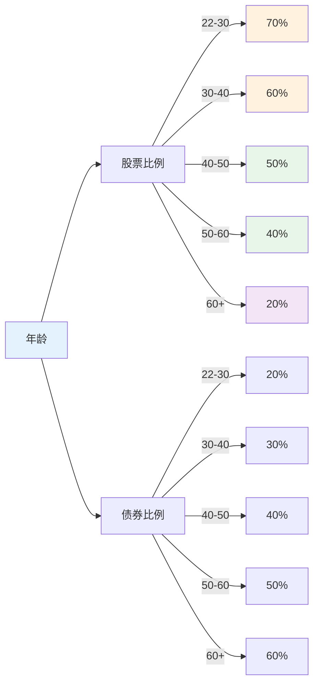
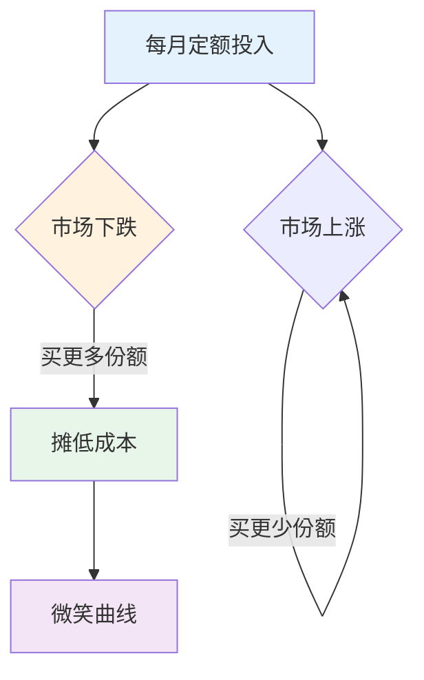
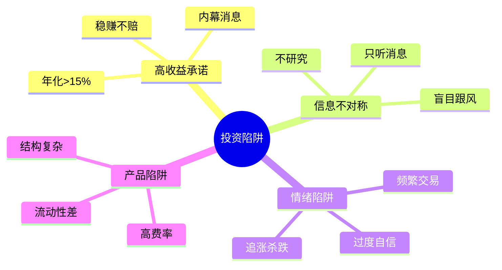

# 资产配置实战 — 构建稳健的投资组合

> 不要把所有鸡蛋放在一个篮子里，但也不要放在太多篮子里

---

## 一、资产配置核心原则

### 1.1 三大原则

### 1.2 风险收益矩阵

| 资产类别 | 预期收益 | 风险等级 | 波动性 |
|----------|----------|----------|--------|
| 货币基金 | 2-4% | 低 | 极低 |
| 债券基金 | 4-8% | 中低 | 低 |
| 混合基金 | 6-12% | 中 | 中 |
| 股票基金 | 8-15% | 中高 | 高 |
| 股票 | ±50% | 高 | 极高 |

---

## 二、标准普尔配置法

### 2.1 四象限配置

### 2.2 案例：100万资产配置

| 象限 | 金额 | 用途 | 产品 |
|------|------|------|------|
| 要花的钱 | 10万 | 6个月生活费 | 货币基金 |
| 保命的钱 | 20万 | 保障保险 | 意外+重疾+医疗 |
| 生钱的钱 | 30万 | 高收益投资 | 股票基金 |
| 保本的钱 | 40万 | 稳健增值 | 债券基金 |

---

## 三、生命周期配置

### 3.1 不同年龄配置

### 3.2 配置原则

| 阶段 | 年龄 | 股票 | 债券 | 现金 | 保险 |
|------|------|------|------|------|------|
| 积累期 | 22-35 | 60-70% | 20-30% | 10% | 基础 |
| 增长期 | 35-50 | 50-60% | 30-40% | 10% | 完善 |
| 保本期 | 50-60 | 30-40% | 40-50% | 10% | 全面 |
| 退休期 | 60+ | 10-20% | 50-60% | 20% | 充足 |

---

## 四、定投策略

### 4.1 定投原理

### 4.2 定投要点

| 要点 | 说明 | 重要性 |
|------|------|--------|
| 选对品种 | 波动大的指数基金 | ⭐⭐⭐⭐⭐ |
| 坚持长期 | 至少3-5年 | ⭐⭐⭐⭐⭐ |
| 止盈不止损 | 下跌时更要坚持 | ⭐⭐⭐⭐ |
| 定额投入 | 每月固定金额 | ⭐⭐⭐ |
| 定期复盘 | 每季度检查 | ⭐⭐ |

### 4.3 案例：沪深300定投

**背景：** 每月定投2000元沪深300指数基金

| 时间 | 投入金额 | 市场状态 | 份额 | 收益 |
|------|----------|----------|------|------|
| 第1年 | 24,000 | 下跌20% | 增加 | 浮亏 |
| 第2年 | 48,000 | 震荡 | 增加 | 微利 |
| 第3年 | 72,000 | 上涨30% | 增加 | 盈利 |
| 第5年 | 120,000 | 上涨50% | 增加 | 大幅盈利 |

**关键：** 坚持定投，穿越牛熊

---

## 五、指数基金投资

### 5.1 主流指数基金

| 指数 | 特点 | 适合人群 | 代码 |
|------|------|----------|------|
| 沪深300 | 大盘蓝筹 | 稳健型 | 510300 |
| 中证500 | 中盘成长 | 进取型 | 510500 |
| 创业板 | 科技成长 | 高风险 | 159915 |
| 恒生指数 | 港股 | 分散风险 | 159920 |
| 标普500 | 美股 | 全球配置 | 513500 |

### 5.2 选择标准

| 标准 | 说明 | 重要性 |
|------|------|--------|
| 费率 | 管理费+托管费 | ⭐⭐⭐⭐⭐ |
| 规模 | 规模越大越好 | ⭐⭐⭐⭐ |
| 跟踪误差 | 越小越好 | ⭐⭐⭐ |
| 流动性 | 成交量越大越好 | ⭐⭐⭐ |

---

## 六、避坑指南

### 6.1 常见投资陷阱

### 6.2 检查清单

**投资前：**
- [ ] 是否理解这个产品？
- [ ] 风险是否能承受？
- [ ] 是否是闲钱？
- [ ] 预期收益是否合理？
- [ ] 是否有退出机制？

**投资中：**
- [ ] 是否频繁查看？
- [ ] 是否追涨杀跌？
- [ ] 是否过度集中？
- [ ] 是否忽视风险？

---

## 七、行动清单

### 第一步：评估现状

- [ ] 盘点现有资产
- [ ] 计算月收入和支出
- [ ] 评估风险承受能力
- [ ] 确定投资目标

### 第二步：制定计划

- [ ] 确定资产配置比例
- [ ] 选择投资产品
- [ ] 设定定投金额和时间
- [ ] 准备应急资金

### 第三步：执行与坚持

- [ ] 开始定投
- [ ] 坚持至少1年
- [ ] 每季度复盘
- [ ] 不轻易改变计划

---

> **记住：投资最重要的不是赚多少，而是不亏。活着才能赚钱。**
