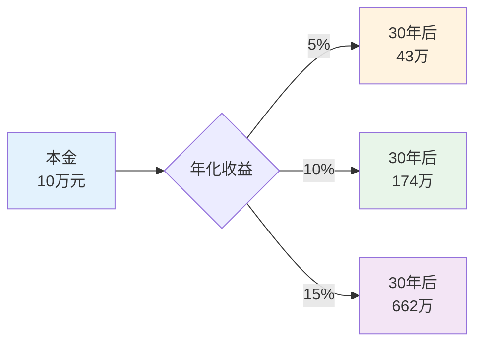
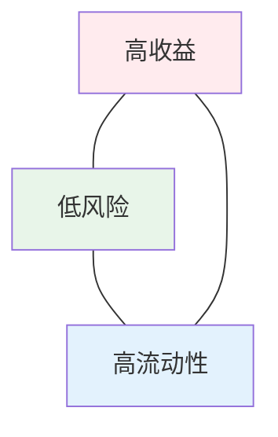
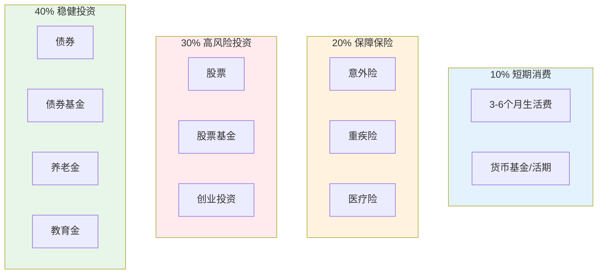
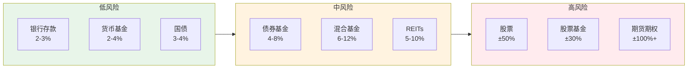
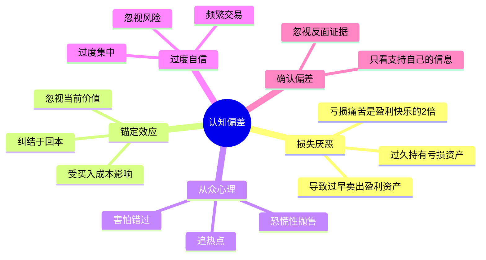
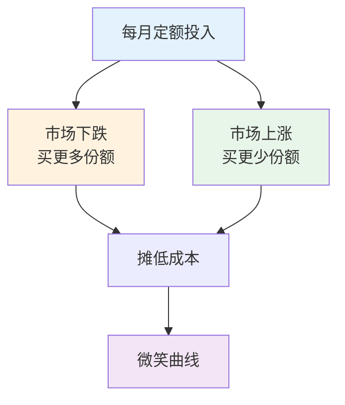
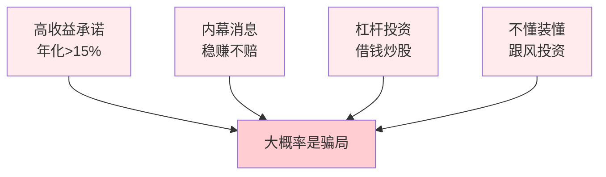

# 投资理财 — 内行思维与避坑指南

> 投资的20%知识决定80%的收益，但90%的人在用错误的方式理财
> 目标：建立正确的投资认知，避免致命错误，实现长期财富增长

---

## 一、投资核心规律

### 1.1 复利的力量

**核心公式：** `最终财富 = 本金 × (1 + 收益率)^时间`

**内行认知：**
- 复利的敌人是**中断**和**高费率**
- 年化15%已经是顶级投资者的长期水平
- **时间**比**收益率**更重要

### 1.2 投资不可能三角

**外行踩坑：** 追求"高收益+低风险+随时可取"
**内行做法：** 接受三选二的现实，根据目标配置

---

## 二、资产配置框架

### 2.1 标准普尔家庭资产配置

### 2.2 不同人生阶段配置

| 阶段 | 年龄 | 股票类 | 债券类 | 现金类 | 保险 |
|------|------|--------|--------|--------|------|
| 单身期 | 22-30 | 70% | 20% | 10% | 基础 |
| 家庭形成 | 30-40 | 60% | 30% | 10% | 完善 |
| 家庭成长 | 40-50 | 50% | 40% | 10% | 充足 |
| 家庭成熟 | 50-60 | 40% | 50% | 10% | 全面 |
| 退休期 | 60+ | 20% | 60% | 20% | 完善 |

---

## 三、投资品种详解

### 3.1 风险收益图谱

### 3.2 基金投资要点

| 类型 | 适合人群 | 选择标准 | 常见错误 |
|------|----------|----------|----------|
| 货币基金 | 所有人 | 规模>100亿 | 追求高收益 |
| 债券基金 | 稳健型 | 历史回撤<5% | 频繁买卖 |
| 混合基金 | 均衡型 | 基金经理任职>3年 | 只看短期排名 |
| 股票基金 | 进取型 | 长期业绩稳定 | 追涨杀跌 |
| 指数基金 | 长期投资 | 费率低、跟踪误差小 | 频繁择时 |

---

## 四、投资心理陷阱

### 4.1 常见认知偏差

**外行踩坑 vs 内行做法：**

| 陷阱 | 外行表现 | 内行应对 |
|------|----------|----------|
| 损失厌恶 | 止损不坚决 | 严格止损纪律 |
| 锚定效应 | "等回本再卖" | 只看当前价值 |
| 从众心理 | 别人买我也买 | 独立思考决策 |
| 过度自信 | 频繁交易 | 减少操作次数 |
| 追涨杀跌 | 高点追入 | 定投分散风险 |

---

## 五、实操策略

### 5.1 定投策略

**定投要点：**
- 坚持长期（至少3-5年）
- 选择波动大的品种（指数基金）
- 止盈不止损
- 下跌时更要坚持

### 5.2 股票投资检查清单

**买入前：**
- [ ] 公司基本面是否优秀？（ROE>15%）
- [ ] 估值是否合理？（PE历史百分位<50%）
- [ ] 我能持有3年以上吗？
- [ ] 这是闲钱吗？（不用借贷投资）

**卖出条件：**
- [ ] 基本面恶化
- [ ] 估值过高（PE历史百分位>80%）
- [ ] 发现更好的机会
- [ ] 有更急需的资金用途

---

## 六、避坑指南

### 6.1 绝对不能碰的坑

### 6.2 保险避坑

| 险种 | 必买 | 可选 | 不推荐 |
|------|------|------|--------|
| 医疗险 | 百万医疗 | - | 门诊险 |
| 重疾险 | 达尔文/康惠保 | 多次赔付 | 返还型 |
| 意外险 | 小蜜蜂/大保镖 | - | 长期意外险 |
| 寿险 | 定期寿险 | 终身寿险 | 万能险 |

**核心原则：**
- 先保障后理财
- 先大人后小孩
- 保额要够（年收入10倍）
- 保费不超过年收入10%

---

## 七、落地清单

### 理财第一步

- [ ] 记账：了解资金流向
- [ ] 预算：制定月度支出计划
- [ ] 储蓄：每月强制储蓄30%
- [ ] 保障：配齐基础保险
- [ ] 应急金：准备6个月生活费

### 投资第一步

- [ ] 学习：了解各类资产特性
- [ ] 风险评估：明确自己能承受的波动
- [ ] 制定计划：确定资产配置比例
- [ ] 开户：开好股票/基金账户
- [ ] 小额试水：先用小钱实践

---

## 八、推荐阅读

- 《小狗钱钱》— 理财入门
- 《富爸爸穷爸爸》— 财商启蒙
- 《指数基金投资指南》— 基金投资
- 《聪明的投资者》— 价值投资
- 《思考，快与慢》— 投资心理
