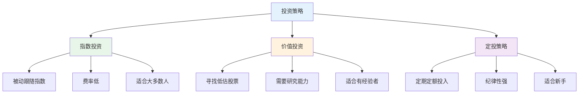
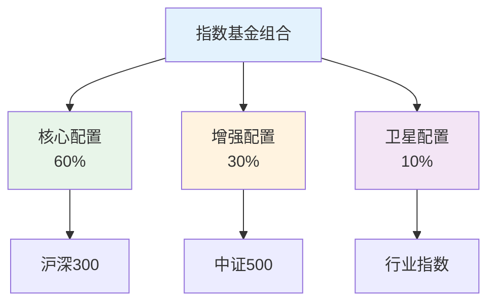
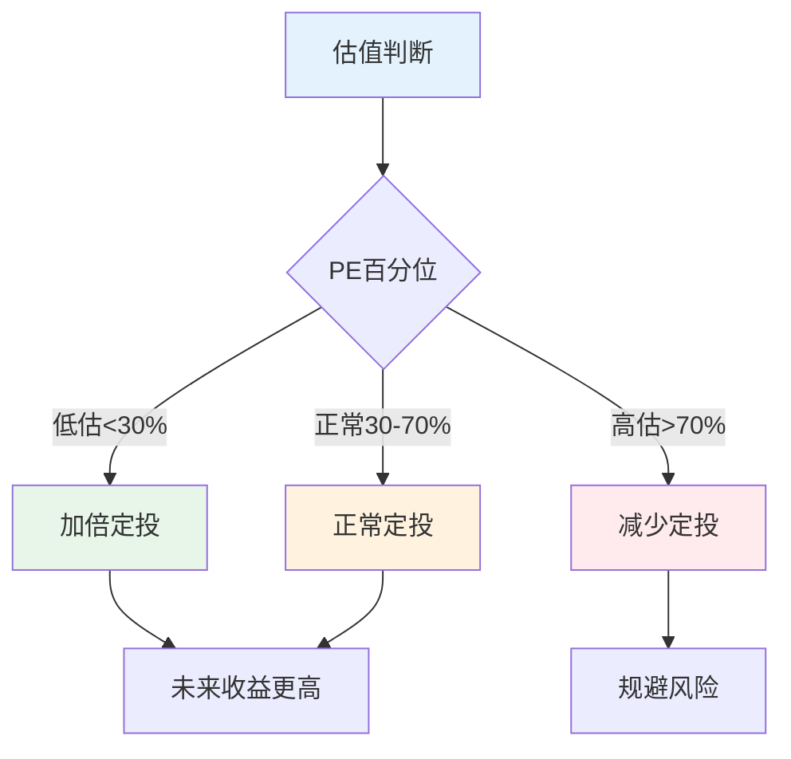
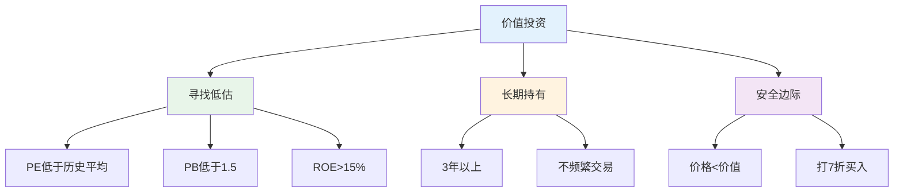
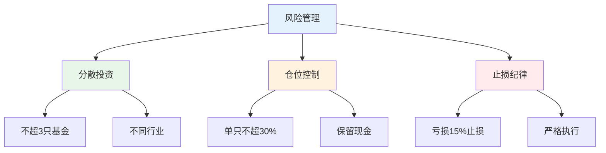

# 投资策略详解 — 适合普通人的投资方法

> 不需要成为专家，用简单方法也能获得不错收益

---

## 一、三大投资策略

### 1.1 策略对比



### 1.2 选择建议

| 策略 | 适合人群 | 时间投入 | 难度 |
|------|----------|----------|------|
| 指数投资 | 大多数人 | 少 | 低 |
| 价值投资 | 有经验者 | 多 | 高 |
| 定投策略 | 新手 | 少 | 低 |

---

## 二、指数投资详解

### 2.1 为什么选择指数基金

```
主动基金问题：
- 80%跑不赢指数
- 费率高（1.5-2%）
- 基金经理离职风险
- 风格漂移

指数基金优势：
- 被动跟踪，费率低（0.5%）
- 透明度高
- 长期收益稳定
- 不依赖基金经理
```

### 2.2 指数基金选择矩阵

| 指数 | 市值 | 行业 | 波动 | 适合 |
|------|------|------|------|------|
| 沪深300 | 大盘 | 综合 | 中 | 核心配置 |
| 中证500 | 中盘 | 综合 | 中高 | 增强配置 |
| 创业板 | 成长 | 科技 | 高 | 卫星配置 |
| 消费指数 | 行业 | 消费 | 中 | 行业配置 |
| 医药指数 | 行业 | 医药 | 中高 | 行业配置 |

### 2.3 组合配置建议



---

## 三、定投策略详解

### 3.1 定投方法

| 方法 | 说明 | 优点 | 缺点 |
|------|------|------|------|
| 普通定投 | 固定时间固定金额 | 简单 | 不够灵活 |
| 智慧定投 | 低估多投高估少投 | 收益更高 | 需要判断 |
| 目标止盈 | 达到目标收益卖出 | 锁定利润 | 可能卖早 |
| 估值定投 | 根据PE估值调整 | 科学 | 需要学习 |

### 3.2 智慧定投策略



### 3.3 定投案例

**案例：每月定投2000元沪深300**

| 年份 | 市场状态 | 定投金额 | 累计收益 |
|------|----------|----------|----------|
| 2018 | 下跌25% | 24,000 | -15% |
| 2019 | 上涨36% | 24,000 | +15% |
| 2020 | 上涨27% | 24,000 | +45% |
| 2021 | 震荡 | 24,000 | +35% |
| 2022 | 下跌21% | 24,000 | +10% |
| 2023 | 震荡 | 24,000 | +20% |

**5年累计：** 投入120,000，收益约24,000（20%）

---

## 四、价值投资入门

### 4.1 价值投资核心



### 4.2 选股标准

| 指标 | 标准 | 说明 |
|------|------|------|
| ROE | >15% | 盈利能力强 |
| PE | <20 | 估值合理 |
| PB | <3 | 资产折价 |
| 股息率 | >3% | 分红稳定 |
| 营收增长 | >10% | 成长性好 |

### 4.3 案例：茅台投资分析

**基本面：**
- ROE：30%+
- 毛利率：90%+
- 净利润增长：20%+

**估值分析：**
- PE：30倍（历史平均40倍）
- 股息率：2%

**结论：** 优质公司，合理估值，长期持有

---

## 五、风险管理

### 5.1 风险控制原则



### 5.2 止损策略

| 策略 | 触发条件 | 操作 |
|------|----------|------|
| 固定止损 | 亏损15% | 卖出 |
| 移动止损 | 回撤20% | 卖出 |
| 时间止损 | 持有3年无盈利 | 考虑卖出 |
| 估值止损 | PE>历史80% | 分批卖出 |

---

## 六、行动清单

### 新手入门

- [ ] 了解指数基金概念
- [ ] 选择1-2只指数基金
- [ ] 设定每月定投金额
- [ ] 坚持至少1年
- [ ] 不频繁查看账户

### 进阶提升

- [ ] 学习估值方法
- [ ] 尝试智慧定投
- [ ] 了解价值投资
- [ ] 建立投资体系
- [ ] 定期复盘总结

---

> **记住：投资最大的敌人是自己。控制情绪，坚持纪律，时间会给你答案。**
