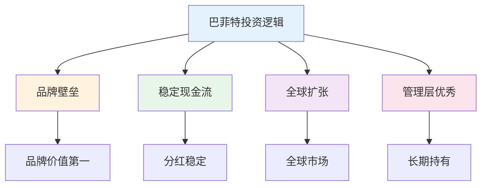
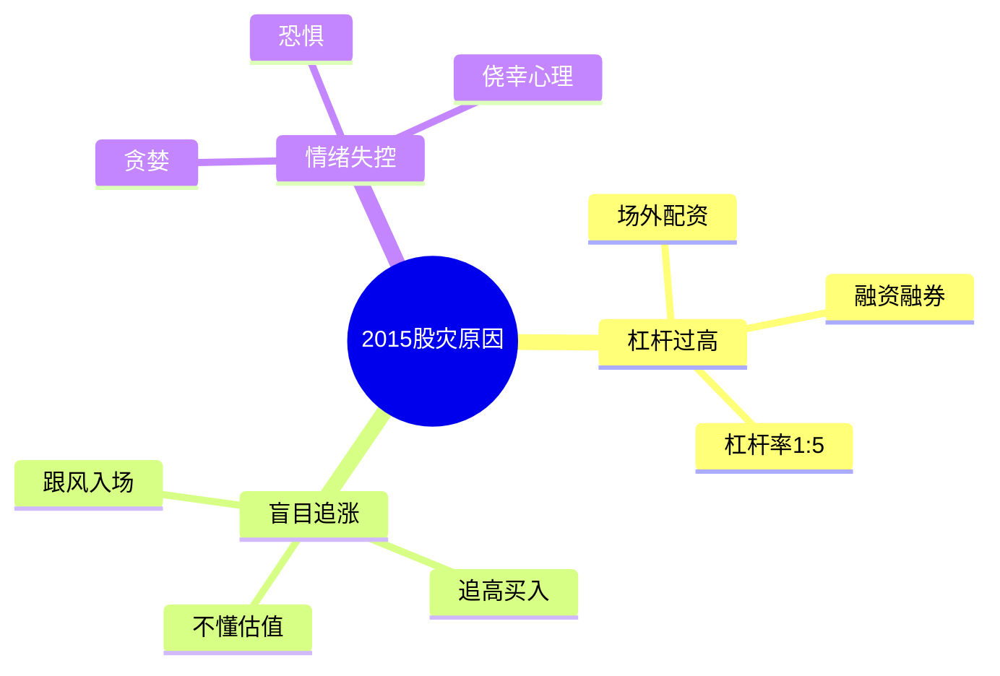
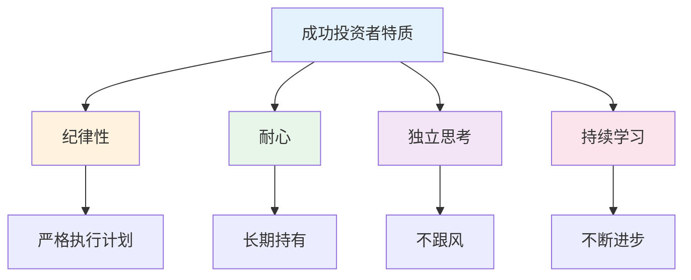
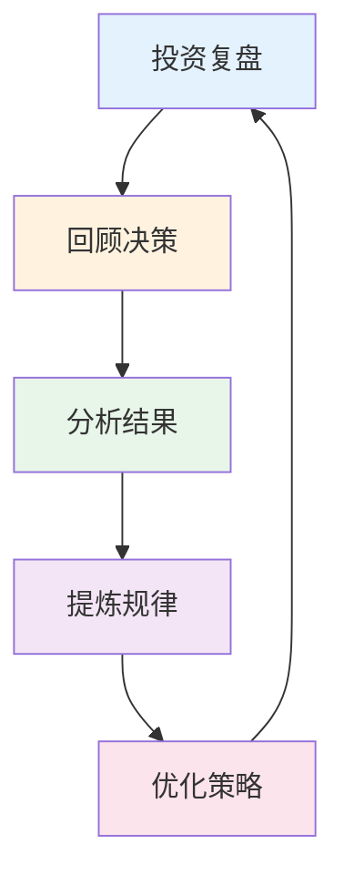

# 投案案例复盘 — 成功与失败的规律

> 从真实案例中学习投资智慧

---

## 一、成功案例分析

### 1.1 案例：巴菲特投资可口可乐

**投资背景：**
- 1988年买入可口可乐
- 投入10.24亿美元
- 持有至今

**投资逻辑：**


**结果：**
- 35年持有，收益超20倍
- 每年分红超7亿美元

**启示：**
1. 选择有护城河的公司
2. 长期持有，享受复利
3. 低估时买入

### 1.2 案例：定投指数基金

**背景：** 每月定投2000元沪深300，坚持10年

**结果：**
| 指标 | 数值 |
|------|------|
| 总投入 | 240,000 |
| 最终价值 | 450,000 |
| 收益率 | 87.5% |
| 年化收益 | 6.5% |

**关键：**
1. 坚持10年不动摇
2. 下跌时加倍定投
3. 不频繁交易

---

## 二、失败案例分析

### 2.1 案例：2015年股灾

**失败原因：**


**教训：**
1. 不要用杠杆
2. 不要追涨
3. 控制情绪

### 2.2 案例：追涨杀跌

**错误操作：**
```
2020年3月：市场下跌，恐慌卖出
2020年7月：市场上涨，追高买入
2021年2月：市场高点，继续加仓
2021年12月：市场下跌，恐慌卖出
```

**结果：** 亏损30%

**教训：**
1. 不要频繁交易
2. 不要追涨杀跌
3. 坚持定投纪律

### 2.3 案例：过度集中

**错误操作：**
- 全仓买入某只股票
- 没有分散投资

**结果：** 股票暴跌，损失惨重

**教训：**
1. 分散投资
2. 单只不超30%
3. 控制风险

---

## 三、成功规律总结

### 3.1 成功投资者特质



### 3.2 成功投资公式

```
成功投资 = 正确方法 × 长期坚持 × 情绪控制
```

| 因素 | 权重 | 说明 |
|------|------|------|
| 正确方法 | 40% | 找到适合自己的策略 |
| 长期坚持 | 40% | 时间是朋友 |
| 情绪控制 | 20% | 避免人性弱点 |

---

## 四、失败规律总结

### 4.1 常见投资错误

| 错误 | 表现 | 后果 |
|------|------|------|
| 追涨杀跌 | 高买低卖 | 亏损 |
| 频繁交易 | 不断买卖 | 手续费消耗 |
| 过度集中 | 全仓单只 | 风险集中 |
| 借钱投资 | 杠杆放大 | 爆仓风险 |
| 情绪化 | 贪婪恐惧 | 决策失误 |

### 4.2 失败案例框架

```
【案例背景】
- 投资者：
- 投资标的：
- 投资时间：

【操作记录】
- 买入理由：
- 持有过程：
- 卖出理由：

【结果】
- 收益/亏损：
- 最大回撤：

【教训总结】
- 做对了什么：
- 做错了什么：
- 可改进的：
```

---

## 五、复盘框架

### 5.1 投资复盘流程



### 5.2 复盘检查清单

**投资决策：**
- [ ] 投资逻辑是什么？
- [ ] 为什么买入？
- [ ] 为什么卖出？
- [ ] 仓位控制如何？

**情绪管理：**
- [ ] 是否追涨杀跌？
- [ ] 是否频繁交易？
- [ ] 是否过度集中？
- [ ] 是否借钱投资？

**结果分析：**
- [ ] 收益率多少？
- [ ] 最大回撤多少？
- [ ] 持有多长时间？
- [ ] 与基准对比如何？

---

## 六、行动清单

### 定期复盘

- [ ] 每月回顾一次投资
- [ ] 每季度调整一次配置
- [ ] 每年总结一次经验
- [ ] 记录投资日记

### 持续学习

- [ ] 阅读投资经典
- [ ] 学习成功案例
- [ ] 吸取失败教训
- [ ] 建立投资体系

---

> **记住：投资是认知的变现。提升认知，才能提升收益。**
