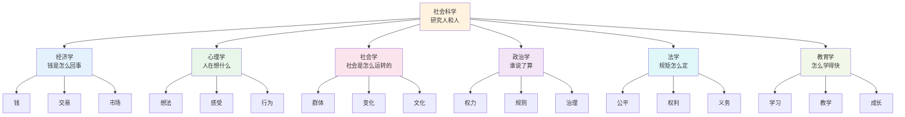
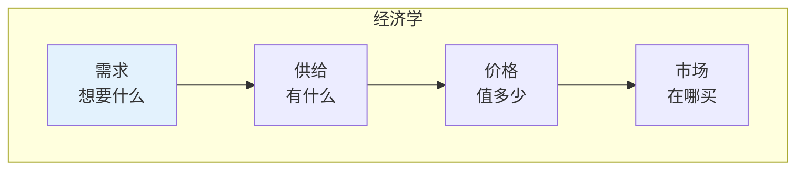
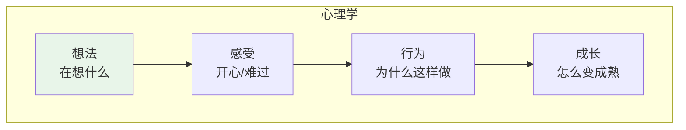
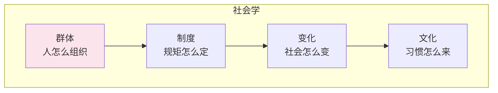
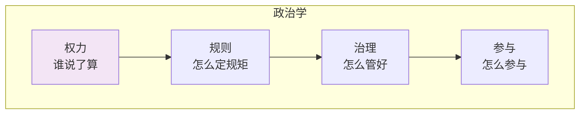
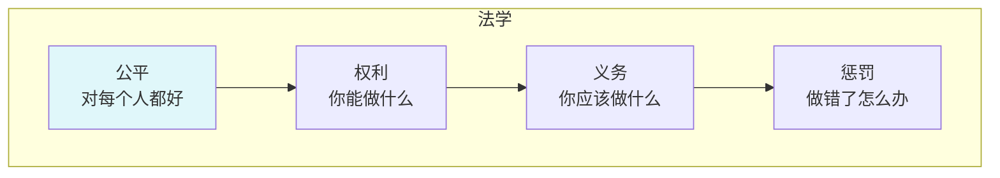
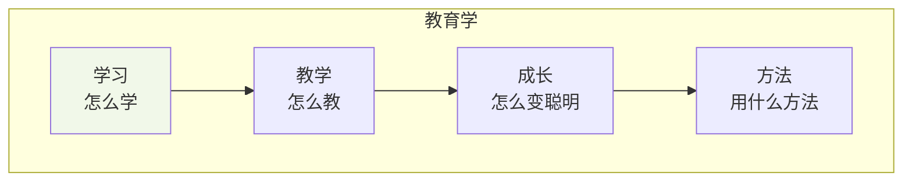
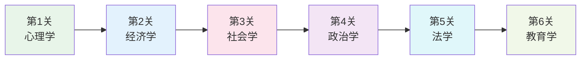

# 社会科学

> **费曼学习法**：社会就是人和人在一起，社会科学就是研究"人怎么相处"的学问！

---

## 🎯 一句话理解社会科学

**社会科学就是研究人和人之间是怎么相处的！**

为什么要有学校？为什么要花钱？为什么要有规矩？社会科学就是回答这些问题的！

---

## 🏗️ 社会科学的"积木塔"

---

## 📚 每个积木块详解

### 💰 经济学（钱是怎么回事）

**用小学生的话说**：经济学就是研究"钱"和"交易"的学问！

| 积木块 | 小学生版解释 | 生活中的例子 |
|--------|--------------|--------------|
| 需求 | 想要什么 | 想买玩具 |
| 供给 | 有什么 | 商店有玩具 |
| 价格 | 值多少 | 玩具10块钱 |
| 市场 | 在哪买 | 商店、超市 |

---

### 🧠 心理学（人在想什么）

**用小学生的话说**：心理学就是研究"人在想什么"和"为什么这样做"的学问！

| 积木块 | 小学生版解释 | 生活中的例子 |
|--------|--------------|--------------|
| 想法 | 在想什么 | 想玩游戏 |
| 感受 | 开心/难过 | 考试考好了很开心 |
| 行为 | 为什么这样做 | 因为想玩所以去玩 |
| 成长 | 怎么变成熟 | 越来越懂事 |

---

### 🏫 社会学（社会是怎么运转的）

**用小学生的话说**：社会学就是研究"为什么有学校、有公司、有国家"的学问！

| 积木块 | 小学生版解释 | 生活中的例子 |
|--------|--------------|--------------|
| 群体 | 人怎么组织 | 班级、学校 |
| 制度 | 规矩怎么定 | 校规、班规 |
| 变化 | 社会怎么变 | 以前没有手机 |
| 文化 | 习惯怎么来 | 过年吃饺子 |

---

### 🏛️ 政治学（谁说了算）

**用小学生的话说**：政治学就是研究"谁说了算"和"规矩怎么定"的学问！

| 积木块 | 小学生版解释 | 生活中的例子 |
|--------|--------------|--------------|
| 权力 | 谁说了算 | 班长、老师 |
| 规则 | 怎么定规矩 | 班规怎么定 |
| 治理 | 怎么管好 | 班级怎么管 |
| 参与 | 怎么参与 | 怎么当班长 |

---

### ⚖️ 法学（规矩怎么定）

**用小学生的话说**：法学就是研究"什么能做、什么不能做"的学问！

| 积木块 | 小学生版解释 | 生活中的例子 |
|--------|--------------|--------------|
| 公平 | 对每个人都好 | 不欺负人 |
| 权利 | 你能做什么 | 你有权学习 |
| 义务 | 你应该做什么 | 你应该做作业 |
| 惩罚 | 做错了怎么办 | 打人要道歉 |

---

### 📚 教育学（怎么学得快）

**用小学生的话说**：教育学就是研究"怎么学得快、记得牢"的学问！

| 积木块 | 小学生版解释 | 生活中的例子 |
|--------|--------------|--------------|
| 学习 | 怎么学 | 认真听讲 |
| 教学 | 怎么教 | 老师怎么教 |
| 成长 | 怎么变聪明 | 越来越厉害 |
| 方法 | 用什么方法 | 做笔记、多复习 |

---

## 🎮 社会科学闯关游戏

**闯关秘籍**：
1. **第1关**：学心理学（理解自己）
2. **第2关**：学经济学（理解钱）
3. **第3关**：学社会学（理解社会）
4. **第4关**：学政治学（理解权力）
5. **第5关**：学法学（理解规矩）
6. **第6关**：学教育学（理解学习）

---

## 💡 给小学生的话

> 社会就像一个大家庭，每个人都是其中一员！
> 
> 多观察、多思考、多和别人交流！
> 
> 理解别人，才能更好地相处！

---

**每个社会学家都曾经是初学者！**