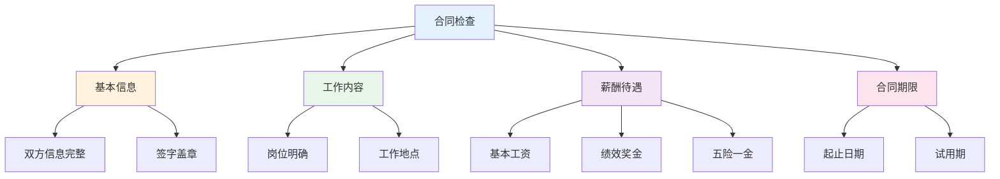
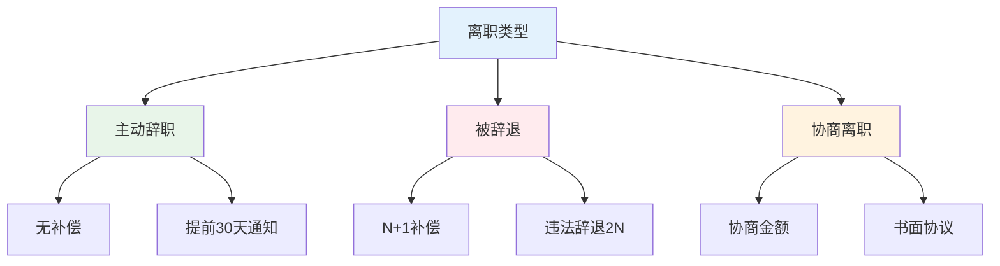
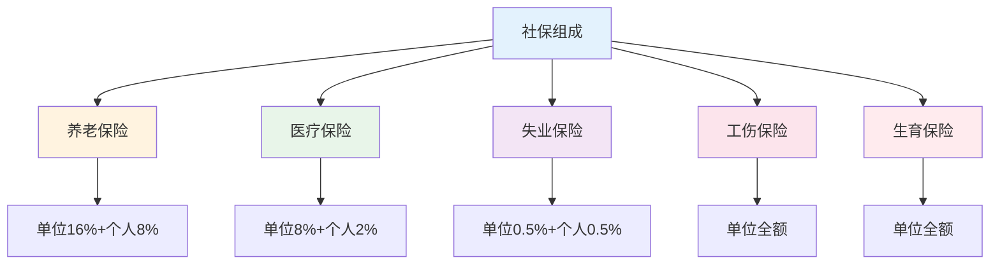
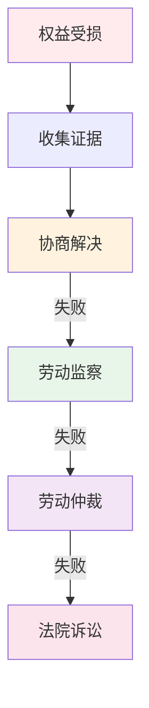

# 劳动维权实战 — 保护自己的劳动权益

> 90%的劳动者不了解自己的权益，导致利益受损

---

## 一、劳动合同要点

### 1.1 签订合同检查清单

### 1.2 合同陷阱

| 陷阱 | 表现 | 应对 |
|------|------|------|
| 未签合同 | 试用期不签 | 要求双倍工资 |
| 试用期过长 | 超过法定期限 | 仲裁维权 |
| 薪资模糊 | 不写具体金额 | 要求明确 |
| 竞业限制 | 无补偿金 | 协商修改 |

---

## 二、离职权益

### 2.1 离职补偿标准

### 2.2 补偿计算

| 情况 | 补偿标准 | 说明 |
|------|----------|------|
| 合法辞退 | N+1 | N=工作年限 |
| 违法辞退 | 2N | 2倍赔偿 |
| 协商离职 | 协商金额 | 书面协议 |
| 主动辞职 | 无 | 提前30天 |

---

## 三、加班权益

### 3.1 加班费标准

| 类型 | 标准 | 说明 |
|------|------|------|
| 工作日加班 | 1.5倍 | 平日延长 |
| 周末加班 | 2倍 | 休息日 |
| 法定节假日 | 3倍 | 带薪假期 |

### 3.2 加班维权

- [ ] 保留加班记录
- [ ] 保留考勤记录
- [ ] 保留工作沟通记录
- [ ] 向劳动监察投诉
- [ ] 申请劳动仲裁

---

## 四、社保权益

### 4.1 社保缴纳标准

### 4.2 社保维权

- 单位未缴社保：可要求补缴
- 未缴社保：可被迫离职并要求补偿
- 投诉渠道：12333、劳动监察

---

## 五、维权流程

### 5.1 维权步骤

### 5.2 证据收集

| 证据类型 | 具体内容 |
|----------|----------|
| 劳动合同 | 原件或复印件 |
| 工资条 | 银行流水 |
| 考勤记录 | 打卡记录 |
| 工作沟通 | 邮件、微信 |
| 加班记录 | 加班审批、工作记录 |

---

## 六、行动清单

### 入职时

- [ ] 签订正式劳动合同
- [ ] 保留合同副本
- [ ] 确认薪资待遇
- [ ] 确认社保缴纳

### 工作中

- [ ] 保留工作记录
- [ ] 保留考勤记录
- [ ] 保留沟通记录
- [ ] 了解自己的权益

### 离职时

- [ ] 确认补偿方案
- [ ] 签订书面协议
- [ ] 办理离职手续
- [ ] 转移社保关系

---

> **记住：法律保护懂法的人。了解权益，才能保护权益。**
