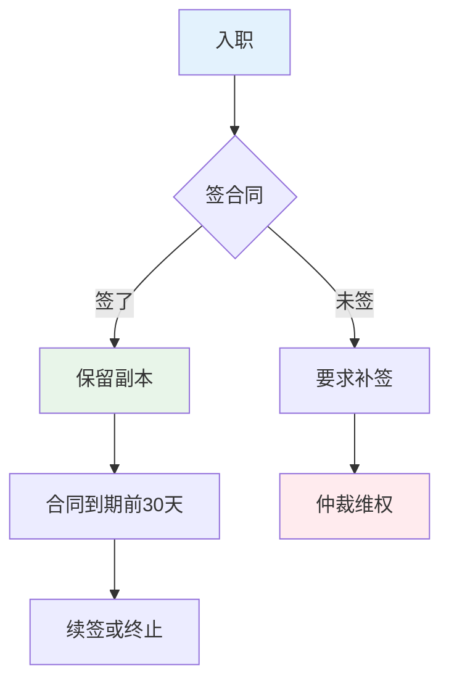
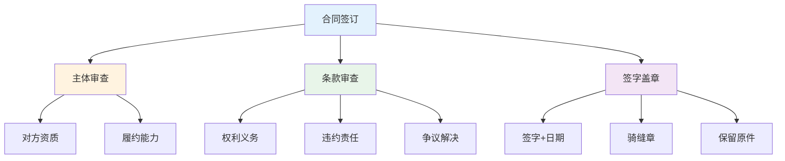
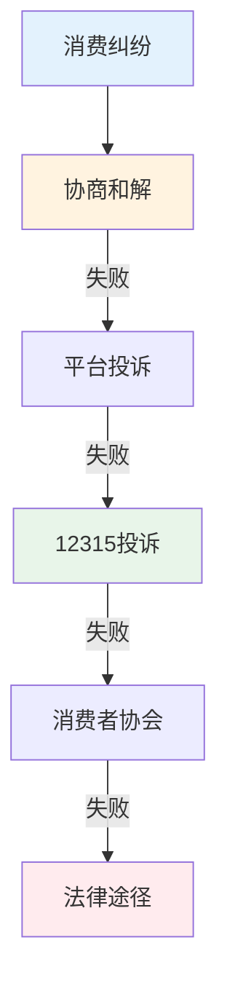
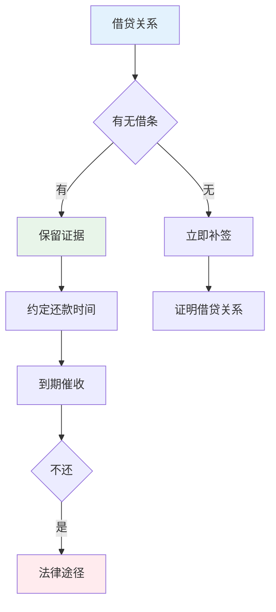
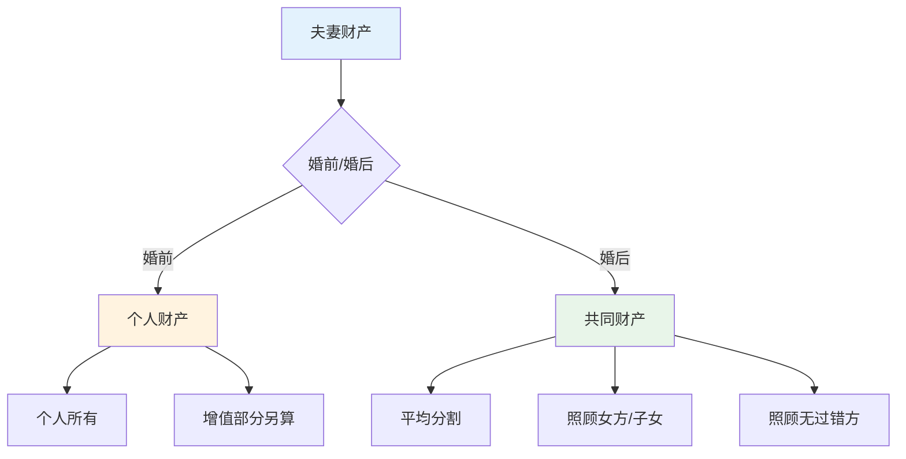
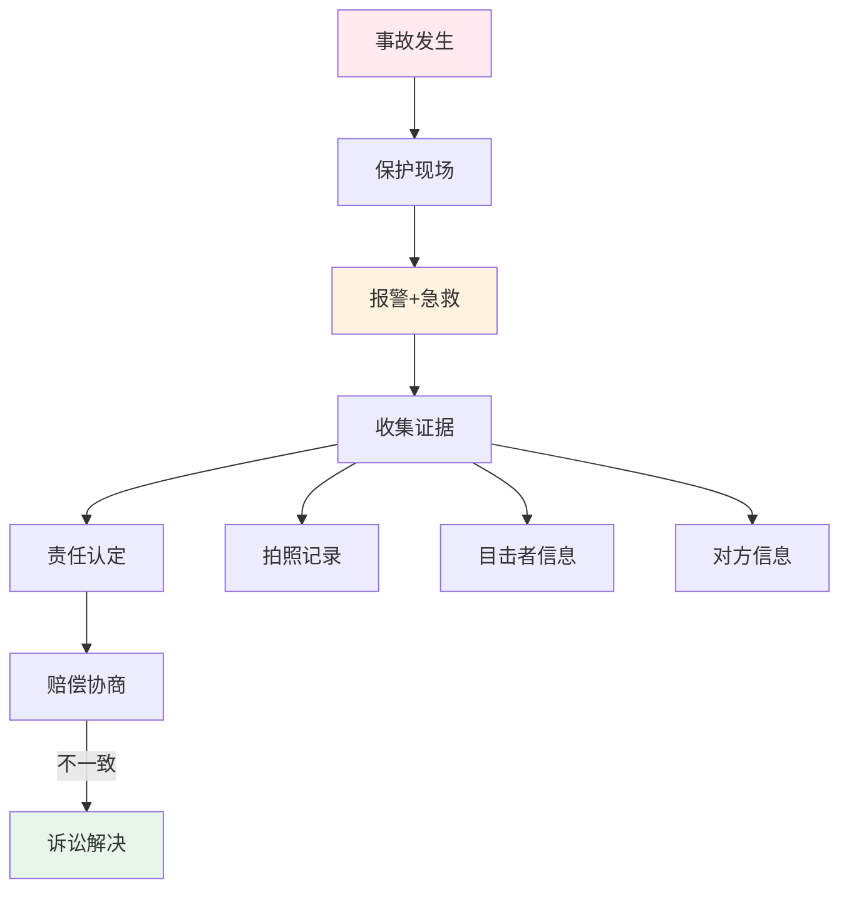
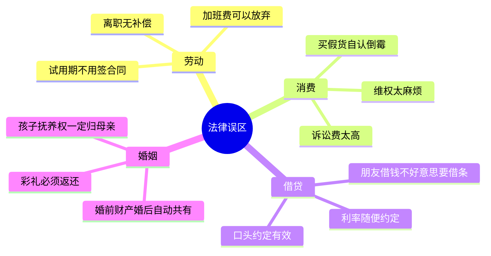

# 法律常识 — 保护自己的必备知识

> 90%的人不了解基本法律常识，导致权益受损时无法有效维权
> 目标：掌握日常生活中最实用的法律知识，避免踩坑

---

## 一、劳动法核心知识

### 1.1 劳动合同要点



### 1.2 劳动权益对照表

| 情况 | 外行做法 | 内行做法 |
|------|----------|----------|
| 未签合同 | 继续工作 | 要求双倍工资赔偿 |
| 试用期过长 | 忍着 | 仲裁要求补偿 |
| 加班无加班费 | 不敢要 | 收集证据仲裁 |
| 被辞退无补偿 | 自认倒霉 | 要求N+1补偿 |
| 社保未缴纳 | 不在乎 | 要求补缴或赔偿 |

### 1.3 离职注意事项

| 场景 | 外行做法 | 内行做法 |
|------|----------|----------|
| 主动辞职 | 随时走 | 提前30天书面通知 |
| 被辞退 | 签字走人 | 确认补偿方案 |
| 协商离职 | 接受口头承诺 | 签订书面协议 |
| 离职证明 | 不在意 | 要求开具 |
| 社保转移 | 不处理 | 及时转移 |

---

## 二、合同法基础

### 2.1 合同签订要点



### 2.2 常见合同陷阱

| 陷阱类型 | 外行做法 | 内行做法 |
|----------|----------|----------|
| 阴阳合同 | 只看一份 | 核对所有版本 |
| 模糊条款 | 不在意 | 要求明确具体 |
| 不平等条款 | 接受 | 协商修改或拒签 |
| 缺少违约条款 | 不关注 | 明确违约责任 |
| 口头承诺 | 相信 | 要求写入合同 |

---

## 三、消费者权益

### 3.1 维权流程



### 3.2 消费者权益对照

| 权益 | 具体内容 | 维权方式 |
|------|----------|----------|
| 知情权 | 了解商品真实情况 | 要求提供信息 |
| 选择权 | 自主选择商品 | 拒绝强制消费 |
| 公平交易权 | 质价相符 | 投诉/仲裁 |
| 安全权 | 人身财产安全 | 要求赔偿 |
| 求偿权 | 受损后索赔 | 协商/投诉/诉讼 |

---

## 四、借贷法律知识

### 4.1 借贷风险防范



### 4.2 借条模板要点

```
借条

今借到[出借人姓名]人民币[大写金额]元整（¥[数字金额]元），
用于[借款用途]，借款期限为[起止日期]，
年利率为[利率]%，到期一次性还本付息。

如逾期未还，借款人愿承担出借人为实现债权所支付的
诉讼费、律师费、交通费等费用。

借款人：[签字+手印]
身份证号：[号码]
联系电话：[号码]
日期：[年月日]
```

### 4.3 利率红线

| 情况 | 利率标准 | 法律效力 |
|------|----------|----------|
| 年利率<24% | 合法 | 受法律保护 |
| 24%-36% | 自然债务 | 已付不退，未付不追 |
| >36% | 无效 | 无效，可要求返还 |

---

## 五、婚姻家庭法

### 5.1 财产分割原则



### 5.2 离婚注意事项

| 事项 | 外行做法 | 内行做法 |
|------|----------|----------|
| 财产转移 | 不注意 | 保留证据 |
| 债务问题 | 不清楚 | 明确共同债务 |
| 子女抚养 | 争抢 | 以子女利益为重 |
| 离婚协议 | 随便签 | 仔细审查条款 |
| 房产分割 | 不懂 | 咨询专业律师 |

---

## 六、交通事故处理

### 6.1 事故处理流程



### 6.2 赔偿项目

| 项目 | 内容 | 注意事项 |
|------|------|----------|
| 医疗费 | 实际发生 | 保留票据 |
| 误工费 | 收入减少 | 提供证明 |
| 护理费 | 护理支出 | 需医嘱 |
| 交通费 | 就医交通 | 保留票据 |
| 营养费 | 加强营养 | 需医嘱 |
| 残疾赔偿 | 伤残等级 | 需鉴定 |

---

## 七、法律避坑指南

### 7.1 常见法律误区



### 7.2 证据意识

| 场景 | 外行做法 | 内行做法 |
|------|----------|----------|
| 纠纷发生 | 口头争论 | 书面记录 |
| 对方承诺 | 口头相信 | 录音/书面确认 |
| 损失发生 | 不记录 | 拍照+保留凭证 |
| 沟通记录 | 不保存 | 截图+备份 |

---

## 八、落地清单

### 法律意识培养

- [ ] 学习：了解基本法律常识
- [ ] 合同：重要合同仔细审查
- [ ] 证据：养成保留证据习惯
- [ ] 咨询：遇到问题先咨询
- [ ] 防范：预防胜于维权

### 常用法律资源

- [ ] 12348法律援助热线
- [ ] 当地法律援助中心
- [ ] 人民法院在线服务平台
- [ ] 国家企业信用信息公示系统

---

## 九、推荐阅读

- 《中华人民共和国民法典》— 基本法律
- 《劳动法》《劳动合同法》— 劳动权益
- 《消费者权益保护法》— 消费维权
- 《法律的悖论》— 法律思维
- 《洞穴奇案》— 法律哲学
