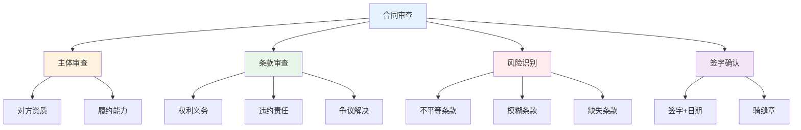
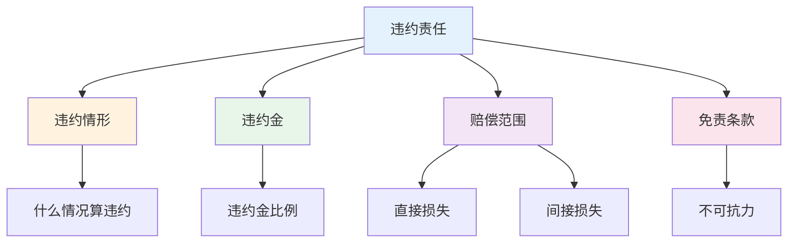

# 合同审查要点 — 避免合同陷阱

> 合同是法律保障的基础，审查合同是保护自己的第一道防线

---

## 一、合同审查框架

### 1.1 审查流程



---

## 二、合同核心条款

### 2.1 权利义务条款

| 条款 | 审查要点 | 风险点 |
|------|----------|--------|
| 标的物 | 明确具体 | 规格不清 |
| 价款 | 金额+支付方式 | 模糊不清 |
| 履行期限 | 明确时间 | 期限模糊 |
| 履行方式 | 具体要求 | 约定不明 |

### 2.2 违约责任条款



---

## 三、常见合同陷阱

### 3.1 陷阱类型

| 陷阱 | 表现 | 应对 |
|------|------|------|
| 阴阳合同 | 两份内容不同 | 只签一份，保留原件 |
| 模糊条款 | "大概""左右" | 要求明确 |
| 不平等条款 | 单方面免责 | 协商修改 |
| 缺少违约条款 | 无违约责任 | 要求补充 |
| 争议解决不利 | 对方有利 | 协商修改 |

### 3.2 案例：租房合同陷阱

**陷阱：**
```
"乙方不得提前解约，否则押金不退"
```

**问题：**
- 没有约定甲方违约责任
- 乙方单方面受限

**修改建议：**
```
"任何一方提前解约，需提前30天通知，
并支付相当于一个月租金的违约金。"
```

---

## 四、合同审查检查清单

### 4.1 基本信息

- [ ] 双方名称/地址完整
- [ ] 签字盖章齐全
- [ ] 签订日期明确

### 4.2 核心条款

- [ ] 标的物明确
- [ ] 价款清晰
- [ ] 履行期限明确
- [ ] 违约责任清晰
- [ ] 争议解决方式明确

### 4.3 风险条款

- [ ] 无不平等条款
- [ ] 无模糊条款
- [ ] 无缺失条款
- [ ] 免责条款合理

---

## 五、行动清单

### 签订前

- [ ] 审查对方资质
- [ ] 审查合同条款
- [ ] 识别风险点
- [ ] 协商修改

### 签订时

- [ ] 确认无误再签
- [ ] 签字+日期
- [ ] 骑缝章
- [ ] 保留原件

### 签订后

- [ ] 履行合同义务
- [ ] 保留履行证据
- [ ] 及时处理争议

---

> **记住：合同是法律的凭证，签之前一定要看清楚。**
