# 心理学知识体系

> **第一性原理**：心理学是研究心理活动和行为规律的科学。所有心理现象都有生物学基础和社会文化根源。

---

## 📚 心理学的公理体系

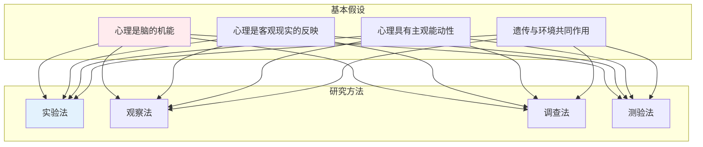

---

## 一、基础心理学 Basic Psychology

### 感觉与知觉

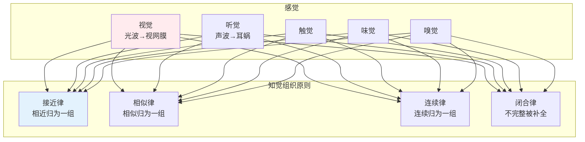

### 记忆系统

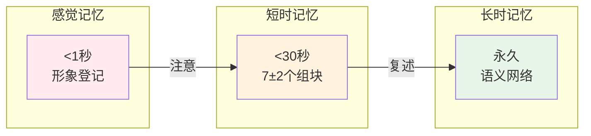

### 遗忘规律（艾宾浩斯）

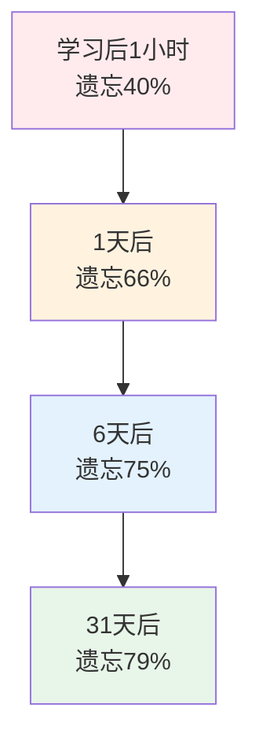

---

## 二、发展心理学 Developmental Psychology

### 皮亚杰认知发展阶段

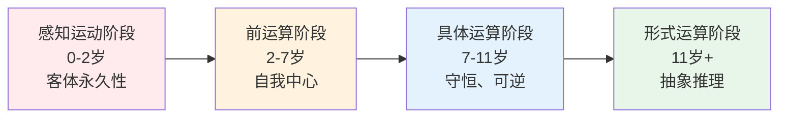

### 埃里克森心理社会发展阶段

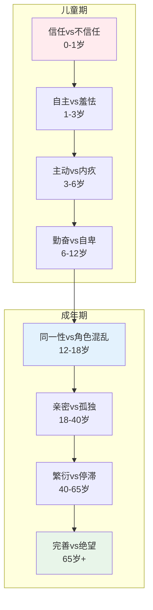

---

## 三、社会心理学 Social Psychology

### 社会认知

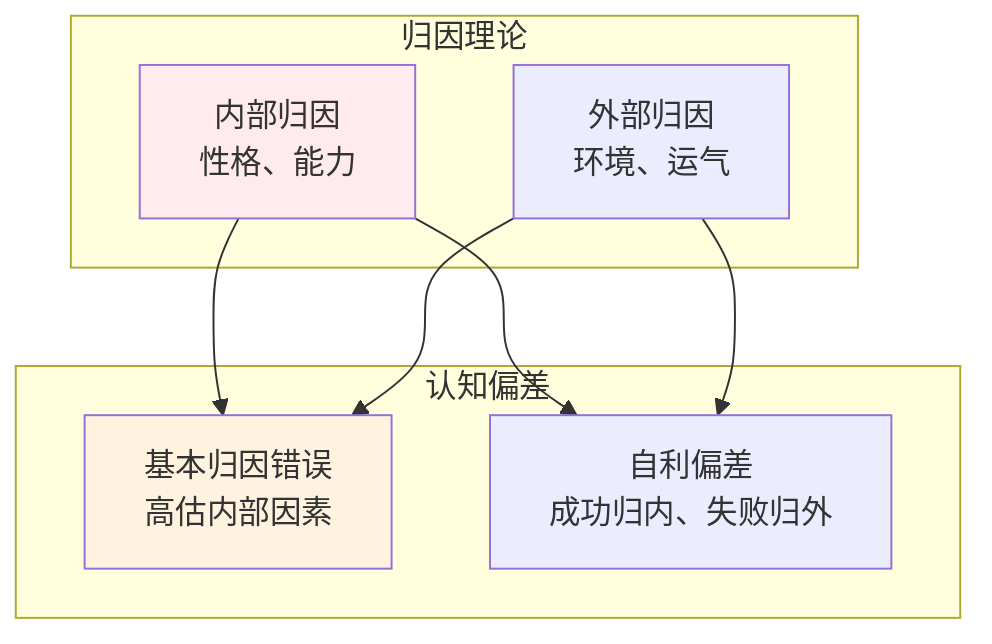

### 从众与服从

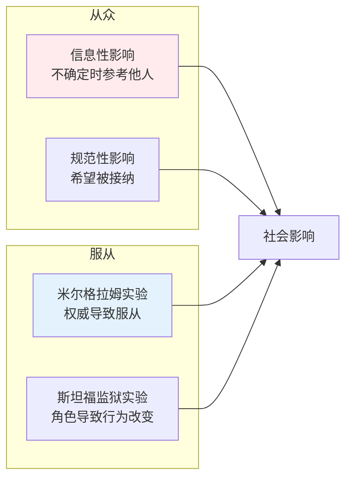

### 态度与认知失调

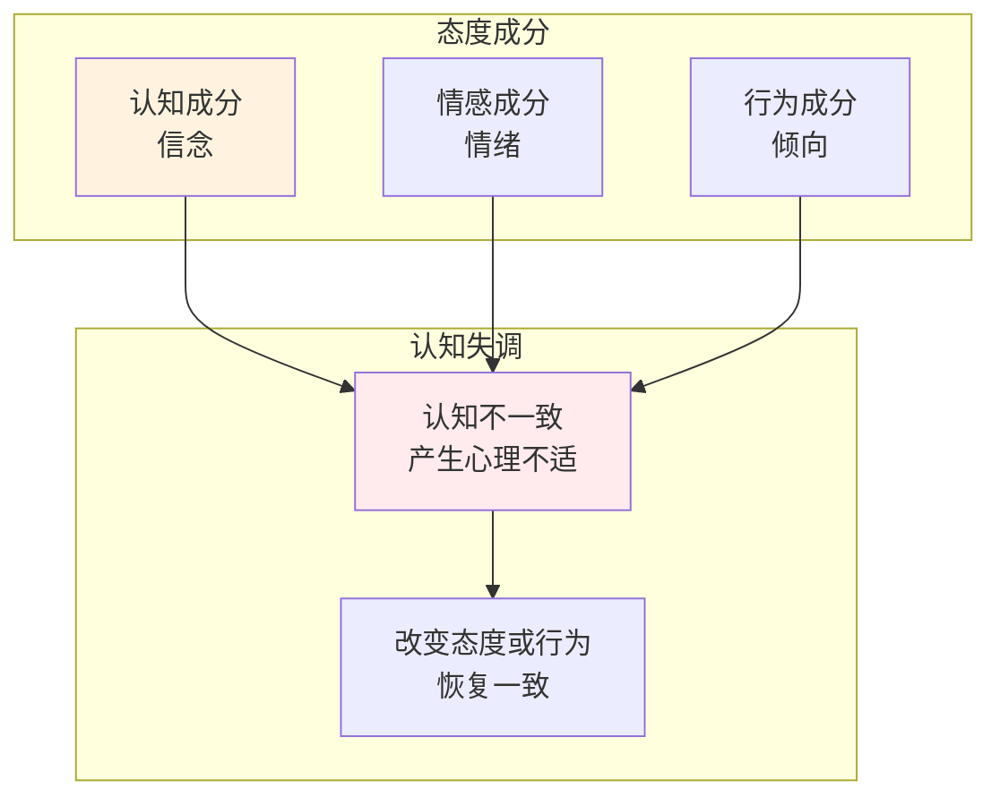

---

## 四、临床心理学 Clinical Psychology

### 心理障碍分类

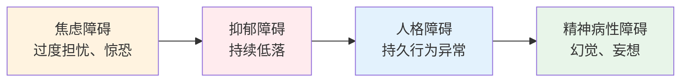

### 治疗方法

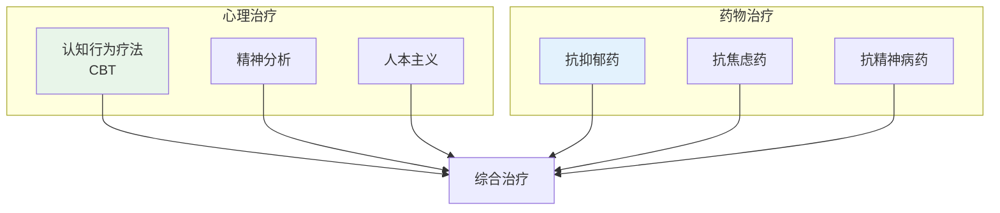

---

## 五、心理学思维方式

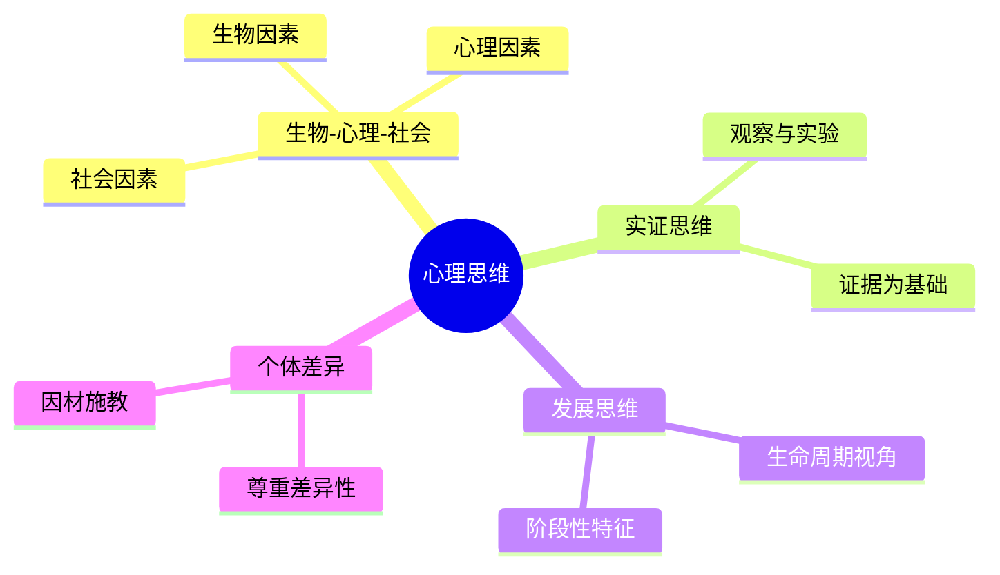

---

## 📖 学习路径

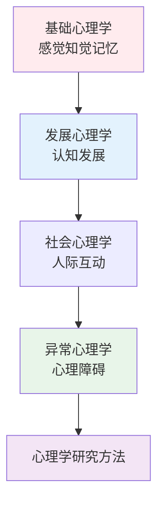

---

## 参考文献

1. 《心理学导论》- 津巴多
2. 《发展心理学》- 林崇德
3. 《社会心理学》- 阿伦森
4. 《普通心理学》- 彭聃龄