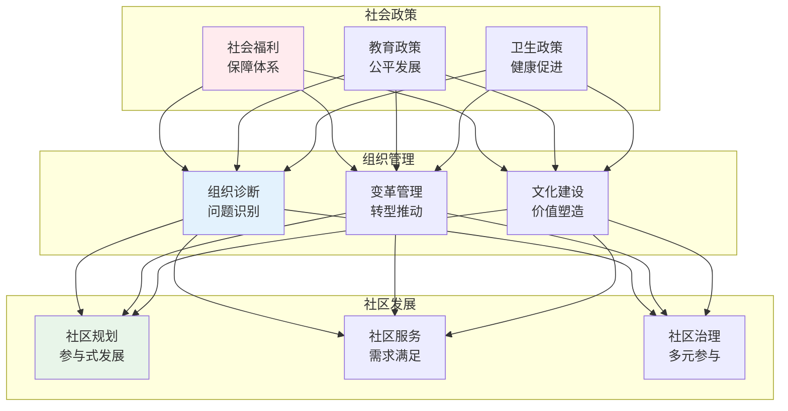
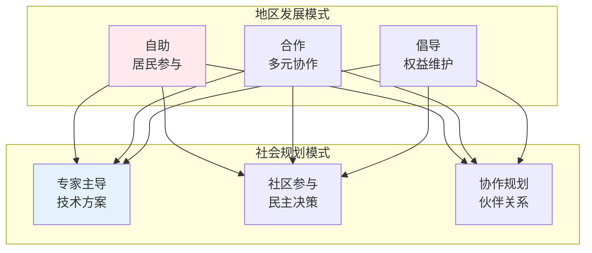

# 应用社会学

> **核心观点**：社会学理论与方法可以应用于解决现实社会问题，促进社会发展。

---

## 📊 应用领域概览



---

## 🏛️ 社会政策

### 社会政策类型

| 政策类型 | 目标 | 工具 | 例子 |
|----------|------|------|------|
| 保障型 | 基本生活保障 | 社会救助 | 最低生活保障 |
| 保险型 | 风险分担 | 社会保险 | 养老保险 |
| 发展型 | 能力建设 | 社会投资 | 教育培训 |
| 福利型 | 全面保障 | 福利服务 | 北欧模式 |

### 社会政策分析


### 社会问题分析

| 社会问题 | 成因分析 | 干预策略 |
|----------|----------|----------|
| 贫困 | 结构性不平等 | 扶贫开发 |
| 犯罪 | 社会失范、机会不均 | 综合治理 |
| 环境问题 | 外部性、公地悲剧 | 制度设计 |
| 健康不平等 | 社会决定因素 | 健康公平 |

---

## 🏢 组织社会学应用

### 组织诊断

```
组织诊断五要素：
1. 结构：组织架构是否合理
2. 流程：工作流程是否高效
3. 文化：组织文化是否健康
4. 人员：人力资源是否匹配
5. 环境：外部环境是否适应
```

### 组织变革

| 变革类型 | 特征 | 实施难度 |
|----------|------|----------|
| 适应性变革 | 渐进调整 | 低 |
| 创新性变革 | 突破创新 | 高 |
| 重建性变革 | 根本重构 | 极高 |

### 组织文化诊断

| 维度 | 评估内容 | 诊断工具 |
|------|----------|----------|
| 价值观 | 核心信念 | 问卷调查 |
| 规范 | 行为准则 | 观察访谈 |
| 仪式 | 仪式活动 | 参与观察 |
| 符号 | 文化符号 | 文本分析 |

---

## 🏘️ 社区社会学

### 社区类型

| 类型 | 特征 | 问题 |
|------|------|------|
| 传统社区 | 地缘、血缘纽带 | 现代化冲击 |
| 城市社区 | 异质、匿名 | 社会疏离 |
| 虚拟社区 | 网络连接 | 真实互动缺失 |
| 移民社区 | 多元文化 | 文化融合 |

### 社区发展模式



### 社区治理

```
社区治理原则：
1. 多元参与：政府、市场、社会协作
2. 共建共享：共同建设、共同受益
3. 协商民主：对话协商、达成共识
4. 法治保障：制度规范、权利保障
```

---

## 📱 网络社会学

### 网络社会特征

| 特征 | 内涵 | 影响 |
|------|------|------|
| 去中心化 | 权力分散 | 信息民主 |
| 虚拟化 | 在线互动 | 社交变革 |
| 全球化 | 跨越边界 | 文化融合 |
| 数据化 | 行为记录 | 监控社会 |

### 网络社会问题

| 问题类型 | 表现 | 应对策略 |
|----------|------|----------|
| 数字鸿沟 | 信息不平等 | 普及教育 |
| 网络暴力 | 欺凌、人肉 | 法律规制 |
| 隐私泄露 | 数据滥用 | 隐私保护 |
| 虚假信息 | 谣言传播 | 媒介素养 |

---

## 🎯 核心结论

### 应用社会学的价值

1. **问题诊断**：识别社会问题的根源
2. **方案设计**：制定有效的干预策略
3. **效果评估**：检验政策实施效果
4. **理论检验**：验证社会学理论
5. **知识传播**：普及社会学知识

### 实践启示

```
应用社会学的方法论：
1. 问题导向：从实际问题出发
2. 多元视角：综合不同理论
3. 实证基础：基于数据证据
4. 参与合作：利益相关者参与
5. 反思改进：持续优化方案
```

---

## 📚 参考文献

1. 费孝通《江村经济》
2. 普特南《独自打保龄》
3. 吉登斯《第三条道路》
4. 世界银行《世界发展报告》
5. 联合国《人类发展报告》
6. 陆学艺《当代中国社会阶层研究报告》
7. 李培林《社会冲突与社会和谐》
8. 郑杭生《社会学概论新修》