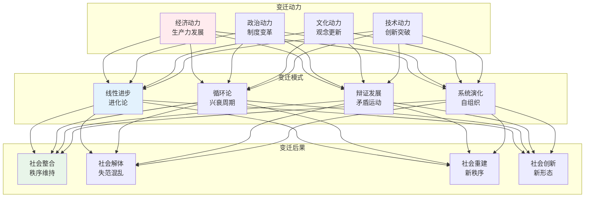
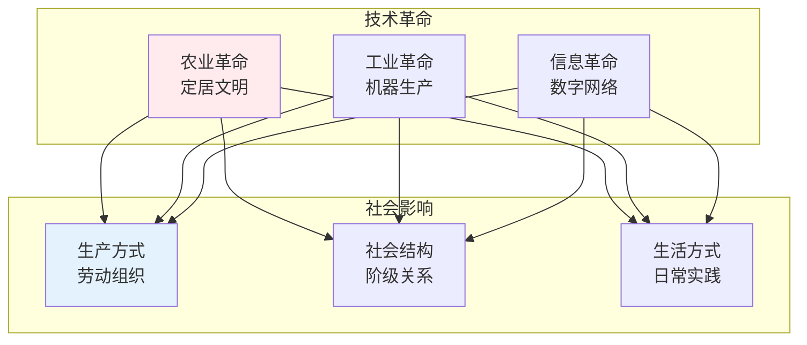
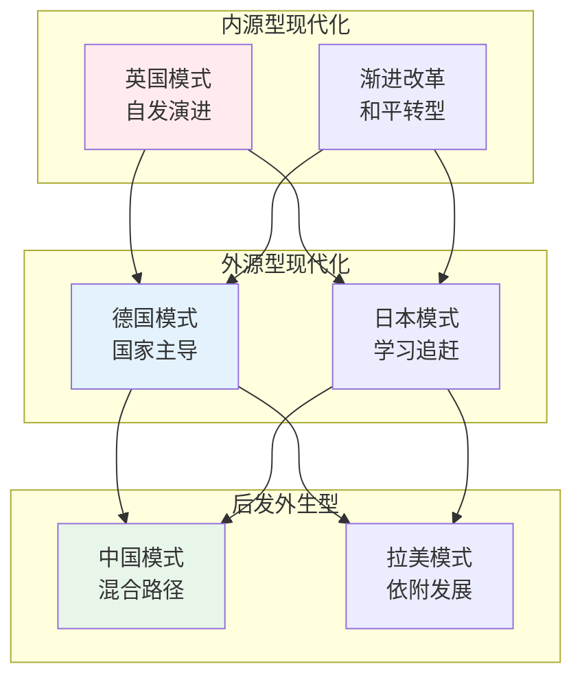
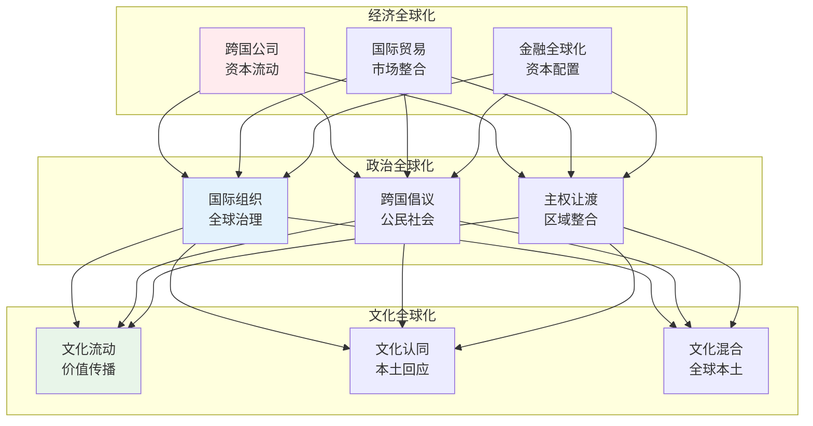

# 社会变迁

> **核心观点**：社会变迁是社会结构、制度、文化的动态变化过程，理解变迁机制是认识社会发展的关键。

---

## 📊 变迁理论框架



---

## 🔬 变迁动力分析

### 经济动力

| 动力类型 | 机制 | 历史案例 |
|----------|------|----------|
| 生产力发展 | 技术进步、效率提升 | 工业革命 |
| 经济危机 | 结构失衡、系统崩溃 | 1929大萧条 |
| 全球化 | 资本流动、市场扩张 | 当代全球化 |
| 市场竞争 | 优胜劣汰、产业升级 | 市场经济 |

### 政治动力

```
政治变迁机制：
1. 革命：根本性制度变革
2. 改革：渐进式制度调整
3. 演化：自发性制度变迁
4. 移植：制度跨文化传播
```

### 文化动力

| 文化因素 | 影响机制 | 实例 |
|----------|----------|------|
| 宗教变革 | 价值观重塑 | 新教改革 |
| 启蒙运动 | 理性主义兴起 | 法国大革命 |
| 民族主义 | 国家认同建构 | 民族国家形成 |
| 消费主义 | 生活方式改变 | 当代社会 |

### 技术动力



---

## 📈 变迁模式

### 线性进步观

**核心观点**：社会从简单到复杂、从低级到高级发展。

| 阶段 | 特征 | 代表人物 |
|------|------|----------|
| 野蛮阶段 | 狩猎采集 | 摩尔根 |
| 文明阶段 | 农业生产 | 摩尔根 |
| 工业阶段 | 机器生产 | 亨廷顿 |

### 循环论

**核心观点**：社会经历兴起、繁荣、衰落的循环。

| 理论 | 核心观点 | 代表人物 |
|------|----------|----------|
| 帕累托 | 精英循环 | 帕累托 |
| 斯宾格勒 | 文化四季 | 斯宾格勒 |
| 汤因比 | 文明挑战应战 | 汤因比 |

### 辩证发展观

**核心观点**：社会通过矛盾运动不断发展。

```
辩证法三定律：
1. 对立统一：矛盾是发展动力
2. 量变质变：渐进导致突变
3. 否定之否定：螺旋式上升
```

---

## 🌍 现代化理论

### 现代化特征

| 领域 | 传统社会 | 现代社会 |
|------|----------|----------|
| 经济 | 农业为主 | 工业/服务业 |
| 政治 | 传统权威 | 理性权威 |
| 文化 | 宗教主导 | 理性主导 |
| 社会 | 机械团结 | 有机团结 |
| 个人 | 集体主义 | 个体主义 |

### 现代化路径



### 现代化反思

| 问题 | 表现 | 批判观点 |
|------|------|----------|
| 西方中心 | 现代化=西方化 | 多元现代性 |
| 发展代价 | 环境破坏、文化丧失 | 可持续发展 |
| 不平等加剧 | 贫富差距扩大 | 公平发展 |
| 精神危机 | 意义缺失、异化 | 人文关怀 |

---

## 🔮 全球化与社会变迁

### 全球化维度



### 反全球化运动

| 运动类型 | 主张 | 策略 |
|----------|------|------|
| 环保运动 | 可持续发展 | 抗议、倡导 |
| 劳工运动 | 劳动权益保护 | 罢工、谈判 |
| 原住民运动 | 文化保护 | 抵抗、自治 |
| 反资本主义 | 社会公正 | 替代方案 |

---

## 🏛️ 社会转型

### 转型类型

| 类型 | 特征 | 案例 |
|------|------|------|
| 革命转型 | 暴力、根本 | 法国大革命 |
| 改革转型 | 渐进、制度 | 中国改革开放 |
| 崩溃转型 | 失控、解体 | 苏联解体 |
| 外部强加 | 外力推动 | 战后德国 |

### 转型机制

```
社会转型机制：
1. 结构性危机：系统失衡
2. 精英分裂：权力分化
3. 意识形态转变：观念更新
4. 外部冲击：环境变化
5. 制度创新：规则重建
```

---

## 🎯 核心结论

### 社会变迁的基本规律

1. **变迁是常态**：社会处于持续变化中
2. **动力多元化**：经济、政治、文化、技术共同作用
3. **模式多样化**：不同社会有不同变迁路径
4. **后果双重性**：进步与问题并存
5. **可塑性有限**：变迁受结构制约

### 实践启示

```
应对变迁的策略：
1. 保持开放心态
2. 培养适应能力
3. 批判性思考
4. 积极参与变革
5. 平衡传承与创新
```

---

## 📚 参考文献

1. 韦伯《新教伦理与资本主义精神》
2. 涂尔干《社会分工论》
3. 亨廷顿《变化社会中的政治秩序》
4. 吉登斯《现代性的后果》
5. 贝克《风险社会》
6. 卡斯特《网络社会的崛起》
7. 费孝通《乡土中国》
8. 孙立平《断裂》